# ADK-Go API 参考

## 1. 概述

本文档提供了 ADK-Go 框架的核心 API 参考，包括主要接口、结构体、函数和方法。API 按照包或模块组织，便于查阅和使用。

## 2. agent 包

### 2.1 概述

`agent` 包定义了代理框架的核心接口和类型，是 ADK-Go 框架的基础。

### 2.2 Agent 接口

```go
type Agent interface {
    Name() string
    Description() string
    Run(InvocationContext) Iterator[*Event]
    SubAgents() []Agent
    internal() *agent
}
```

**描述**：
Agent 接口是所有代理的基本抽象，定义了代理的核心行为。

**方法说明**：
- `Name() string`：返回代理的名称
- `Description() string`：返回代理的描述
- `Run(InvocationContext) Iterator[*Event]`：运行代理，接收上下文并返回事件迭代器
- `SubAgents() []Agent`：返回代理的子代理列表
- `internal() *agent`：返回内部代理实现（内部使用）

### 2.3 InvocationContext 接口

```go
type InvocationContext interface {
    Done() context.Context
    Agent() Agent
    Session() session.Session
    Artifacts() artifact.Service
    Memory() memory.Service
    UserContent() *genai.Content
    RunConfig() RunConfig
    Branch() string
}
```

**描述**：
InvocationContext 提供了代理运行时的上下文信息。

**方法说明**：
- `Done() context.Context`：返回上下文的 done 通道
- `Agent() Agent`：返回当前代理
- `Session() session.Session`：返回当前会话
- `Artifacts() artifact.Service`：返回制品服务
- `Memory() memory.Service`：返回内存服务
- `UserContent() *genai.Content`：返回用户内容
- `RunConfig() RunConfig`：返回运行配置
- `Branch() string`：返回分支名称

### 2.4 RunConfig 结构体

```go
type RunConfig struct {
    Stream bool
    Debug  bool
    // 其他配置字段
}
```

**描述**：
RunConfig 包含代理运行时的配置选项。

**字段说明**：
- `Stream bool`：是否启用流式输出
- `Debug bool`：是否启用调试模式

## 3. agent/llmagent 包

### 3.1 概述

`llmagent` 包提供了基于大语言模型的代理实现。

### 3.2 New 函数

```go
func New(opts ...Option) (Agent, error)
```

**描述**：
创建一个新的 LLM 代理。

**参数**：
- `opts ...Option`：配置选项列表

**返回值**：
- `Agent`：创建的代理实例
- `error`：如果创建失败，返回错误

### 3.3 Option 类型

```go
type Option func(*Config)
```

**描述**：
Option 是用于配置 LLM 代理的函数类型。

### 3.4 WithModel 函数

```go
func WithModel(model model.LLM) Option
```

**描述**：
设置代理使用的 LLM 模型。

**参数**：
- `model model.LLM`：LLM 模型实例

**返回值**：
- `Option`：配置选项函数

### 3.5 WithInstruction 函数

```go
func WithInstruction(instruction string) Option
```

**描述**：
设置代理的系统指令。

**参数**：
- `instruction string`：系统指令

**返回值**：
- `Option`：配置选项函数

### 3.6 WithTools 函数

```go
func WithTools(tools ...tool.Tool) Option
```

**描述**：
设置代理可用的工具列表。

**参数**：
- `tools ...tool.Tool`：工具列表

**返回值**：
- `Option`：配置选项函数

## 4. agent/workflowagents 包

### 4.1 概述

`workflowagents` 包提供了多种工作流代理实现，用于编排多个子代理的执行。

### 4.2 sequentialagent 包

#### 4.2.1 New 函数

```go
func New(opts ...Option) (agent.Agent, error)
```

**描述**：
创建一个新的顺序代理，按顺序执行子代理。

**参数**：
- `opts ...Option`：配置选项列表

**返回值**：
- `agent.Agent`：创建的代理实例
- `error`：如果创建失败，返回错误

#### 4.2.2 WithAgents 函数

```go
func WithAgents(agents ...agent.Agent) Option
```

**描述**：
设置顺序代理的子代理列表。

**参数**：
- `agents ...agent.Agent`：子代理列表

**返回值**：
- `Option`：配置选项函数

### 4.3 parallelagent 包

#### 4.3.1 New 函数

```go
func New(opts ...Option) (agent.Agent, error)
```

**描述**：
创建一个新的并行代理，同时执行子代理。

**参数**：
- `opts ...Option`：配置选项列表

**返回值**：
- `agent.Agent`：创建的代理实例
- `error`：如果创建失败，返回错误

### 4.4 loopagent 包

#### 4.4.1 New 函数

```go
func New(opts ...Option) (agent.Agent, error)
```

**描述**：
创建一个新的循环代理，重复执行子代理直到满足退出条件。

**参数**：
- `opts ...Option`：配置选项列表

**返回值**：
- `agent.Agent`：创建的代理实例
- `error`：如果创建失败，返回错误

#### 4.4.2 WithMaxIterations 函数

```go
func WithMaxIterations(max uint) Option
```

**描述**：
设置循环代理的最大迭代次数。

**参数**：
- `max uint`：最大迭代次数

**返回值**：
- `Option`：配置选项函数

## 5. tool 包

### 5.1 概述

`tool` 包定义了工具系统的核心接口和类型。

### 5.2 Tool 接口

```go
type Tool interface {
    Name() string
    Description() string
    IsLongRunning() bool
}
```

**描述**：
Tool 接口是所有工具的基本抽象，定义了工具的核心行为。

**方法说明**：
- `Name() string`：返回工具的名称
- `Description() string`：返回工具的描述
- `IsLongRunning() bool`：判断工具是否为长期运行的工具

### 5.3 tool/functiontool 包

#### 5.3.1 New 函数

```go
func New(name, description string, fn Function, opts ...Option) Tool
```

**描述**：
创建一个新的函数工具，将普通函数包装为工具。

**参数**：
- `name string`：工具名称
- `description string`：工具描述
- `fn Function`：要包装的函数
- `opts ...Option`：配置选项列表

**返回值**：
- `Tool`：创建的工具实例

#### 5.3.2 Function 类型

```go
type Function func(context.Context, map[string]any) (any, error)
```

**描述**：
Function 是函数工具执行的函数类型。

## 6. session 包

### 6.1 概述

`session` 包提供了会话管理的核心接口和类型。

### 6.2 Session 接口

```go
type Session interface {
    ID() string
    AppName() string
    UserID() string
    State() State
    Events() Events
    LastUpdateTime() time.Time
}
```

**描述**：
Session 接口定义了会话的核心行为。

**方法说明**：
- `ID() string`：返回会话ID
- `AppName() string`：返回应用名称
- `UserID() string`：返回用户ID
- `State() State`：返回会话状态
- `Events() Events`：返回会话事件
- `LastUpdateTime() time.Time`：返回最后更新时间

### 6.3 Service 接口

```go
type Service interface {
    Get(ctx context.Context, appName, sessionID string) (Session, error)
    Create(ctx context.Context, appName, userID string) (Session, error)
    Update(ctx context.Context, session Session) error
    Delete(ctx context.Context, appName, sessionID string) error
}
```

**描述**：
Service 接口定义了会话服务的核心行为。

**方法说明**：
- `Get(ctx context.Context, appName, sessionID string) (Session, error)`：获取会话
- `Create(ctx context.Context, appName, userID string) (Session, error)`：创建会话
- `Update(ctx context.Context, session Session) error`：更新会话
- `Delete(ctx context.Context, appName, sessionID string) error`：删除会话

## 7. artifact 包

### 7.1 概述

`artifact` 包提供了制品服务的核心接口和类型，用于管理代理产生和使用的制品。

### 7.2 Service 接口

```go
type Service interface {
    Get(ctx context.Context, appName, sessionID, key string) ([]byte, error)
    Put(ctx context.Context, appName, sessionID, key string, value []byte) error
    List(ctx context.Context, appName, sessionID string) ([]string, error)
    Delete(ctx context.Context, appName, sessionID, key string) error
}
```

**描述**：
Service 接口定义了制品服务的核心行为。

**方法说明**：
- `Get(ctx context.Context, appName, sessionID, key string) ([]byte, error)`：获取制品
- `Put(ctx context.Context, appName, sessionID, key string, value []byte) error`：存储制品
- `List(ctx context.Context, appName, sessionID string) ([]string, error)`：列出制品
- `Delete(ctx context.Context, appName, sessionID, key string) error`：删除制品

## 8. memory 包

### 8.1 概述

`memory` 包提供了内存服务的核心接口和类型，用于管理代理的短期和长期记忆。

### 8.2 Service 接口

```go
type Service interface {
    Get(ctx context.Context, appName, sessionID, key string) (string, error)
    Put(ctx context.Context, appName, sessionID, key, value string) error
    List(ctx context.Context, appName, sessionID string) ([]string, error)
    Delete(ctx context.Context, appName, sessionID, key string) error
}
```

**描述**：
Service 接口定义了内存服务的核心行为。

**方法说明**：
- `Get(ctx context.Context, appName, sessionID, key string) (string, error)`：获取内存项
- `Put(ctx context.Context, appName, sessionID, key, value string) error`：存储内存项
- `List(ctx context.Context, appName, sessionID string) ([]string, error)`：列出内存项
- `Delete(ctx context.Context, appName, sessionID, key string) error`：删除内存项

## 9. model 包

### 9.1 概述

`model` 包定义了与 LLM 模型交互的核心接口和类型。

### 9.2 LLM 接口

```go
type LLM interface {
    Name() string
    GenerateContent(ctx context.Context, req *GenerateContentRequest, stream bool) Iterator[*GenerateContentResponse]
}
```

**描述**：
LLM 接口定义了与 LLM 模型交互的核心行为。

**方法说明**：
- `Name() string`：返回模型名称
- `GenerateContent(ctx context.Context, req *GenerateContentRequest, stream bool) Iterator[*GenerateContentResponse]`：生成内容

### 9.3 GenerateContentRequest 结构体

```go
type GenerateContentRequest struct {
    Contents []*genai.Content
    Tools    []*genai.Tool
    // 其他字段
}
```

**描述**：
GenerateContentRequest 包含生成内容的请求参数。

**字段说明**：
- `Contents []*genai.Content`：输入内容列表
- `Tools []*genai.Tool`：可用工具列表

### 9.4 model/gemini 包

#### 9.4.1 New 函数

```go
func New(ctx context.Context, opts ...Option) (model.LLM, error)
```

**描述**：
创建一个新的 Gemini 模型实例。

**参数**：
- `ctx context.Context`：上下文
- `opts ...Option`：配置选项列表

**返回值**：
- `model.LLM`：创建的模型实例
- `error`：如果创建失败，返回错误

### 9.5 model/openai 包

#### 9.5.1 New 函数

```go
func New(ctx context.Context, opts ...Option) (model.LLM, error)
```

**描述**：
创建一个新的 OpenAI 模型实例。

**参数**：
- `ctx context.Context`：上下文
- `opts ...Option`：配置选项列表

**返回值**：
- `model.LLM`：创建的模型实例
- `error`：如果创建失败，返回错误

## 10. runner 包

### 10.1 概述

`runner` 包提供了代理运行器的核心接口和类型，负责管理代理的执行。

### 10.2 Runner 结构体

```go
type Runner struct {
    // 内部字段
}
```

**描述**：
Runner 结构体负责管理代理的执行。

### 10.3 New 函数

```go
func New(config Config) (*Runner, error)
```

**描述**：
创建一个新的 Runner 实例。

**参数**：
- `config Config`：配置

**返回值**：
- `*Runner`：创建的 Runner 实例
- `error`：如果创建失败，返回错误

### 10.4 Run 方法

```go
func (r *Runner) Run(ctx context.Context, userID, sessionID, msg string, cfg *agent.RunConfig) Iterator[*Event]
```

**描述**：
运行代理，处理用户请求。

**参数**：
- `ctx context.Context`：上下文
- `userID string`：用户ID
- `sessionID string`：会话ID
- `msg string`：用户消息
- `cfg *agent.RunConfig`：运行配置

**返回值**：
- `Iterator[*Event]`：事件迭代器

## 11. cmd/launcher 包

### 11.1 概述

`cmd/launcher` 包提供了启动器的核心接口和类型，用于启动和管理代理应用。

### 11.2 full 包

#### 11.2.1 NewLauncher 函数

```go
func NewLauncher() *Launcher
```

**描述**：
创建一个完整的启动器，支持多种运行模式。

**返回值**：
- `*Launcher`：创建的启动器实例

#### 11.2.2 ParseAndRun 方法

```go
func (l *Launcher) ParseAndRun(ctx context.Context, config Config, args []string, errorMode ErrorMode) error
```

**描述**：
解析命令行参数并运行应用。

**参数**：
- `ctx context.Context`：上下文
- `config Config`：配置
- `args []string`：命令行参数
- `errorMode ErrorMode`：错误模式

**返回值**：
- `error`：如果运行失败，返回错误

## 12. API 依赖关系图

```mermaid
graph TD
    subgraph "核心 API"
        Agent[Agent 接口]
        InvocationContext[InvocationContext 接口]
        Tool[Tool 接口]
        Session[Session 接口]
        LLM[LLM 接口]
        Runner[Runner]
    end
    
    subgraph "代理类型"
        LLMAgent[LLM 代理]
        SequentialAgent[顺序代理]
        ParallelAgent[并行代理]
        LoopAgent[循环代理]
    end
    
    subgraph "工具实现"
        FunctionTool[函数工具]
        AgentTool[代理工具]
        GeminiTool[Gemini 工具]
    end
    
    subgraph "模型实现"
        Gemini[Gemini 模型]
        OpenAI[OpenAI 模型]
        DeepSeek[DeepSeek 模型]
        Kimi[Kimi 模型]
        Qwen[Qwen 模型]
        SiliconFlow[SiliconFlow 模型]
        Zhipu[Zhipu 模型]
    end
    
    subgraph "服务接口"
        SessionService[Session 服务]
        ArtifactService[Artifact 服务]
        MemoryService[Memory 服务]
    end
    
    Runner --> Agent
    Runner --> Session
    Runner --> SessionService
    Runner --> ArtifactService
    Runner --> MemoryService
    
    LLMAgent --> Agent
    LLMAgent --> LLM
    LLMAgent --> Tool
    
    SequentialAgent --> Agent
    ParallelAgent --> Agent
    LoopAgent --> Agent
    
    FunctionTool --> Tool
    AgentTool --> Tool
    GeminiTool --> Tool
    
    Gemini --> LLM
    OpenAI --> LLM
    DeepSeek --> LLM
    Kimi --> LLM
    Qwen --> LLM
    SiliconFlow --> LLM
    Zhipu --> LLM
    
    InvocationContext --> Agent
    InvocationContext --> Session
    InvocationContext --> ArtifactService
    InvocationContext --> MemoryService
    
    style Agent fill:#e1f5fe
    style InvocationContext fill:#e1f5fe
    style Tool fill:#e1f5fe
    style Session fill:#e1f5fe
    style LLM fill:#e1f5fe
    style Runner fill:#e1f5fe
```



**API 依赖关系图说明**：

这张图展示了 ADK-Go 核心 API 之间的依赖关系。Runner 是核心组件，负责管理代理、会话和各种服务。Agent 是执行任务的实体，支持多种类型，包括 LLM 代理和工作流代理。Tool 扩展了代理的能力，支持多种实现。LLM 接口定义了与 LLM 模型交互的标准方法，支持多种模型实现。Session、Artifact 和 Memory 服务提供了必要的支持功能。

## 13. 下一步

- 阅读 [ADK-Go 开发指南](./ADK-Go开发指南.md)，学习如何使用这些 API 开发代理应用
- 查看 [ADK-Go 示例](./examples/)，了解 API 的实际使用
- 探索 [ADK-Go 架构分析文档](./ADK-Go架构分析文档.md)，深入了解 API 设计背后的架构

通过本 API 参考文档，您应该能够了解 ADK-Go 框架的核心 API，并开始使用这些 API 开发自己的代理应用。