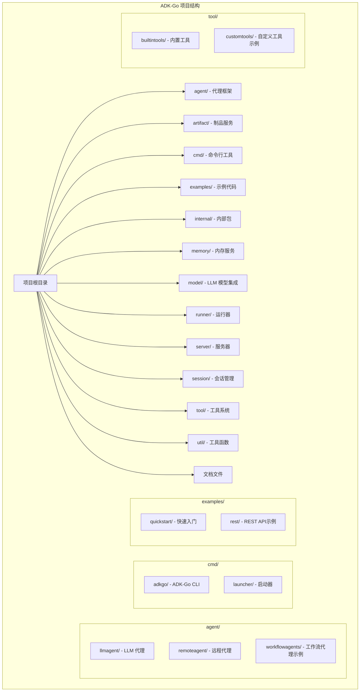
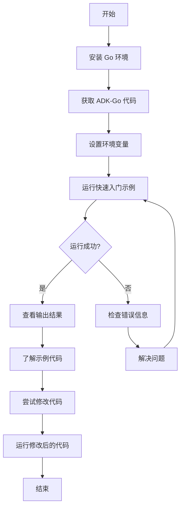

# ADK-Go 入门指南

## 1. 什么是ADK-Go

ADK-Go (Agent Development Kit for Go) 是 Google 开发的一个开源、代码优先的 Go 工具包，用于构建、评估和部署复杂的 AI 代理系统。该框架将软件开发原则应用于 AI 代理创建，支持从简单任务到复杂系统的代理工作流编排。

### 核心优势

- **代码优先设计**：使用 Go 语言编写，支持编译时检查和类型安全
- **丰富的工具生态系统**：内置多种工具，同时支持自定义工具开发
- **灵活的工作流编排**：支持顺序、并行和循环等多种工作流模式
- **部署灵活性**：支持多种部署方式，包括本地运行、容器化和云原生部署
- **模型无关**：虽然针对 Gemini 优化，但支持与其他 LLM 模型集成

## 2. 安装和环境配置

### 2.1 系统要求

- Go 1.21 或更高版本
- Git（用于克隆代码库）
- 可选：Docker（用于容器化部署）

### 2.2 安装步骤

#### 2.2.1 安装 Go

如果您还没有安装 Go，可以从 [Go 官方网站](https://golang.org/dl/) 下载并安装。

验证 Go 安装：

```bash
go version
```

#### 2.2.2 获取 ADK-Go

您可以通过两种方式获取 ADK-Go：

1. **作为依赖项添加到现有项目**：

```bash
go get github.com/sjzsdu/adk-go
```

2. **克隆代码库**：

```bash
git clone https://github.com/sjzsdu/adk-go.git
cd adk-go
```

### 2.3 配置环境变量

ADK-Go 需要一些环境变量来运行，特别是与 LLM 模型集成时：

```bash
# 设置 Gemini API 密钥（如果使用 Gemini 模型）
export GOOGLE_API_KEY="your-gemini-api-key"

# 可选：设置其他环境变量
export ADK_APP_NAME="my-adk-app"
export ADK_LOG_LEVEL="debug"
```

## 3. 第一个代理应用

让我们创建一个简单的 LLM 代理应用，该代理使用 Gemini 模型来响应查询。

### 3.1 快速入门示例

我们将使用 ADK-Go 提供的快速入门示例：

```bash
cd examples/quickstart
go run main.go
```

### 3.2 示例代码解析

让我们分析一下快速入门示例的代码结构：

```go
package main

import (
	"context"
	"fmt"

	"github.com/sjzsdu/adk-go/agent"
	"github.com/sjzsdu/adk-go/agent/llmagent"
	"github.com/sjzsdu/adk-go/runner"
	"github.com/sjzsdu/adk-go/server/rest"
)

func main() {
	// 创建一个简单的 LLM 代理
	llmAgent, err := llmagent.New(llmagent.Config{
		Name:        "quickstart-agent",
		Description: "A simple LLM agent",
		Model:       "gemini-1.5-pro", // 使用 Gemini 模型
		Instruction: "You are a helpful assistant.",
	})
	if err != nil {
		panic(err)
	}

	// 创建运行器
	runner, err := runner.New(runner.Config{
		AppName:   "quickstart-app",
		RootAgent: llmAgent,
	})
	if err != nil {
		panic(err)
	}

	// 运行 REST 服务器
	restServer := rest.New(runner)
	fmt.Println("Server starting on :8080...")
	if err := restServer.Run(rest.RunConfig{Port: 8080}); err != nil {
		panic(err)
	}
}
```

### 3.3 运行方式

ADK-Go 支持多种运行方式：

#### 3.3.1 命令行接口 (CLI)

```bash
# 运行 CLI 示例
cd examples/cli
go run main.go
```

#### 3.3.2 REST API

```bash
# 运行 REST API 示例
cd examples/rest
go run main.go
```

然后可以通过 HTTP 请求与代理交互：

```bash
curl -X POST http://localhost:8080/v1/run \n  -H "Content-Type: application/json" \n  -d '{"user_id": "test-user", "session_id": "test-session", "content": "Hello, ADK-Go!"}'
```

#### 3.3.3 直接调用

在自己的 Go 代码中直接调用代理：

```go
// 创建代理
agent, err := llmagent.New(llmagent.Config{
	Name:        "my-agent",
	Description: "A simple agent",
	Model:       "gemini-1.5-pro",
	Instruction: "You are a helpful assistant.",
})

// 创建上下文
ctx := context.Background()

// 运行代理
for event, err := range agent.Run(ctx) {
	// 处理事件
	if err != nil {
		log.Fatal(err)
	}
	fmt.Println("Agent response:", event.Content)
}
```

## 4. 项目结构

ADK-Go 采用模块化设计，项目结构清晰：



## 5. 常见问题和解决方案

### 5.1 连接 LLM 模型失败

**问题**：运行代理时出现 "failed to connect to LLM model" 错误

**解决方案**：

1. 检查 API 密钥是否正确设置

2. 确保网络连接正常

3. 检查模型名称是否正确

### 5.2 端口被占用

**问题**：运行 REST 服务器时出现 "address already in use" 错误

**解决方案**：

1. 更改端口号：`rest.RunConfig{Port: 8081}`

2. 查找并杀死占用端口的进程：`lsof -i :8080 | grep LISTEN` 然后 `kill <PID>`

### 5.3 依赖项问题

**问题**：运行 `go run` 时出现依赖项错误

**解决方案**：

1. 运行 `go mod tidy` 来更新依赖项

2. 检查 Go 版本是否符合要求

3. 确保所有依赖项都已正确安装

## 6. 下一步学习

现在您已经完成了 ADK-Go 的入门学习，可以继续深入了解：

1. **核心概念详解**：深入理解 ADK-Go 的核心概念和组件

2. **架构设计文档**：了解 ADK-Go 的架构设计和各组件之间的关系

3. **开发指南**：学习如何开发更复杂的代理应用

4. **示例库详解**：查看更多示例，了解各种使用场景

5. **API 参考**：查阅详细的 API 文档，了解所有可用的接口和方法

## 7. 快速入门流程图



通过本入门指南，您已经成功安装并运行了第一个 ADK-Go 代理应用。接下来，您可以深入学习 ADK-Go 的核心概念和架构设计，开发更复杂的代理应用。