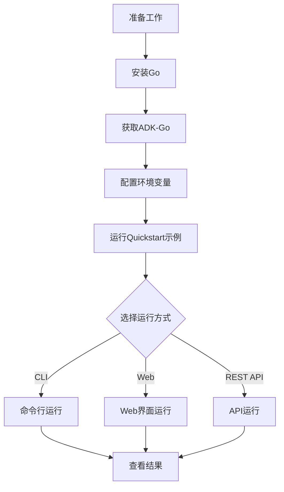
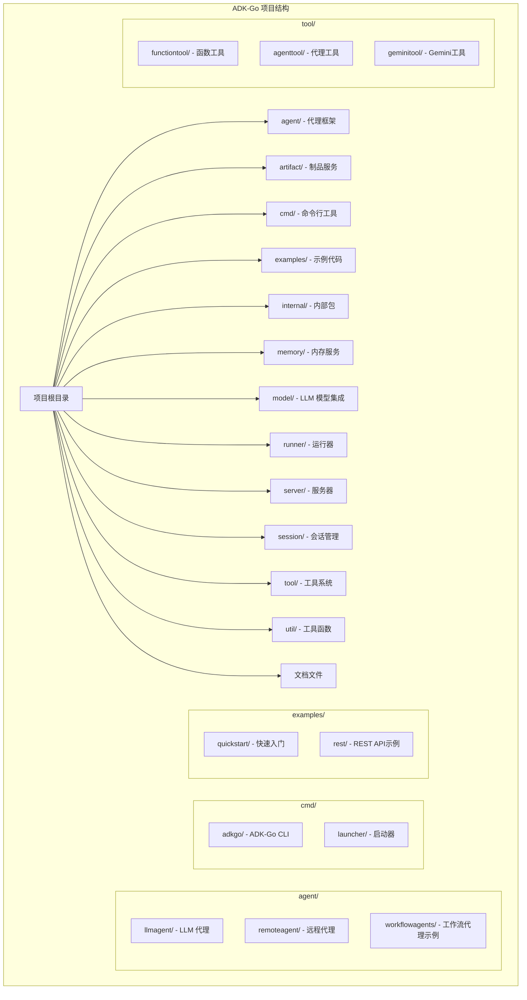

# ADK-Go 入门指南

## 1. 什么是ADK-Go

ADK-Go (Agent Development Kit for Go) 是 Google 开发的一个开源、代码优先的 Go 工具包，用于构建、评估和部署复杂的 AI 代理系统。该框架将软件开发原则应用于 AI 代理创建，支持从简单任务到复杂系统的代理工作流编排。

### 核心优势

- **代码优先设计**：使用 Go 语言编写，支持编译时检查和类型安全
- **丰富的工具生态系统**：内置多种工具，同时支持自定义工具开发
- **灵活的工作流编排**：支持顺序、并行和循环等多种工作流模式
- **部署灵活性**：支持多种部署方式，包括本地运行、容器化和云原生部署
- **模型无关**：虽然针对 Gemini 优化，但支持与其他 LLM 模型集成

## 2. 安装和环境配置

### 2.1 系统要求

- Go 1.21 或更高版本
- Git（用于克隆代码库）
- 可选：Docker（用于容器化部署）

### 2.2 安装步骤

#### 2.2.1 安装 Go

如果您还没有安装 Go，可以从 [Go 官方网站](https://golang.org/dl/) 下载并安装。

验证 Go 安装：

```bash
go version
```

#### 2.2.2 获取 ADK-Go

您可以通过两种方式获取 ADK-Go：

1. **作为依赖项添加到现有项目**：

```bash
go get github.com/sjzsdu/adk-go
```

2. **克隆代码库**：

```bash
git clone https://github.com/sjzsdu/adk-go.git
cd adk-go
```

### 2.3 配置环境变量

对于需要访问外部 LLM 服务的代理，您需要配置相应的 API 密钥。例如，对于 Gemini 模型：

```bash
export GOOGLE_API_KEY="your-google-api-key"
```

## 3. 快速入门流程图



**快速入门流程图说明**：

这张流程图展示了使用 ADK-Go 快速入门的完整步骤。首先需要准备开发环境，安装 Go 并获取 ADK-Go，然后配置必要的环境变量。接下来可以运行 Quickstart 示例，根据需要选择不同的运行方式（CLI、Web 或 REST API），最后查看运行结果。

## 4. 第一个代理应用：Quickstart 示例解析

### 4.1 示例概述

Quickstart 示例是一个简单的代理应用，展示了 ADK-Go 的基本功能。让我们来解析这个示例，了解其结构和工作原理。

### 4.2 示例代码结构

```bash
examples/
└── quickstart/
    └── main.go  # Quickstart 示例的主文件
```

### 4.3 代码解析

让我们看看 `quickstart/main.go` 的核心代码：

```go
package main

import (
	"context"
	"log"
	"os"

	"github.com/sjzsdu/adk-go/agent/llmagent"
	"github.com/sjzsdu/adk-go/cmd/launcher/full"
	"github.com/sjzsdu/adk-go/cmd/launcher/universal"
	"github.com/sjzsdu/adk-go/model/gemini"
)

func main() {
	ctx := context.Background()

	// 创建 Gemini 模型实例
	model, err := gemini.New(ctx, gemini.WithModel("gemini-1.5-flash"))
	if err != nil {
		log.Fatalf("failed to create model: %v", err)
	}

	// 创建 LLM 代理
	llmAgent, err := llmagent.New(
		llmagent.WithModel(model),
		llmagent.WithInstruction("You are a helpful assistant."),
	)
	if err != nil {
		log.Fatalf("failed to create agent: %v", err)
	}

	// 创建配置
	config := full.NewEmptyConfig()
	config.Agent = llmAgent

	// 创建启动器并运行
	l := full.NewLauncher()
	err = l.ParseAndRun(ctx, config, os.Args[1:], universal.ErrorOnUnparsedArgs)
	if err != nil {
		log.Fatalf("run failed: %v\n\n%s", err, l.FormatSyntax())
	}
}
```

### 4.4 代码解释

1. **导入依赖**：导入必要的 ADK-Go 包和标准库。
2. **创建模型实例**：初始化 Gemini 模型，指定模型名称为 "gemini-1.5-flash"。
3. **创建 LLM 代理**：使用模型实例和指令创建一个 LLM 代理。
4. **创建配置**：创建一个空配置，并将代理添加到配置中。
5. **创建启动器并运行**：创建一个完整的启动器，解析命令行参数并运行应用。

## 5. 运行方式

ADK-Go 支持多种运行方式，您可以根据需要选择适合的方式。

### 5.1 命令行（CLI）运行

最直接的运行方式是通过命令行：

```bash
go run ./examples/quickstart/main.go console
```

运行后，您可以直接在命令行中与代理交互：

```
> Hello, ADK-Go!
I'm here to help you with any questions or tasks you have. What would you like to know or do today?
```

### 5.2 Web 界面运行

您可以通过 Web 界面与代理交互：

```bash
go run ./examples/quickstart/main.go webui
```

然后在浏览器中访问 `http://localhost:8080`，即可看到 Web 界面。

### 5.3 REST API 运行

ADK-Go 还支持通过 REST API 访问代理：

```bash
go run ./examples/quickstart/main.go restapi
```

API 将在 `http://localhost:8080/api/rest` 上运行，您可以使用 curl 或其他 HTTP 客户端访问：

```bash
curl -X POST http://localhost:8080/api/rest/v1/agents/run \
  -H "Content-Type: application/json" \
  -d '{"user_id": "test-user", "message": "Hello, ADK-Go!"}'
```

### 5.4 A2A（Agent-to-Agent）运行

A2A 允许代理之间进行通信：

```bash
go run ./examples/quickstart/main.go a2a
```

## 6. 项目目录结构示意图



**项目目录结构说明**：

ADK-Go 采用模块化设计，项目目录结构清晰。核心功能分布在不同的包中：

- **agent/**：包含代理框架和各种类型的代理实现
- **artifact/**：提供制品存储服务，用于管理代理产生的数据
- **cmd/**：包含命令行工具和启动器
- **examples/**：提供各种示例代码，帮助开发者学习和理解框架
- **internal/**：包含内部使用的包，不对外暴露
- **memory/**：提供内存服务，用于代理的短期和长期记忆
- **model/**：包含与各种 LLM 模型的集成
- **runner/**：负责代理的运行和管理
- **server/**：提供 Web 服务器和 API 支持
- **session/**：管理代理会话
- **tool/**：包含工具系统和各种工具实现
- **util/**：提供通用工具函数

## 7. 常见问题和解决方案

### 7.1 问题：运行示例时出现 "API key not found" 错误

**解决方案**：

确保已正确设置 GOOGLE_API_KEY 环境变量：

```bash
export GOOGLE_API_KEY="your-google-api-key"
```

### 7.2 问题：运行示例时出现 "model not found" 错误

**解决方案**：

检查模型名称是否正确，确保使用的模型名称在您的 API 密钥权限范围内。

### 7.3 问题：Web 界面无法访问

**解决方案**：

1. 检查端口是否被占用
2. 检查防火墙设置
3. 尝试使用不同的浏览器

### 7.4 问题：API 调用返回错误

**解决方案**：

1. 检查请求格式是否正确
2. 检查请求参数是否完整
3. 查看日志获取详细错误信息

## 8. 下一步

现在您已经完成了 ADK-Go 的快速入门，了解了基本概念和使用方法。接下来，您可以：

1. 阅读 [ADK-Go 核心概念详解](ADK-Go核心概念详解.md)，深入理解框架的核心概念
2. 查看 [ADK-Go 架构设计文档](ADK-Go架构分析文档.md)，了解框架的架构设计
3. 尝试运行其他示例，如 REST API 示例、工作流代理示例等
4. 开始开发自己的代理应用

## 9. 资源链接

- [ADK-Go GitHub 仓库](https://github.com/sjzsdu/adk-go)
- [ADK-Go 官方文档](https://google.github.io/adk-docs/)
- [ADK 示例仓库](https://github.com/google/adk-samples)
- [Gemini API 文档](https://ai.google.dev/docs)

祝您使用 ADK-Go 开发出优秀的 AI 代理应用！