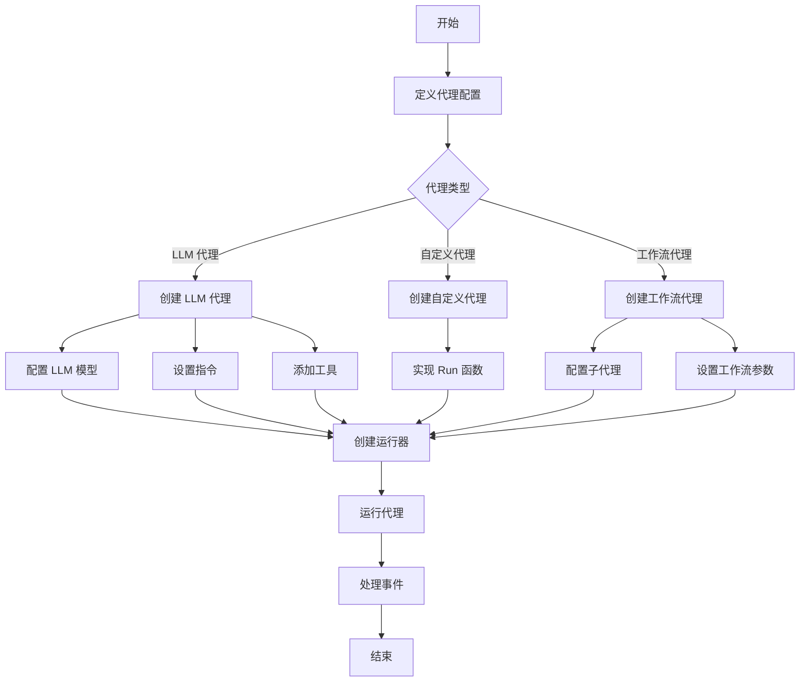
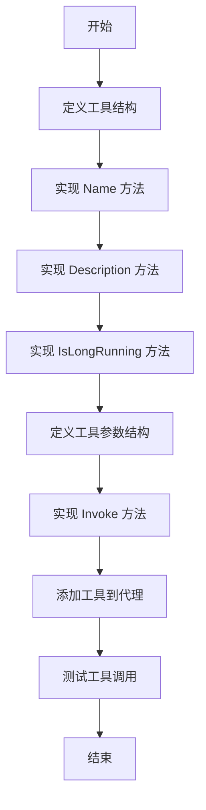
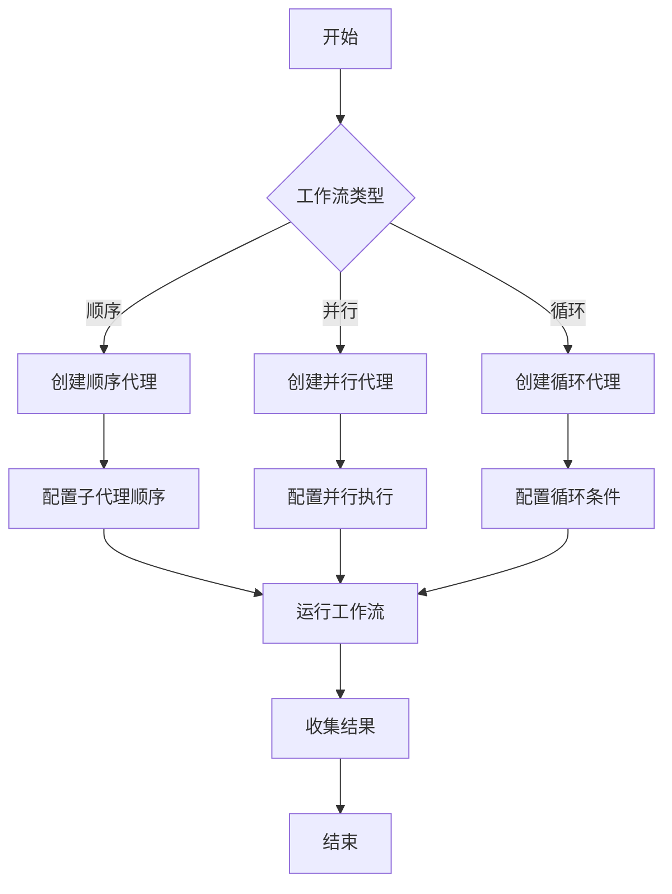
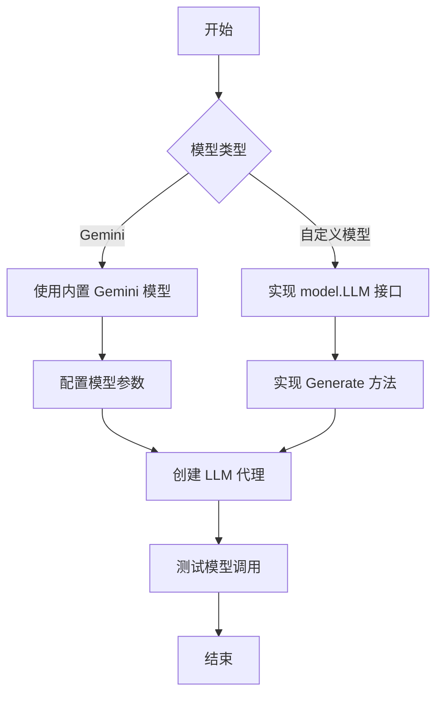
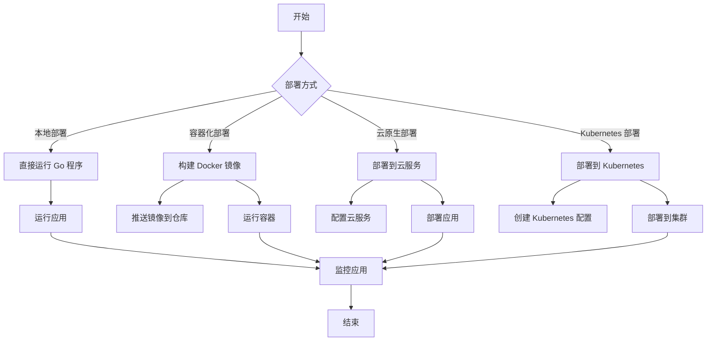

# ADK-Go 开发指南

## 1. 概述

ADK-Go 是一个强大的 AI 代理开发工具包，允许开发者构建、评估和部署复杂的 AI 代理系统。本开发指南将指导您如何使用 ADK-Go 框架开发自己的代理应用，从基础概念到高级功能。

## 2. 开发环境设置

### 2.1 安装依赖

要开始使用 ADK-Go，您需要安装 Go 1.21 或更高版本。然后，您可以通过以下命令将 ADK-Go 添加到您的项目中：

```bash
go get github.com/sjzsdu/adk-go
```

### 2.2 创建新项目

创建一个新的 Go 项目并添加 ADK-Go 依赖：

```bash
mkdir my-adk-agent
cd my-adk-agent
go mod init my-adk-agent
go get github.com/sjzsdu/adk-go
```

### 2.3 配置环境变量

ADK-Go 需要一些环境变量来运行，特别是与 LLM 模型集成时：

```bash
# 设置 Gemini API 密钥（如果使用 Gemini 模型）
export GOOGLE_API_KEY="your-gemini-api-key"

# 可选：设置其他环境变量
export ADK_APP_NAME="my-adk-app"
export ADK_LOG_LEVEL="debug"
```

## 3. 创建基础代理

### 3.1 简单 LLM 代理

让我们创建一个基本的 LLM 代理，该代理使用 Gemini 模型来响应查询：

```go
package main

import (
	"context"
	"fmt"
	"os"

	"github.com/sjzsdu/adk-go/agent"
	"github.com/sjzsdu/adk-go/agent/llmagent"
	"github.com/sjzsdu/adk-go/runner"
	"github.com/sjzsdu/adk-go/server/rest"
)

func main() {
	// 创建一个简单的 LLM 代理
	llmAgent, err := llmagent.New(llmagent.Config{
		Name:        "llm-assistant",
		Description: "A helpful LLM assistant",
		Model:       "gemini-1.5-pro", // 使用 Gemini 模型
		Instruction: "You are a helpful assistant.",
	})
	if err != nil {
		panic(err)
	}

	// 创建运行器
	runner, err := runner.New(runner.Config{
		AppName:   "my-adk-app",
		RootAgent: llmAgent,
	})
	if err != nil {
		panic(err)
	}

	// 运行 REST 服务器
	restServer := rest.New(runner)
	port := 8080
	fmt.Printf("Server starting on :%d...\n", port)
	if err := restServer.Run(rest.RunConfig{Port: port}); err != nil {
		panic(err)
	}
}
```

### 3.2 自定义代理

您也可以创建自定义代理，实现自己的业务逻辑：

```go
package main

import (
	"context"
	"fmt"

	"github.com/sjzsdu/adk-go/agent"
	"github.com/sjzsdu/adk-go/session"
	"google.golang.org/genai"
)

func main() {
	// 创建自定义代理
	myAgent, err := agent.New(agent.Config{
		Name:        "my-custom-agent",
		Description: "A simple custom agent",
		Run: func(ctx agent.InvocationContext) iter.Seq2[*session.Event, error] {
			return func(yield func(*session.Event, error) bool) {
				// 生成欢迎事件
				welcomeEvent := session.NewEvent(ctx.InvocationID())
				welcomeEvent.Content = genai.NewContentFromText("Hello from my custom agent!")
				welcomeEvent.Author = ctx.Agent().Name()
				if !yield(welcomeEvent, nil) {
					return
				}

				// 生成用户输入响应事件
				userContent := ctx.UserContent()
				if userContent != nil {
					// 简单回应用户输入
					responseEvent := session.NewEvent(ctx.InvocationID())
					responseEvent.Content = genai.NewContentFromText(fmt.Sprintf("You said: %s", userContent.Parts[0].Text))
					responseEvent.Author = ctx.Agent().Name()
					if !yield(responseEvent, nil) {
						return
					}
				}
			}
		},
	})
	if err != nil {
		panic(err)
	}

	// 使用代理
	// ...
}
```

### 3.3 代理开发流程图



## 4. 实现自定义工具

### 4.1 基本工具实现

ADK-Go 支持自定义工具，允许您扩展代理的能力。让我们创建一个简单的计算器工具：

```go
package main

import (
	"context"
	"encoding/json"
	"fmt"
)

// CalculatorTool 是一个简单的计算器工具
type CalculatorTool struct{}

// Name 返回工具名称
func (t *CalculatorTool) Name() string {
	return "calculator"
}

// Description 返回工具描述
func (t *CalculatorTool) Description() string {
	return "A simple calculator tool for performing arithmetic operations"
}

// IsLongRunning 返回工具是否为长时间运行的任务
func (t *CalculatorTool) IsLongRunning() bool {
	return false
}

// CalculatorArgs 定义计算器工具的参数
type CalculatorArgs struct {
	Operation string  `json:"operation"` // 操作类型: add, subtract, multiply, divide
	Num1      float64 `json:"num1"`      // 第一个数字
	Num2      float64 `json:"num2"`      // 第二个数字
}

// Invoke 执行工具调用
func (t *CalculatorTool) Invoke(ctx context.Context, args json.RawMessage) (any, error) {
	var calcArgs CalculatorArgs
	if err := json.Unmarshal(args, &calcArgs); err != nil {
		return nil, fmt.Errorf("invalid arguments: %w", err)
	}

	var result float64
	switch calcArgs.Operation {
	case "add":
		result = calcArgs.Num1 + calcArgs.Num2
	case "subtract":
		result = calcArgs.Num1 - calcArgs.Num2
	case "multiply":
		result = calcArgs.Num1 * calcArgs.Num2
	case "divide":
		if calcArgs.Num2 == 0 {
			return nil, fmt.Errorf("division by zero")
		}
		result = calcArgs.Num1 / calcArgs.Num2
	default:
		return nil, fmt.Errorf("unknown operation: %s", calcArgs.Operation)
	}

	return map[string]any{
		"result": result,
	}, nil
}
```

### 4.2 将工具添加到代理

现在，让我们将计算器工具添加到 LLM 代理中：

```go
// 创建计算器工具
calculatorTool := &CalculatorTool{}

// 创建带有工具的 LLM 代理
llmAgent, err := llmagent.New(llmagent.Config{
	Name:        "llm-assistant-with-tools",
	Description: "A helpful LLM assistant with calculator tool",
	Model:       "gemini-1.5-pro",
	Instruction: "You are a helpful assistant. Use the calculator tool for arithmetic operations.",
	Tools:       []tool.Tool{calculatorTool}, // 添加计算器工具
})
```

### 4.3 工具开发流程图



## 5. 构建工作流代理

### 5.1 顺序代理

顺序代理按顺序执行其子代理，每个子代理执行一次：

```go
package main

import (
	"github.com/sjzsdu/adk-go/agent"
	"github.com/sjzsdu/adk-go/agent/llmagent"
	"github.com/sjzsdu/adk-go/agent/workflowagents/sequentialagent"
)

func main() {
	// 创建第一个 LLM 代理
	agent1, err := llmagent.New(llmagent.Config{
		Name:        "agent-1",
		Description: "First agent",
		Model:       "gemini-1.5-pro",
		Instruction: "You are the first agent. Greet the user.",
	})
	if err != nil {
		panic(err)
	}

	// 创建第二个 LLM 代理
	agent2, err := llmagent.New(llmagent.Config{
		Name:        "agent-2",
		Description: "Second agent",
		Model:       "gemini-1.5-pro",
		Instruction: "You are the second agent. Ask the user what they want to do.",
	})
	if err != nil {
		panic(err)
	}

	// 创建第三个 LLM 代理
	agent3, err := llmagent.New(llmagent.Config{
		Name:        "agent-3",
		Description: "Third agent",
		Model:       "gemini-1.5-pro",
		Instruction: "You are the third agent. Summarize the conversation.",
	})
	if err != nil {
		panic(err)
	}

	// 创建顺序代理
	sequentialAgent, err := sequentialagent.New(sequentialagent.Config{
		AgentConfig: agent.Config{
			Name:        "sequential-workflow",
			Description: "A sequential workflow agent",
			SubAgents:   []agent.Agent{agent1, agent2, agent3}, // 按顺序执行的子代理
		},
	})
	if err != nil {
		panic(err)
	}

	// 使用顺序代理
	// ...
}
```

### 5.2 并行代理

并行代理同时执行其子代理，每个子代理在独立的上下文中运行：

```go
package main

import (
	"github.com/sjzsdu/adk-go/agent"
	"github.com/sjzsdu/adk-go/agent/llmagent"
	"github.com/sjzsdu/adk-go/agent/workflowagents/parallelagent"
)

func main() {
	// 创建多个 LLM 代理
	agents := make([]agent.Agent, 3)
	for i := 0; i < 3; i++ {
		agent, err := llmagent.New(llmagent.Config{
			Name:        fmt.Sprintf("agent-%d", i+1),
			Description: fmt.Sprintf("Agent %d", i+1),
			Model:       "gemini-1.5-pro",
			Instruction: fmt.Sprintf("You are agent %d. Provide a unique perspective on the user's query.", i+1),
		})
		if err != nil {
			panic(err)
		}
		agents[i] = agent
	}

	// 创建并行代理
	parallelAgent, err := parallelagent.New(parallelagent.Config{
		AgentConfig: agent.Config{
			Name:        "parallel-workflow",
			Description: "A parallel workflow agent",
			SubAgents:   agents, // 并行执行的子代理
		},
	})
	if err != nil {
		panic(err)
	}

	// 使用并行代理
	// ...
}
```

### 5.3 循环代理

循环代理重复执行其子代理，直到满足终止条件或达到最大迭代次数：

```go
package main

import (
	"github.com/sjzsdu/adk-go/agent"
	"github.com/sjzsdu/adk-go/agent/llmagent"
	"github.com/sjzsdu/adk-go/agent/workflowagents/loopagent"
)

func main() {
	// 创建一个 LLM 代理，用于修改代码
	codeAgent, err := llmagent.New(llmagent.Config{
		Name:        "code-refiner",
		Description: "Code refinement agent",
		Model:       "gemini-1.5-pro",
		Instruction: "You are a code refinement agent. Improve the provided code based on the feedback.",
	})
	if err != nil {
		panic(err)
	}

	// 创建循环代理，最多迭代 5 次
	loopAgent, err := loopagent.New(loopagent.Config{
		AgentConfig: agent.Config{
			Name:        "loop-workflow",
			Description: "A loop workflow agent for code refinement",
			SubAgents:   []agent.Agent{codeAgent}, // 循环执行的子代理
		},
		MaxIterations: 5, // 最多迭代 5 次
	})
	if err != nil {
		panic(err)
	}

	// 使用循环代理
	// ...
}
```

### 5.4 工作流设计模式图



## 6. 集成 LLM 模型

### 6.1 使用 Gemini 模型

ADK-Go 针对 Gemini 模型进行了优化，使用起来非常简单：

```go
// 创建使用 Gemini 模型的 LLM 代理
llmAgent, err := llmagent.New(llmagent.Config{
	Name:        "gemini-agent",
	Description: "A Gemini-based agent",
	Model:       "gemini-1.5-pro", // 使用 Gemini 模型
	Instruction: "You are a helpful assistant.",
})
```

### 6.2 使用自定义模型

ADK-Go 支持与其他 LLM 模型集成。您可以通过实现 `model.LLM` 接口来支持自定义模型：

```go
// 自定义模型实现
type CustomModel struct {
	// 模型配置
}

// Generate 实现 model.LLM 接口的 Generate 方法
func (m *CustomModel) Generate(ctx context.Context, req *model.GenerateRequest) (*model.GenerateResponse, error) {
	// 调用自定义模型 API
	// ...
	return &model.GenerateResponse{
		Content: genai.NewContentFromText("Model response"),
	}, nil
}

// 创建使用自定义模型的 LLM 代理
customModel := &CustomModel{}
llmAgent, err := llmagent.New(llmagent.Config{
	Name:    "custom-model-agent",
	Model:   customModel, // 使用自定义模型
	Instruction: "You are a helpful assistant.",
})
```

### 6.3 模型集成流程图



## 7. 调试和测试技巧

### 7.1 日志调试

ADK-Go 提供了丰富的日志支持，可以帮助您调试代理应用：

```go
// 设置日志级别
export ADK_LOG_LEVEL="debug"

// 或者在代码中设置
log.SetLevel(log.DebugLevel)
```

### 7.2 单元测试

ADK-Go 支持单元测试，您可以使用 Go 标准库的测试框架来测试您的代理和工具：

```go
package main

import (
	"context"
	"testing"

	"github.com/sjzsdu/adk-go/agent"
	"github.com/sjzsdu/adk-go/internal/testutil"
)

func TestMyAgent(t *testing.T) {
	// 创建测试代理
	myAgent, err := agent.New(agent.Config{
		Name:        "test-agent",
		Description: "Test agent",
		Run: func(ctx agent.InvocationContext) iter.Seq2[*session.Event, error] {
			// 代理实现
			// ...
		},
	})
	if err != nil {
		t.Fatal(err)
	}

	// 使用测试工具运行代理
	runner := testutil.NewTestAgentRunner(myAgent)
	results, err := runner.Run("test-user", "test-session", "Hello, world!")
	if err != nil {
		t.Fatal(err)
	}

	// 验证结果
	if len(results) == 0 {
		t.Error("Expected at least one result")
	}
}
```

### 7.3 调试工具

ADK-Go 提供了一些调试工具，可以帮助您分析代理的执行：

```go
// 使用调试工具
debugAgent := debug.NewDebugAgent(myAgent)

// 运行调试代理
for event, err := range debugAgent.Run(ctx) {
	// 处理调试事件
	// ...
}
```

## 8. 最佳实践

### 8.1 代理设计最佳实践

* **单一职责原则**：每个代理应该只负责一个特定的任务

* **模块化设计**：将复杂代理分解为多个简单代理

* **清晰的指令**：为 LLM 代理提供明确、具体的指令

* **适当的工具选择**：为代理提供必要的工具，避免过多无用工具

* **合理的工作流设计**：根据任务需求选择合适的工作流代理类型

### 8.2 性能优化最佳实践

* **避免不必要的 LLM 调用**：只在必要时调用 LLM

* **合理使用缓存**：缓存频繁使用的结果

* **优化工具调用**：减少工具调用次数，优化工具实现

* **使用并行处理**：对于独立任务，使用并行代理提高效率

* **适当调整模型参数**：根据任务需求调整温度、top-p 等模型参数

### 8.3 安全性最佳实践

* **限制工具权限**：为工具设置适当的权限，避免安全风险

* **验证输入输出**：验证工具的输入和输出，防止注入攻击

* **加密敏感数据**：对敏感数据进行加密存储和传输

* **使用最小权限原则**：代理和工具只应拥有必要的权限

* **定期更新依赖**：定期更新依赖项，修复安全漏洞

## 9. 部署和监控

### 9.1 部署选项

ADK-Go 支持多种部署方式：

* **本地部署**：直接运行 Go 程序

* **容器化部署**：使用 Docker 容器化应用

* **云原生部署**：部署到 Google Cloud Run、AWS Lambda 等云服务

* **Kubernetes 部署**：部署到 Kubernetes 集群

### 9.2 监控和日志

ADK-Go 提供了监控和日志支持，可以帮助您监控代理的运行状态：

```go
// 配置监控	runner, err := runner.New(runner.Config{
	AppName:   "my-app",
	RootAgent: myAgent,
	Monitor:   monitor.NewPrometheusMonitor(), // 使用 Prometheus 监控
})
```

### 9.3 部署流程图



## 10. 高级功能

### 10.1 会话管理

ADK-Go 提供了会话管理功能，可以帮助您管理代理与用户的交互：

```go
// 获取会话服务
sessionService := runner.SessionService()

// 创建会话
session, err := sessionService.Create(ctx, "test-user", map[string]any{
	"custom-field": "value",
})
```

### 10.2 制品管理

ADK-Go 提供了制品管理功能，可以帮助您管理代理生成和使用的制品：

```go
// 获取制品服务
artifactService := runner.ArtifactService()

// 创建制品
artifact, err := artifactService.Create(ctx, &artifact.Artifact{
	Name:        "document.txt",
	Type:        "text/plain",
	Content:     []byte("Hello, world!"),
	SessionID:   session.ID(),
})
```

### 10.3 内存管理

ADK-Go 提供了内存管理功能，可以帮助您管理代理的内存：

```go
// 获取内存服务
memoryService := runner.MemoryService()

// 写入内存
memory, err := memoryService.Write(ctx, &memory.Memory{
	Type:      "short-term",
	Content:   "User likes coffee",
	SessionID: session.ID(),
})
```

## 11. 常见问题和解决方案

### 11.1 代理运行缓慢

**问题**：代理运行速度很慢，响应时间长

**解决方案**：

1. 检查网络连接

2. 优化 LLM 模型调用参数

3. 减少不必要的工具调用

4. 使用并行处理提高效率

5. 考虑使用更高效的模型

### 11.2 工具调用失败

**问题**：代理调用工具时失败

**解决方案**：

1. 检查工具实现是否正确

2. 验证工具参数格式

3. 检查工具权限设置

4. 查看工具调用日志

### 11.3 工作流执行不符合预期

**问题**：工作流代理执行顺序或次数不符合预期

**解决方案**：

1. 检查工作流代理配置

2. 验证子代理列表顺序

3. 检查循环条件设置

4. 查看工作流执行日志

## 12. 下一步学习

现在您已经掌握了 ADK-Go 开发的基本技能，可以继续深入学习：

1. **API 参考**：查阅详细的 API 文档，了解所有可用的接口和方法

2. **示例库**：查看更多示例，了解各种使用场景

3. **高级功能**：学习更多高级功能，如会话管理、制品管理、内存管理等

4. **性能优化**：学习如何优化代理性能，提高响应速度

5. **安全最佳实践**：了解如何确保代理应用的安全性

通过不断学习和实践，您将能够开发出更复杂、更强大的 AI 代理应用。
