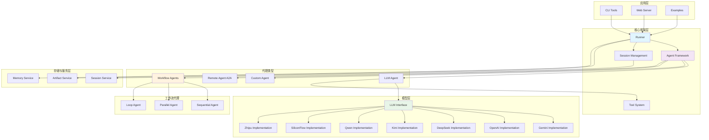
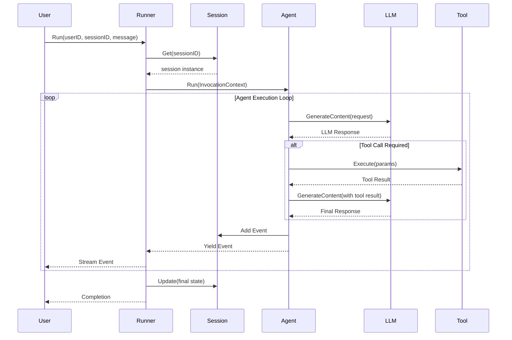
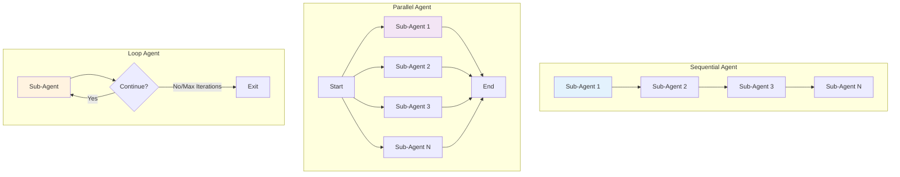
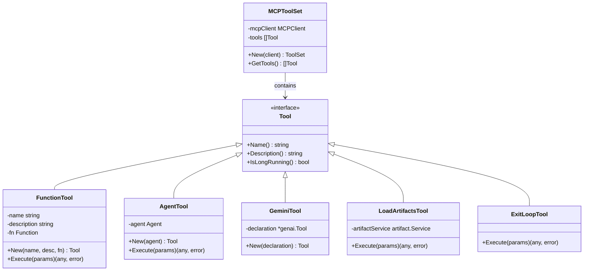
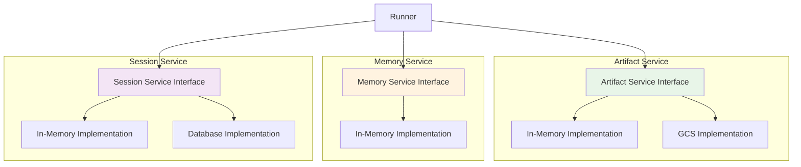
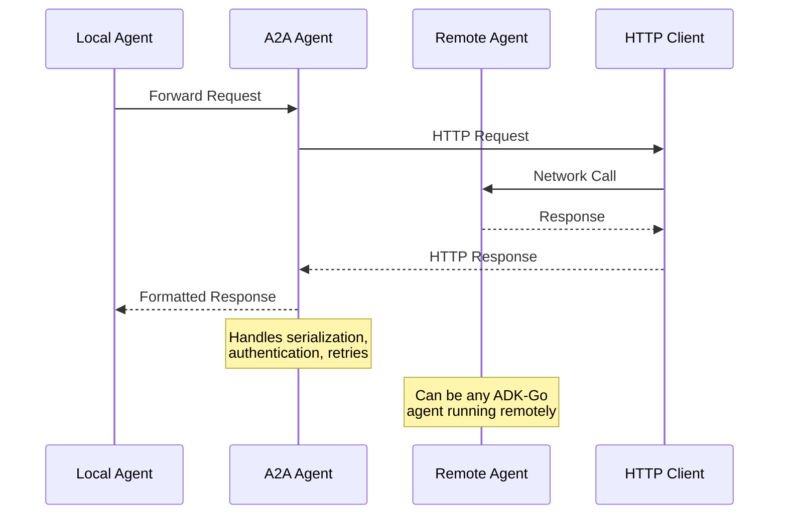
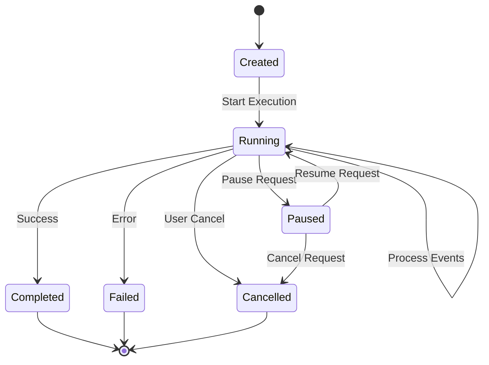
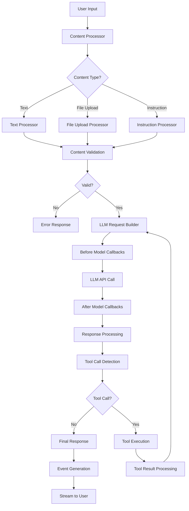

# ADK-Go 架构分析文档

## 项目概述

ADK-Go (Agent Development Kit for Go) 是 Google 开发的一个开源、代码优先的 Go 工具包，用于构建、评估和部署复杂的 AI 代理系统。该框架将软件开发原则应用于 AI 代理创建，支持从简单任务到复杂系统的代理工作流编排。

## 整体架构图



**架构图说明：**
这个整体架构图展示了 ADK-Go 的分层结构。从上到下分为应用层、核心框架层、代理类型层、存储服务层和模型层。Runner 作为核心调度器，统一管理各种代理的执行，而不同类型的代理（LLM、自定义、远程、工作流）提供了灵活的实现方式。存储服务层提供了持久化能力，模型层则抽象了与多种 LLM 的交互，包括 Gemini、OpenAI、DeepSeek、Kimi、Qwen、SiliconFlow 和 Zhipu 等。

## 核心组件类图

```mermaid
classDiagram
    class Agent {
        <<interface>>
        +Name() string
        +Description() string
        +Run(InvocationContext) Iterator
        +SubAgents() []Agent
        +internal() *agent
    }
    
    class Runner {
        -appName string
        -rootAgent Agent
        -sessionService session.Service
        -artifactService artifact.Service
        -memoryService memory.Service
        -parents parentmap.Map
        +New(Config) (*Runner, error)
        +Run(ctx, userID, sessionID, msg, cfg) Iterator
    }
    
    class Session {
        <<interface>>
        +ID() string
        +AppName() string
        +UserID() string
        +State() State
        +Events() Events
        +LastUpdateTime() time.Time
    }
    
    class InvocationContext {
        <<interface>>
        +Done() context
        +Agent() Agent
        +Session() Session
        +Artifacts() artifact.Service
        +Memory() memory.Service
        +UserContent() *genai.Content
        +RunConfig() agent.RunConfig
        +Branch() string
    }
    
    class LLMAgent {
        -beforeModelCallbacks []BeforeModelCallback
        -model model.LLM
        -afterModelCallbacks []AfterModelCallback
        -instruction string
        -tools []tool.Tool
        +New(Config) (Agent, error)
        +run(InvocationContext) Iterator
    }
    
    class Tool {
        <<interface>>
        +Name() string
        +Description() string
        +IsLongRunning() bool
    }
    
    class LLM {
        <<interface>>
        +Name() string
        +GenerateContent(ctx, req, stream) Iterator
    }
    
    class Gemini {
        -modelName string
        +New(ctx, opts) LLM
        +GenerateContent(ctx, req, stream) Iterator
    }
    
    class OpenAI {
        -modelName string
        +New(ctx, opts) LLM
        +GenerateContent(ctx, req, stream) Iterator
    }
    
    class DeepSeek {
        -modelName string
        +New(ctx, opts) LLM
        +GenerateContent(ctx, req, stream) Iterator
    }
    
    class Kimi {
        -modelName string
        +New(ctx, opts) LLM
        +GenerateContent(ctx, req, stream) Iterator
    }
    
    class Qwen {
        -modelName string
        +New(ctx, opts) LLM
        +GenerateContent(ctx, req, stream) Iterator
    }
    
    class SiliconFlow {
        -modelName string
        +New(ctx, opts) LLM
        +GenerateContent(ctx, req, stream) Iterator
    }
    
    class Zhipu {
        -modelName string
        +New(ctx, opts) LLM
        +GenerateContent(ctx, req, stream) Iterator
    }
    
    Runner --> Agent : manages
    Runner --> Session : uses
    Agent --> InvocationContext : receives
    LLMAgent --|> Agent : implements
    LLMAgent --> Tool : uses
    LLMAgent --> LLM : uses
    Session --> InvocationContext : provides context
    
    LLM <|-- Gemini : implements
    LLM <|-- OpenAI : implements
    LLM <|-- DeepSeek : implements
    LLM <|-- Kimi : implements
    LLM <|-- Qwen : implements
    LLM <|-- SiliconFlow : implements
    LLM <|-- Zhipu : implements
    
    class SequentialAgent {
        +New(Config) (Agent, error)
    }
    
    class ParallelAgent {
        +New(Config) (Agent, error)
        -run(InvocationContext) Iterator
        -runSubAgent(ctx, agent, results, done) error
    }
    
    class LoopAgent {
        -maxIterations uint
        +New(Config) (Agent, error)
        +Run(InvocationContext) Iterator
    }
    
    SequentialAgent --|> Agent : implements
    ParallelAgent --|> Agent : implements  
    LoopAgent --|> Agent : implements
```



**类图说明：**
这个类图展示了 ADK-Go 的核心接口和类之间的关系。Agent 接口是整个框架的核心抽象，定义了代理的基本行为。Runner 负责管理代理的执行生命周期，LLMAgent 是最常用的代理实现，而工作流代理（Sequential、Parallel、Loop）提供了不同的执行模式。InvocationContext 为代理执行提供了必要的上下文信息。LLM 接口定义了与大语言模型交互的标准方法，支持多种实现，包括 Gemini、OpenAI、DeepSeek、Kimi、Qwen、SiliconFlow 和 Zhipu 等。

## 代理执行时序图



**时序图说明：**
此时序图描述了一个典型的代理执行流程。用户通过 Runner 发起请求，Runner 获取或创建 Session，然后调用 Agent 执行任务。Agent 在执行过程中可能需要多次与 LLM 交互，并在必要时调用工具。整个过程采用流式处理，实时向用户返回执行状态和结果。

## 工作流代理执行模式图



**工作流代理说明：**
这个图表展示了三种工作流代理的执行模式。Sequential Agent 按顺序执行子代理，适用于有依赖关系的任务序列。Parallel Agent 并行执行所有子代理，适用于独立任务的并发处理。Loop Agent 重复执行子代理直到满足退出条件，适用于迭代式任务处理。

## 工具系统架构图



**工具系统说明：**
工具系统是 ADK-Go 的重要组成部分，提供了多种类型的工具实现。FunctionTool 封装普通函数，AgentTool 将其他代理作为工具使用，GeminiTool 集成 Gemini API，LoadArtifactsTool 管理制品存储，ExitLoopTool 提供循环退出机制，MCPToolSet 支持模型上下文协议(MCP)工具集成。

## 存储服务架构图



**存储服务说明：**
ADK-Go 采用接口设计模式，为不同的存储需求提供了可插拔的实现。Artifact Service 支持内存和 GCS 存储，用于管理代理产生的制品。Memory Service 提供内存管理功能。Session Service 支持内存和数据库两种实现，用于持久化会话状态。这种设计使得系统可以根据部署环境选择合适的存储后端。

## 远程代理通信图



**远程代理通信说明：**
A2A (Agent-to-Agent) 架构支持分布式代理系统。本地代理可以通过 A2A Agent 与远程运行的代理进行通信。A2A Agent 负责处理网络通信的复杂性，包括序列化、认证、重试等机制，使得远程代理调用对本地代理透明。

## 会话状态管理图



**会话状态管理说明：**
会话状态管理是 ADK-Go 的核心功能之一。会话从创建开始，经过运行状态，最终到达完成、失败或取消状态。运行过程中支持暂停和恢复操作，为长时间运行的任务提供了灵活的控制机制。

## LLM 内容处理流程图



**LLM 内容处理流程说明：**
这个流程图展示了 LLM Agent 处理用户输入的完整过程。从输入内容的类型识别和处理开始，经过验证后构建 LLM 请求。在调用 LLM API 前后支持回调机制，响应处理后检测是否需要工具调用。如果需要工具调用，则执行工具并将结果反馈给 LLM，形成一个完整的对话循环。

## 核心接口定义

### Agent 接口
```go
type Agent interface {
    Name() string
    Description() string  
    Run(InvocationContext) Iterator[*Event]
    SubAgents() []Agent
    internal() *agent
}
```

### Runner 核心方法
```go
func (r *Runner) Run(
    ctx context.Context,
    userID string,
    sessionID string, 
    msg string,
    cfg *agent.RunConfig
) Iterator[*Event]
```

### Tool 接口
```go
type Tool interface {
    Name() string
    Description() string
    IsLongRunning() bool
}
```

## 关键特性

### 1. 代码优先的设计
- 使用 Go 语言的强类型系统
- 编译时错误检查
- 清晰的接口定义和实现

### 2. 流式处理
- 基于 Iterator 模式的事件流
- 实时响应用户交互
- 支持长时间运行的任务

### 3. 可扩展的工具系统
- 插件化的工具架构
- 支持自定义工具开发
- 内置常用工具实现

### 4. 分布式代理支持
- A2A (Agent-to-Agent) 通信
- 远程代理调用
- 负载均衡和容错机制

### 5. 多种存储后端
- 可插拔的存储接口
- 内存、文件系统、云存储支持
- 会话状态持久化

## 使用场景

1. **简单任务代理**: 使用 LLMAgent 处理单一任务
2. **复杂工作流**: 使用工作流代理编排多个子任务
3. **分布式系统**: 使用 A2A 代理实现分布式处理
4. **Web 应用**: 通过 Web 服务器提供代理服务
5. **命令行工具**: 通过 CLI 进行代理交互

## 总结

ADK-Go 是一个功能强大、设计优雅的 AI 代理开发框架。其分层架构、接口抽象、流式处理和可扩展性使其能够满足从简单到复杂的各种 AI 代理应用需求。框架的模块化设计和丰富的工具生态系统为开发者提供了极大的灵活性和生产力。