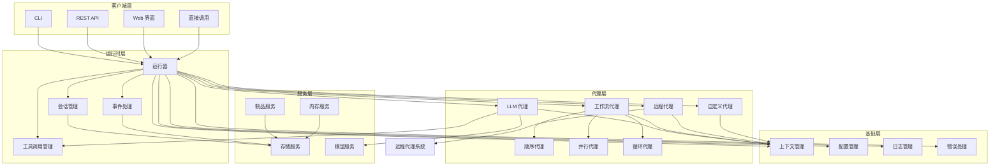
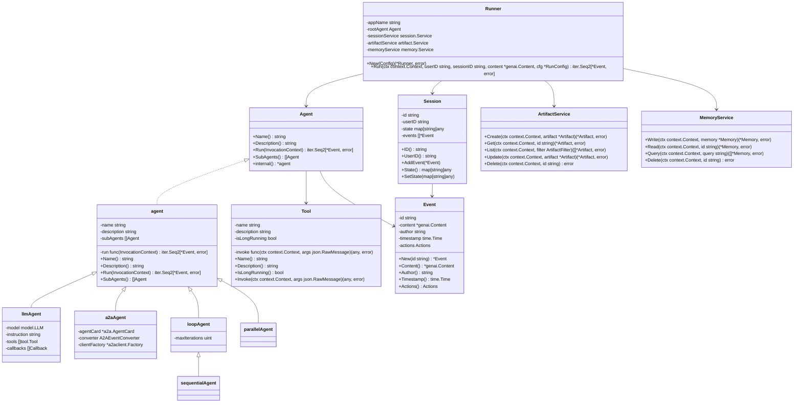
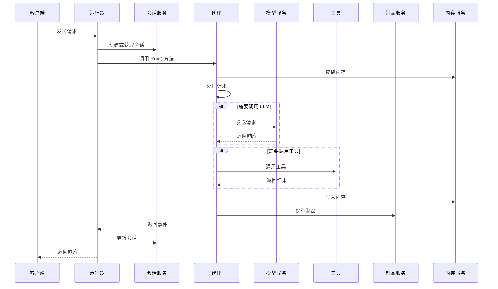
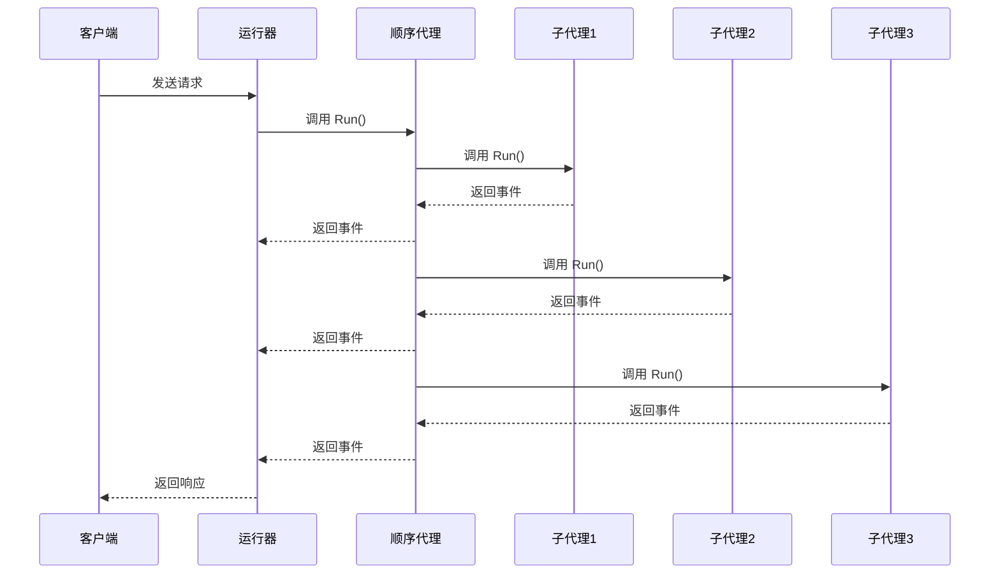
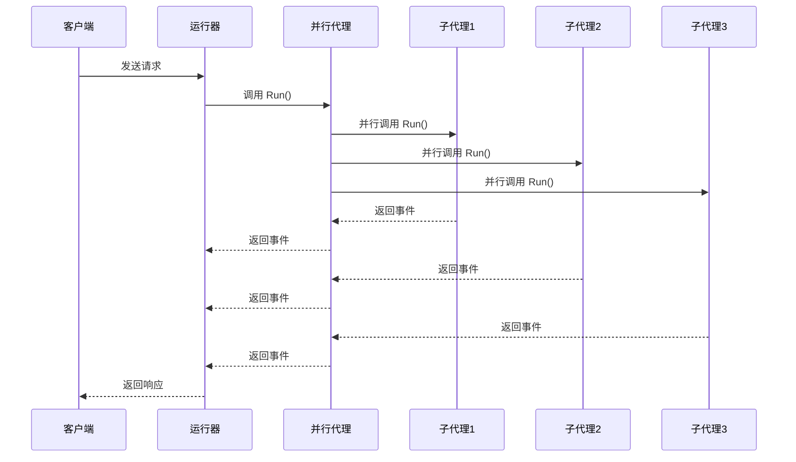
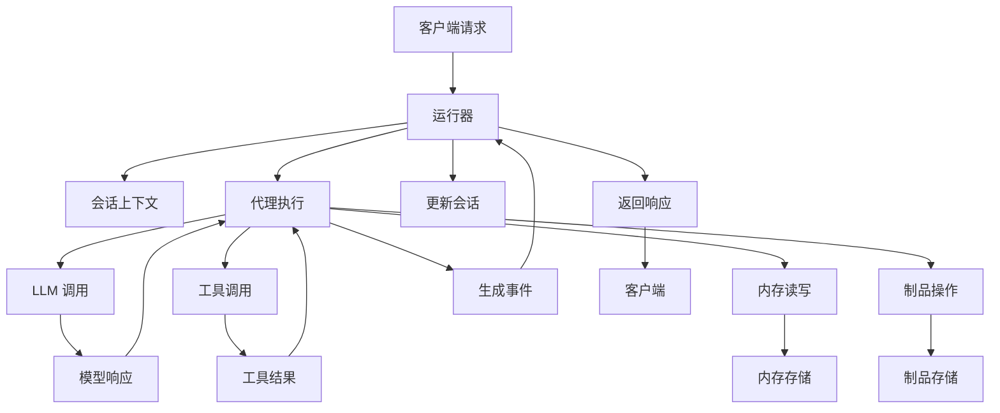
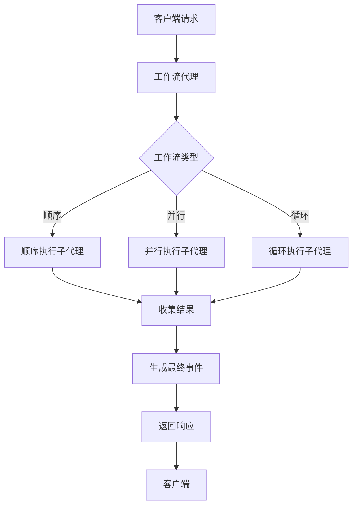
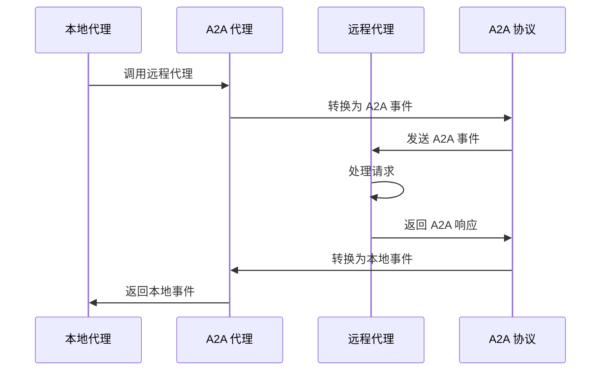
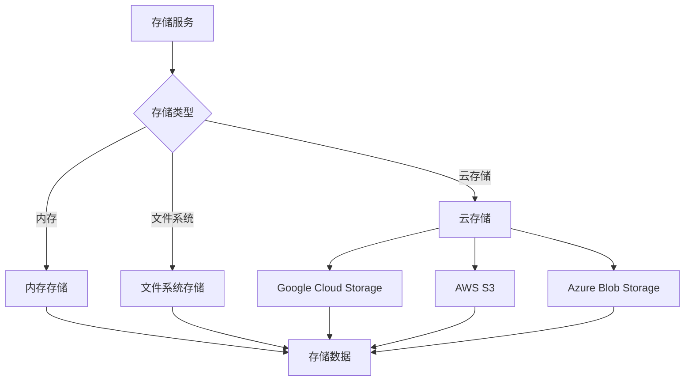

# ADK-Go 架构设计文档

## 1. 项目概述

ADK-Go (Agent Development Kit for Go) 是 Google 开发的一个开源、代码优先的 Go 工具包，用于构建、评估和部署复杂的 AI 代理系统。该框架将软件开发原则应用于 AI 代理创建，支持从简单任务到复杂系统的代理工作流编排。

## 2. 整体架构概述

ADK-Go 采用分层架构设计，各层之间职责明确，通过接口进行通信，实现了高内聚、低耦合的设计目标。框架的核心思想是将代理系统分解为多个独立的组件，每个组件负责特定的功能，通过组合和协作实现复杂的代理系统。

### 2.1 分层设计

ADK-Go 框架分为以下几层：

* **客户端层**：提供与外部系统交互的接口，包括 CLI、REST API、Web 界面等

* **运行时层**：负责代理的运行和管理，包括会话管理、事件处理、工具调用等

* **代理层**：包含各种类型的代理实现，如 LLM 代理、工作流代理、远程代理等

* **服务层**：提供各种服务支持，如制品服务、内存服务、存储服务等

* **基础层**：包含框架的基础组件，如上下文管理、配置管理、日志管理等

### 2.2 整体架构图



## 3. 核心组件设计

### 3.1 核心组件类图



### 3.2 核心组件交互

#### 3.2.1 代理执行时序图



#### 3.2.2 工作流代理执行模式

##### 顺序代理



##### 并行代理



##### 循环代理

```mermaid
sequenceDiagram
    participant Client as 客户端
    participant Runner as 运行器
    participant Loop as 循环代理
    participant Agent as 子代理
    participant Session as 会话服务

    Client->>Runner: 发送请求
    Runner->>Loop: 调用 Run()
    Loop->>Session: 获取迭代计数
    loop 直到达到最大迭代次数
        Loop->>Agent: 调用 Run()
        Agent-->>Loop: 返回事件
        Loop-->>Runner: 返回事件
        Loop->>Session: 更新迭代计数
    end
    Runner-->>Client: 返回响应
```

## 4. 数据流分析

### 4.1 代理执行数据流



### 4.2 工作流代理数据流



## 5. 扩展性设计

ADK-Go 框架设计了良好的扩展性机制，允许开发者扩展和定制框架的各个方面。

### 5.1 代理扩展

开发者可以通过实现 `Agent` 接口来创建自定义代理：

```go
// 创建自定义代理
myAgent, err := agent.New(agent.Config{
    Name:        "my-agent",
    Description: "A simple custom agent",
    Run: func(ctx agent.InvocationContext) iter.Seq2[*session.Event, error] {
        return func(yield func(*session.Event, error) bool) {
            event := session.NewEvent(ctx.InvocationID())
            event.Content = genai.NewContentFromText("Hello from custom agent!")
            event.Author = ctx.Agent().Name()
            yield(event, nil)
        }
    },
})
```

### 5.2 工具扩展

开发者可以通过实现 `Tool` 接口来创建自定义工具：

```go
// 创建自定义工具
myTool := tool.NewTool(tool.ToolConfig{
    Name:        "my-tool",
    Description: "A simple custom tool",
    IsLongRunning: false,
    Invoke: func(ctx context.Context, args json.RawMessage) (any, error) {
        // 工具实现
        return "Tool result", nil
    },
})
```

### 5.3 服务扩展

ADK-Go 支持替换或扩展各种服务，如制品服务、内存服务、存储服务等。开发者可以通过实现相应的接口来创建自定义服务：

```go
// 自定义制品服务
myArtifactService := &MyArtifactService{}
// 设置自定义制品服务
runner.Config.ArtifactService = myArtifactService
```

### 5.4 模型扩展

ADK-Go 支持与各种 LLM 模型集成，开发者可以通过实现 `model.LLM` 接口来支持新的模型：

```go
// 自定义模型服务
myModel := &MyModel{}
// 使用自定义模型创建 LLM 代理
llmAgent, err := llmagent.New(llmagent.Config{
    Name:    "my-llm-agent",
    Model:   myModel,
    Instruction: "You are a helpful assistant.",
})
```

## 6. 关键特性实现

### 6.1 代码优先的设计

ADK-Go 采用代码优先的设计理念，所有的代理、工具和工作流都通过代码来定义，而不是通过配置文件。这种设计的优势：

* 利用 Go 语言的强类型系统，提供编译时错误检查

* 支持复杂的逻辑和条件判断

* 便于版本控制和代码审查

* 支持单元测试和集成测试

### 6.2 流式处理

ADK-Go 使用 Go 1.23 引入的迭代器模式（iter.Seq2）来处理事件流，实现了流式响应：

```go
// 代理 Run 方法返回迭代器
func (a *llmAgent) Run(ctx agent.InvocationContext) iter.Seq2[*session.Event, error] {
    return func(yield func(*session.Event, error) bool) {
        // 生成事件
        for {
            event := session.NewEvent(ctx.InvocationID())
            // 设置事件内容
            if !yield(event, nil) {
                return
            }
        }
    }
}
```

### 6.3 分布式代理支持

ADK-Go 支持 A2A（Agent-to-Agent）协议，允许代理与远程代理通信：



### 6.4 多种存储后端

ADK-Go 支持多种存储后端，包括内存存储、文件系统存储和云存储：



## 7. 性能优化

### 7.1 并行处理

ADK-Go 使用 Go 语言的并发特性，支持并行执行多个代理和工具调用：

```go
// 并行代理使用 errgroup 实现并行执行
func (a *parallelAgent) Run(ctx agent.InvocationContext) iter.Seq2[*session.Event, error] {
    var (
        errGroup, errGroupCtx = errgroup.WithContext(ctx)
        resultsChan           = make(chan result)
    )

    for _, sa := range ctx.Agent().SubAgents() {
        subAgent := sa
        errGroup.Go(func() error {
            // 并行执行子代理
            // ...
        })
    }

    // ...
}
```

### 7.2 延迟加载

ADK-Go 采用延迟加载机制，只有在需要时才会加载和初始化组件：

```go
// 懒加载 LLM 客户端
func (m *geminiModel) getClient() (*genai.Client, error) {
    if m.client == nil {
        // 初始化客户端
        // ...
    }
    return m.client, nil
}
```

### 7.3 资源池管理

ADK-Go 实现了资源池管理，优化资源使用：

```go
// 模型客户端池
type ModelClientPool struct {
    pool sync.Pool
}

func (p *ModelClientPool) Get() *genai.Client {
    client := p.pool.Get()
    if client == nil {
        // 创建新客户端
        // ...
    }
    return client.(*genai.Client)
}

func (p *ModelClientPool) Put(client *genai.Client) {
    p.pool.Put(client)
}
```

## 8. 安全设计

### 8.1 认证和授权

ADK-Go 支持多种认证和授权机制：

* API 密钥认证

* OAuth 2.0 认证

* 基于角色的访问控制（RBAC）

* 会话级别的权限控制

### 8.2 数据加密

ADK-Go 支持数据加密，包括：

* 传输加密（TLS/SSL）

* 存储加密

* 敏感数据加密

### 8.3 安全审计

ADK-Go 提供安全审计功能，记录所有重要操作：

* 代理调用记录

* 工具调用记录

* 会话访问记录

* 配置变更记录

## 9. 容错和恢复

### 9.1 错误处理

ADK-Go 实现了全面的错误处理机制：

```go
// 代理执行错误处理
func (a *llmAgent) Run(ctx agent.InvocationContext) iter.Seq2[*session.Event, error] {
    return func(yield func(*session.Event, error) bool) {
        defer func() {
            if r := recover(); r != nil {
                // 处理 panic
                event := session.NewEvent(ctx.InvocationID())
                event.Content = genai.NewContentFromText(fmt.Sprintf("Error: %v", r))
                event.Author = ctx.Agent().Name()
                yield(event, fmt.Errorf("panic: %v", r))
            }
        }()
        // 正常执行
        // ...
    }
}
```

### 9.2 重试机制

ADK-Go 支持自动重试机制，特别是对于网络请求和外部服务调用：

```go
// 带重试的工具调用
func (t *httpTool) Invoke(ctx context.Context, args json.RawMessage) (any, error) {
    var (n = 3) // 重试次数
    var lastErr error
    for i := 0; i < n; i++ {
        result, err := t.invoke(ctx, args)
        if err == nil {
            return result, nil
        }
        lastErr = err
        // 等待后重试
        time.Sleep(time.Duration(i+1) * time.Second)
    }
    return nil, lastErr
}
```

### 9.3 状态恢复

ADK-Go 支持会话状态的持久化和恢复，确保代理在重启后能够恢复到之前的状态：

```go
// 会话状态恢复
func (s *sessionService) Get(ctx context.Context, sessionID string) (session.Session, error) {
    // 从存储中获取会话状态
    sessionData, err := s.storage.Get(ctx, sessionID)
    if err != nil {
        return nil, err
    }
    // 恢复会话状态
    // ...
    return recoveredSession, nil
}
```

## 10. 架构设计总结

ADK-Go 是一个功能强大、设计优雅的 AI 代理开发框架，其架构设计具有以下特点：

* **分层设计**：清晰的分层结构，各层职责明确，便于扩展和维护

* **模块化设计**：核心组件之间通过接口通信，实现了高内聚、低耦合

* **代码优先**：使用 Go 语言的强类型系统，支持编译时错误检查和版本控制

* **流式处理**：使用迭代器模式实现流式响应，适合实时交互场景

* **分布式支持**：支持 A2A 协议，允许代理与远程代理通信

* **多种存储后端**：支持内存、文件系统和云存储，适应不同的部署环境

* **高性能**：利用 Go 语言的并发特性，支持并行处理和延迟加载

* **安全可靠**：支持认证授权、数据加密和安全审计

* **容错恢复**：实现了全面的错误处理、重试机制和状态恢复

ADK-Go 的架构设计使其能够满足从简单到复杂的各种 AI 代理应用需求，为开发者提供了极大的灵活性和生产力。

## 11. 未来架构演进

### 11.1 服务网格集成

未来版本将支持与服务网格（如 Istio、Linkerd）集成，实现更高级的流量管理、监控和安全功能。

### 11.2 事件驱动架构

增强事件驱动架构的支持，允许代理通过事件总线进行通信和协作。

### 11.3 自适应代理

支持自适应代理，能够根据运行时环境和工作负载自动调整配置和行为。

### 11.4 多模型支持

增强多模型支持，允许代理同时使用多个 LLM 模型，实现更复杂的任务处理。

### 11.5 可视化工作流设计

提供可视化工作流设计工具，允许开发者通过图形界面设计和配置工作流代理。
