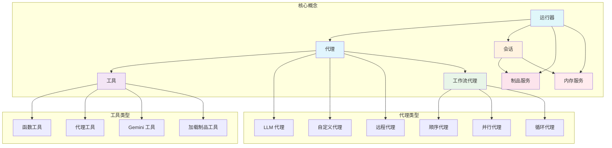
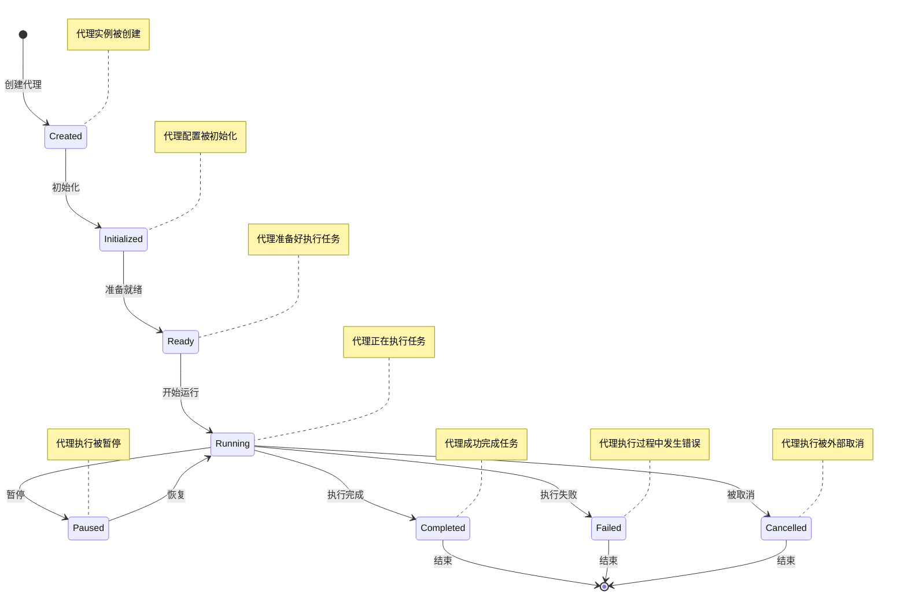

# ADK-Go 核心概念详解

## 1. 概述

ADK-Go 框架基于一系列核心概念构建，这些概念构成了框架的基础。理解这些核心概念对于使用和扩展 ADK-Go 至关重要。本文档将深入解释这些核心概念，帮助您建立清晰的认知模型。

## 2. 代理（Agent）

### 2.1 什么是代理

代理（Agent）是 ADK-Go 框架的核心概念，代表一个能够执行特定任务的实体。代理可以接收输入，处理信息，并生成输出。在 ADK-Go 中，代理通常与 LLM（大语言模型）集成，能够理解自然语言并执行相应的操作。

### 2.2 代理类型

ADK-Go 支持多种类型的代理，每种代理适用于不同的场景：

- **LLM 代理**：基于大语言模型的代理，能够理解和生成自然语言
- **自定义代理**：开发者可以根据需要实现自定义代理
- **远程代理（A2A）**：能够与远程代理通信的代理
- **工作流代理**：用于编排多个子代理的代理

### 2.3 代理接口

所有代理都实现了 `Agent` 接口，该接口定义了代理的基本行为：

```go
type Agent interface {
    Name() string              // 返回代理名称
    Description() string       // 返回代理描述
    Run(InvocationContext) Iterator[*Event]  // 运行代理
    SubAgents() []Agent        // 返回子代理列表
    internal() *agent          // 返回内部代理实现
}
```

## 3. 工具（Tool）

### 3.1 什么是工具

工具（Tool）是代理可以使用的功能模块，用于执行特定的操作。工具扩展了代理的能力，使其能够与外部系统交互、执行计算或访问资源。

### 3.2 工具类型

ADK-Go 提供了多种类型的工具：

- **函数工具**：封装普通函数，允许代理调用
- **代理工具**：将其他代理作为工具使用
- **Gemini 工具**：集成 Gemini API 工具
- **加载制品工具**：用于加载制品
- **退出循环工具**：用于退出循环

### 3.3 工具接口

所有工具都实现了 `Tool` 接口：

```go
type Tool interface {
    Name() string              // 返回工具名称
    Description() string       // 返回工具描述
    IsLongRunning() bool       // 判断是否为长期运行的工具
}
```

## 4. 会话（Session）

### 4.1 什么是会话

会话（Session）代表代理与用户之间的一次交互会话。会话管理了交互的状态、历史记录和上下文信息，允许代理在多次交互之间保持状态。

### 4.2 会话状态

会话具有多种状态，包括：

- **创建（Created）**：会话已创建但尚未开始
- **运行（Running）**：会话正在执行中
- **暂停（Paused）**：会话已暂停
- **完成（Completed）**：会话成功完成
- **失败（Failed）**：会话执行失败
- **取消（Cancelled）**：会话被取消

### 4.3 会话接口

会话实现了 `Session` 接口：

```go
type Session interface {
    ID() string              // 返回会话ID
    AppName() string         // 返回应用名称
    UserID() string          // 返回用户ID
    State() State            // 返回会话状态
    Events() Events          // 返回会话事件
    LastUpdateTime() time.Time // 返回最后更新时间
}
```

## 5. 工作流代理（Workflow Agents）

### 5.1 什么是工作流代理

工作流代理（Workflow Agents）是一种特殊类型的代理，用于编排多个子代理的执行。工作流代理允许开发者定义复杂的执行流程，包括顺序执行、并行执行和循环执行。

### 5.2 工作流代理类型

ADK-Go 支持三种主要的工作流代理类型：

#### 5.2.1 顺序代理（Sequential Agent）

顺序代理按顺序执行子代理，前一个代理的输出作为后一个代理的输入。适用于有依赖关系的任务序列。

#### 5.2.2 并行代理（Parallel Agent）

并行代理同时执行所有子代理，适用于独立任务的并发处理。

#### 5.2.3 循环代理（Loop Agent）

循环代理重复执行子代理，直到满足退出条件或达到最大迭代次数。适用于需要迭代处理的任务。

## 6. 制品服务（Artifact Service）

### 6.1 什么是制品服务

制品服务（Artifact Service）用于管理代理生成和使用的制品（Artifact）。制品可以是文件、数据或其他类型的资源，制品服务提供了存储、检索和管理这些制品的能力。

### 6.2 制品服务实现

ADK-Go 提供了多种制品服务实现：

- **内存实现**：将制品存储在内存中，适用于测试和开发
- **GCS 实现**：将制品存储在 Google Cloud Storage 中，适用于生产环境

### 6.3 制品服务接口

制品服务实现了 `artifact.Service` 接口：

```go
type Service interface {
    Get(ctx context.Context, appName, sessionID, key string) ([]byte, error)
    Put(ctx context.Context, appName, sessionID, key string, value []byte) error
    List(ctx context.Context, appName, sessionID string) ([]string, error)
    Delete(ctx context.Context, appName, sessionID, key string) error
}
```

## 7. 内存服务（Memory Service）

### 7.1 什么是内存服务

内存服务（Memory Service）用于管理代理的内存，包括短期记忆和长期记忆。内存服务允许代理在多次交互之间保持状态和上下文信息。

### 7.2 内存服务实现

ADK-Go 目前提供了内存实现，将内存存储在内存中。

### 7.3 内存服务接口

内存服务实现了 `memory.Service` 接口：

```go
type Service interface {
    Get(ctx context.Context, appName, sessionID, key string) (string, error)
    Put(ctx context.Context, appName, sessionID, key, value string) error
    List(ctx context.Context, appName, sessionID string) ([]string, error)
    Delete(ctx context.Context, appName, sessionID, key string) error
}
```

## 8. 核心概念关系图



**核心概念关系图说明**：

这张图展示了 ADK-Go 核心概念之间的关系。运行器（Runner）是核心组件，负责管理代理、会话、制品服务和内存服务。代理是执行任务的实体，支持多种类型，包括 LLM 代理、自定义代理、远程代理和工作流代理。工具扩展了代理的能力，支持多种类型。会话管理交互状态和上下文，依赖于制品服务和内存服务。

## 9. 代理生命周期图



**代理生命周期图说明**：

这张图展示了代理的完整生命周期。代理从创建开始，经过初始化和准备就绪阶段，然后进入运行状态。在运行过程中，代理可以被暂停和恢复，最终可能以完成、失败或取消状态结束。

## 10. 核心概念总结

| 概念 | 描述 | 主要功能 |
|------|------|----------|
| 代理（Agent） | 执行特定任务的实体 | 接收输入，处理信息，生成输出 |
| 工具（Tool） | 代理可以使用的功能模块 | 扩展代理能力，执行特定操作 |
| 会话（Session） | 代理与用户的一次交互会话 | 管理交互状态、历史记录和上下文 |
| 工作流代理（Workflow Agents） | 编排多个子代理的执行 | 定义复杂的执行流程 |
| 制品服务（Artifact Service） | 管理代理生成和使用的制品 | 存储、检索和管理制品 |
| 内存服务（Memory Service） | 管理代理的内存 | 保存短期和长期记忆 |
| 运行器（Runner） | 代理的运行和管理器 | 负责代理的生命周期管理 |

## 11. 下一步

现在您已经了解了 ADK-Go 的核心概念，接下来可以：

1. 阅读 [ADK-Go 架构设计文档](ADK-Go架构分析文档.md)，了解框架的架构设计
2. 阅读 [ADK-Go 开发指南](ADK-Go开发指南.md)，学习如何开发代理应用
3. 查看 [ADK-Go 示例库详解](ADK-Go示例库详解.md)，了解各种使用场景

通过深入理解这些核心概念，您将能够更好地使用和扩展 ADK-Go 框架，开发出强大的 AI 代理应用。