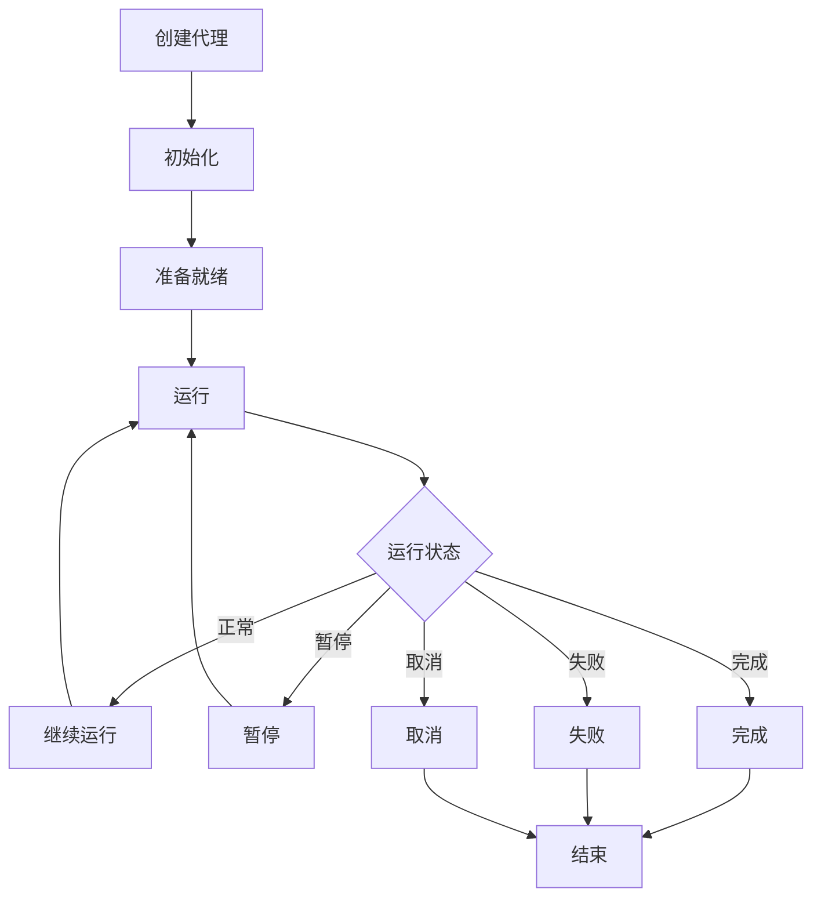
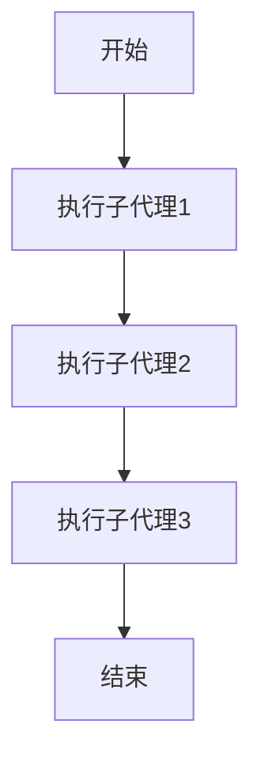
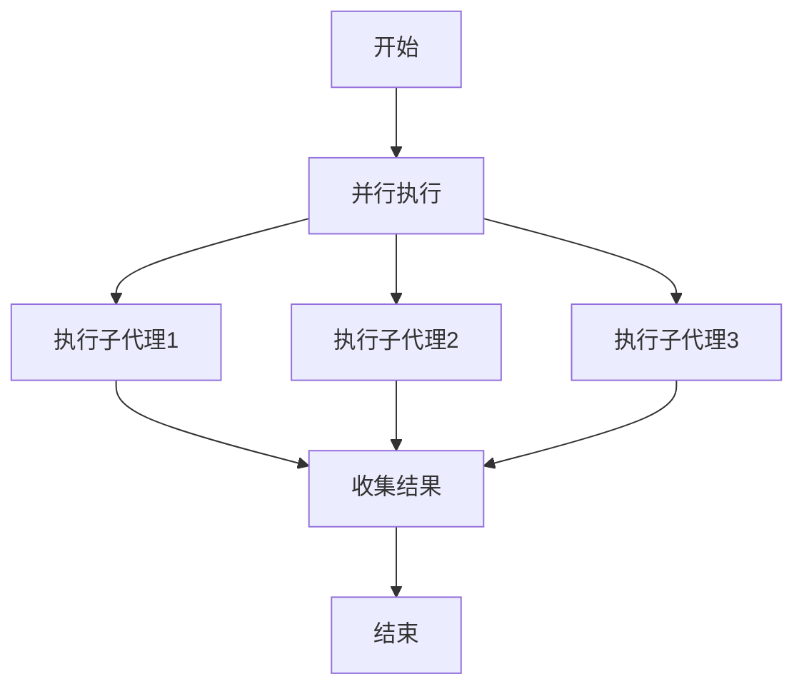
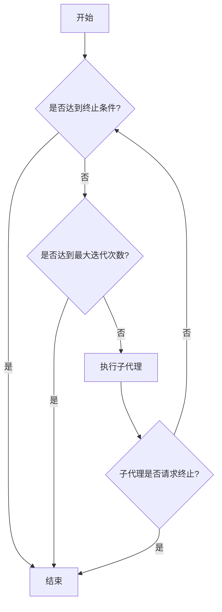
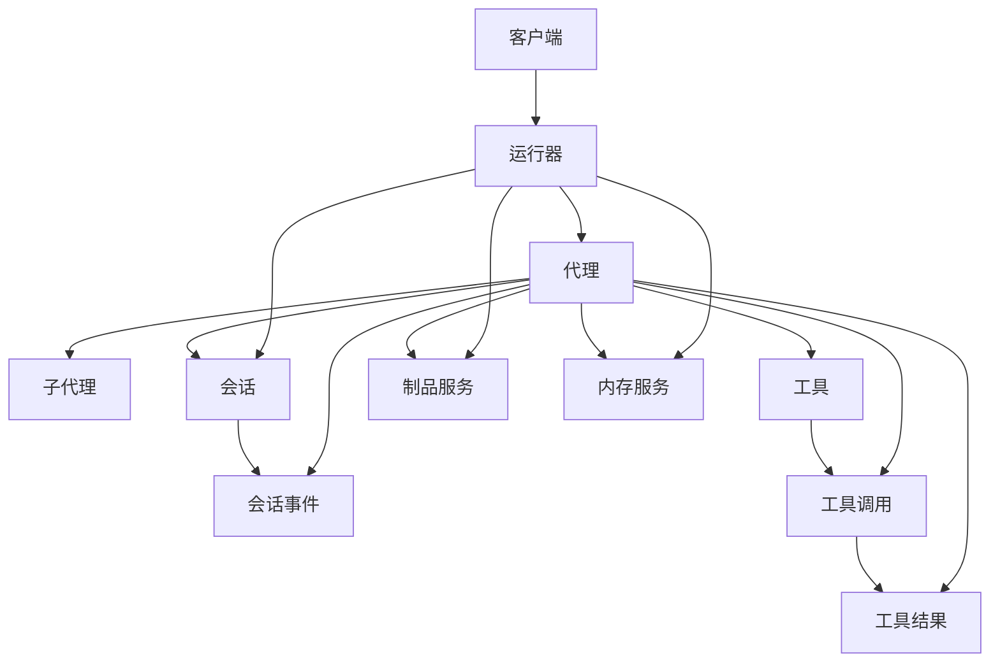
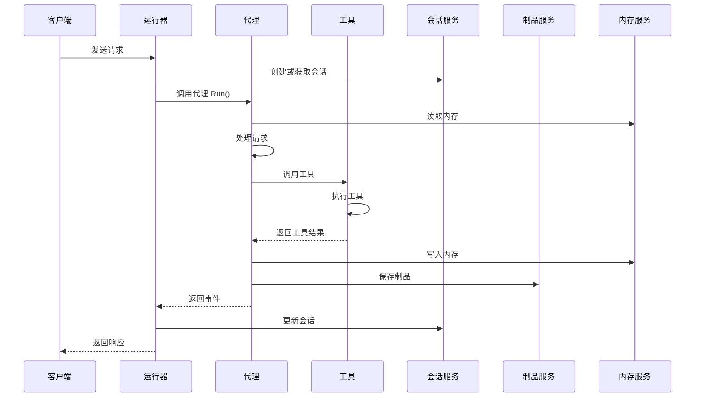

# ADK-Go 核心概念详解

## 1. 概述

ADK-Go 框架基于一系列核心概念构建，这些概念构成了框架的基础。理解这些核心概念对于使用和扩展 ADK-Go 至关重要。本文档将深入解释这些核心概念，帮助您建立清晰的认知模型。

## 2. 代理（Agent）

### 2.1 什么是代理

代理（Agent）是 ADK-Go 框架的核心概念，代表一个能够执行特定任务的实体。代理可以接收输入，处理信息，并生成输出。在 ADK-Go 中，代理通常与 LLM（大语言模型）集成，能够理解自然语言并执行相应的操作。

### 2.2 代理类型

ADK-Go 支持多种类型的代理，每种代理适用于不同的场景：

* **LLM 代理**：基于大语言模型的代理，能够理解和生成自然语言

* **自定义代理**：开发者可以根据需要实现自定义代理

* **远程代理（A2A）**：能够与远程代理通信的代理

* **工作流代理**：用于编排多个子代理的执行

  * **顺序代理**：按顺序执行子代理
  * **并行代理**：并行执行子代理
  * **循环代理**：循环执行子代理

### 2.3 代理接口

所有代理都实现了 `Agent` 接口，该接口定义了代理的基本行为：

```go
type Agent interface {
    Name() string              // 返回代理名称
    Description() string       // 返回代理描述
    Run(InvocationContext) iter.Seq2[*Event, error]  // 运行代理
    SubAgents() []Agent        // 返回子代理列表
    internal() *agent          // 返回内部代理实现
}
```

### 2.4 代理生命周期

代理从创建开始，经过初始化和准备就绪阶段，然后进入运行状态。在运行过程中，代理可以被暂停和恢复，最终可能以完成、失败或取消状态结束。



## 3. 工具（Tool）

### 3.1 什么是工具

工具（Tool）是代理可以使用的功能模块，用于扩展代理的能力，执行特定的操作。工具可以是简单的函数调用，也可以是复杂的服务集成。

### 3.2 工具类型

ADK-Go 支持多种类型的工具：

* **内置工具**：框架提供的常用工具，如文件操作、HTTP 请求、计算器等

* **自定义工具**：开发者可以根据需要实现自定义工具

* **第三方工具**：集成外部服务的工具，如数据库访问、云服务调用等

### 3.3 工具接口

工具实现了 `Tool` 接口，该接口定义了工具的基本行为：

```go
type Tool interface {
    Name() string              // 返回工具名称
    Description() string       // 返回工具描述
    IsLongRunning() bool       // 是否为长时间运行的工具
    Invoke(ctx context.Context, args json.RawMessage) (any, error)  // 调用工具
}
```

### 3.4 工具调用流程

代理调用工具的流程如下：

1. 代理根据用户请求决定调用哪个工具

2. 代理准备工具调用参数

3. 代理调用工具的 `Invoke` 方法

4. 工具执行并返回结果

5. 代理处理工具返回结果

6. 代理生成最终响应

## 4. 会话（Session）

### 4.1 什么是会话

会话（Session）是代理与用户的一次交互会话，用于管理交互状态、历史记录和上下文。会话允许代理在多次交互中保持状态，提供更连贯的用户体验。

### 4.2 会话管理

ADK-Go 提供了会话管理服务，用于：

* 会话创建和销毁

* 会话状态保存和恢复

* 会话历史记录管理

* 会话上下文传递

### 4.3 会话事件

会话事件是代理执行过程中产生的事件，用于传递信息和状态。会话事件包含以下信息：

* 事件类型（如消息、工具调用、状态更新等）

* 内容（文本、图片、文件等）

* 作者（用户或代理）

* 时间戳

* 元数据

## 5. 工作流代理（Workflow Agents）

### 5.1 什么是工作流代理

工作流代理（Workflow Agents）是用于编排多个子代理执行的代理类型。工作流代理定义了子代理的执行顺序、条件和方式，用于构建复杂的执行流程。

### 5.2 工作流代理类型

ADK-Go 支持三种主要的工作流代理类型：

#### 5.2.1 顺序代理（Sequential Agent）

顺序代理按顺序执行其子代理，每个子代理执行一次，执行顺序严格按照子代理列表的顺序。



#### 5.2.2 并行代理（Parallel Agent）

并行代理同时执行其子代理，每个子代理在独立的上下文中运行。并行代理适用于需要多个视角或多次尝试同一任务的场景。



#### 5.2.3 循环代理（Loop Agent）

循环代理重复执行其子代理，直到满足终止条件或达到最大迭代次数。循环代理适用于需要重复或迭代优化的场景，如代码修改。



### 5.3 工作流设计模式

工作流代理支持多种设计模式：

* **管道模式**：数据通过一系列代理依次处理

* **分支模式**：根据条件选择不同的执行路径

* **聚合模式**：收集多个代理的结果并进行汇总

* **递归模式**：代理递归调用自身

* **混合模式**：结合多种模式构建复杂的工作流

## 6. 制品（Artifact）服务

### 6.1 什么是制品

制品（Artifact）是代理生成或使用的文件、数据或其他资源。制品服务用于管理代理生成和使用的制品，提供存储、检索和管理功能。

### 6.2 制品类型

ADK-Go 支持多种类型的制品：

* **文本文件**：如代码、文档、配置文件等

* **数据文件**：如 JSON、CSV、XML 等格式的数据

* **二进制文件**：如图像、音频、视频等

* **模型文件**：如训练好的机器学习模型

### 6.3 制品服务功能

制品服务提供以下功能：

* 制品创建和上传

* 制品检索和下载

* 制品版本管理

* 制品元数据管理

* 制品访问控制

## 7. 内存（Memory）服务

### 7.1 什么是内存服务

内存（Memory）服务用于管理代理的内存，保存短期和长期记忆。内存服务允许代理在多次交互中保持状态，提供更智能的响应。

### 7.2 内存类型

ADK-Go 支持多种类型的内存：

* **短期记忆**：保存当前会话的上下文和状态

* **长期记忆**：保存跨会话的知识和经验

* **结构化记忆**：以结构化方式保存信息，如知识库、数据库等

* **非结构化记忆**：以非结构化方式保存信息，如文本、图像等

### 7.3 内存服务功能

内存服务提供以下功能：

* 内存写入和读取

* 内存检索和查询

* 内存更新和删除

* 内存老化和清理

* 内存持久化

## 8. 运行器（Runner）

### 8.1 什么是运行器

运行器（Runner）是代理的运行和管理器，负责代理的生命周期管理、会话管理、事件处理等。运行器是连接客户端和代理的桥梁，处理客户端请求并将结果返回给客户端。

### 8.2 运行器功能

运行器提供以下功能：

* 代理生命周期管理（创建、运行、暂停、恢复、销毁）

* 会话管理（创建、保存、恢复、销毁）

* 事件处理（生成、传递、处理）

* 工具调用管理

* 错误处理和恢复

* 日志和监控

## 9. 核心概念关系图



## 10. 代理执行时序图



## 11. 核心概念总结

| 概念 | 描述 | 主要功能 |
|------|------|----------|
| 代理（Agent） | 执行特定任务的实体 | 接收输入，处理信息，生成输出 |
| 工具（Tool） | 代理可以使用的功能模块 | 扩展代理能力，执行特定操作 |
| 会话（Session） | 代理与用户的一次交互会话 | 管理交互状态、历史记录和上下文 |
| 工作流代理（Workflow Agents） | 编排多个子代理的执行 | 定义复杂的执行流程 |
| 制品服务（Artifact Service） | 管理代理生成和使用的制品 | 存储、检索和管理制品 |
| 内存服务（Memory Service） | 管理代理的内存 | 保存短期和长期记忆 |
| 运行器（Runner） | 代理的运行和管理器 | 负责代理的生命周期管理 |

## 12. 下一步

现在您已经了解了 ADK-Go 的核心概念，接下来可以：

1. 阅读 [ADK-Go 架构设计文档](ADK-Go架构设计文档.md)，了解框架的架构设计

2. 阅读 [ADK-Go 开发指南](ADK-Go开发指南.md)，学习如何开发代理应用

3. 查看 [ADK-Go 示例库详解](ADK-Go示例库详解.md)，了解各种使用场景

通过深入理解这些核心概念，您将能够更好地使用和扩展 ADK-Go 框架，开发出强大的 AI 代理应用。
