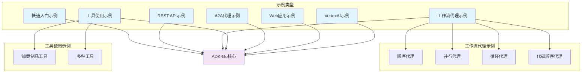

# ADK-Go 示例库详解

## 1. 概述

ADK-Go 提供了丰富的示例，展示了框架的各种功能和使用场景。本文档将详细解析这些示例，帮助开发者理解不同使用场景的实现方式和最佳实践。

## 2. 快速入门示例 (quickstart)

### 2.1 示例概述

快速入门示例是一个简单的 LLM 代理应用，展示了 ADK-Go 的基本功能，是学习 ADK-Go 的起点。

### 2.2 代码结构

```bash
examples/quickstart/
└── main.go  # 主程序文件
```

### 2.3 核心代码解析

```go
// 创建 Gemini 模型
model, err := gemini.New(ctx, gemini.WithModel("gemini-1.5-flash"))
if err != nil {
    log.Fatalf("failed to create model: %v", err)
}

// 创建 LLM 代理
llmAgent, err := llmagent.New(
    llmagent.WithModel(model),
    llmagent.WithInstruction("You are a helpful assistant."),
)
if err != nil {
    log.Fatalf("failed to create agent: %v", err)
}
```

### 2.4 运行方式

```bash
export GOOGLE_API_KEY="your-api-key"
go run ./examples/quickstart/main.go console
```

### 2.5 关键功能

- 基本 LLM 代理创建
- Gemini 模型集成
- 多种运行模式支持（console、webui、restapi、a2a）

## 3. REST API 示例 (rest)

### 3.1 示例概述

REST API 示例展示了如何使用 ADK-Go 创建一个基于 REST API 的代理服务，允许客户端通过 HTTP 请求与代理交互。

### 3.2 代码结构

```bash
examples/rest/
└── main.go  # 主程序文件
```

### 3.3 核心代码解析

```go
// 创建代理配置
config := full.NewEmptyConfig()
config.Agent = llmAgent

// 创建 REST API 启动器
l := full.NewLauncher()

// 解析并运行
if err := l.ParseAndRun(ctx, config, []string{"restapi"}, universal.ErrorOnUnparsedArgs); err != nil {
    log.Fatalf("run failed: %v\n\n%s", err, l.FormatSyntax())
}
```

### 3.4 运行方式

```bash
export GOOGLE_API_KEY="your-api-key"
go run ./examples/rest/main.go
```

### 3.5 关键功能

- REST API 服务创建
- HTTP 请求处理
- JSON 响应格式化

## 4. 工作流代理示例 (workflowagents)

### 4.1 顺序代理示例 (sequential)

#### 4.1.1 示例概述

顺序代理示例展示了如何使用顺序代理编排多个子代理，按顺序执行任务。

#### 4.1.2 代码结构

```bash
examples/workflowagents/sequential/
└── main.go  # 主程序文件
```

#### 4.1.3 核心代码解析

```go
// 创建子代理
agent1, _ := llmagent.New(llmagent.WithModel(model), llmagent.WithInstruction("Summarize this: %s"))
agent2, _ := llmagent.New(llmagent.WithModel(model), llmagent.WithInstruction("Translate to French: %s"))

// 创建顺序代理
sequentialAgent, _ := sequentialagent.New(sequentialagent.WithAgents(agent1, agent2))
```

#### 4.1.4 运行方式

```bash
export GOOGLE_API_KEY="your-api-key"
go run ./examples/workflowagents/sequential/main.go console
```

### 4.2 并行代理示例 (parallel)

#### 4.2.1 示例概述

并行代理示例展示了如何使用并行代理同时执行多个子代理，提高处理效率。

#### 4.2.2 核心代码解析

```go
// 创建并行代理
parallelAgent, _ := parallelagent.New(
    parallelagent.WithAgents(agent1, agent2, agent3),
)
```

### 4.3 循环代理示例 (loop)

#### 4.3.1 示例概述

循环代理示例展示了如何使用循环代理重复执行子代理，直到满足退出条件。

#### 4.3.2 核心代码解析

```go
// 创建循环代理
loopAgent, _ := loopagent.New(
    loopagent.WithAgent(agent1),
    loopagent.WithMaxIterations(5),
)
```

## 5. 工具使用示例 (tools)

### 5.1 加载制品工具示例 (loadartifacts)

#### 5.1.1 示例概述

加载制品工具示例展示了如何使用加载制品工具从制品存储中加载文件。

#### 5.1.2 代码结构

```bash
examples/tools/loadartifacts/
├── animal_picture.png  # 示例图片文件
└── main.go  # 主程序文件
```

#### 5.1.3 核心代码解析

```go
// 创建加载制品工具
loadArtifactsTool := loadartifactstool.New()

// 创建带工具的代理
llmAgent, _ := llmagent.New(
    llmagent.WithModel(model),
    llmagent.WithTools(loadArtifactsTool),
)
```

### 5.2 多种工具示例 (multipletools)

#### 5.2.1 示例概述

多种工具示例展示了如何在一个代理中使用多种工具，扩展代理的能力。

#### 5.2.2 核心代码解析

```go
// 创建多个工具
funcTool := functiontool.New("square", "Calculate square of a number", func(_ context.Context, input map[string]any) (any, error) {
    num := input["number"].(float64)
    return map[string]any{"result": num * num}, nil
})

// 创建带多个工具的代理
llmAgent, _ := llmagent.New(
    llmagent.WithModel(model),
    llmagent.WithTools(funcTool, loadArtifactsTool),
)
```

## 6. A2A 代理示例 (a2a)

### 6.1 示例概述

A2A（Agent-to-Agent）代理示例展示了如何创建一个能够与远程代理通信的代理，支持分布式代理系统。

### 6.2 代码结构

```bash
examples/a2a/
└── main.go  # 主程序文件
```

### 6.3 核心代码解析

```go
// 创建 A2A 代理
remoteAgent, _ := remoteagent.NewA2AAgent(
    remoteagent.WithURL("http://localhost:8080/a2a"),
    remoteagent.WithAppName("remote-app"),
)

// 使用 A2A 代理作为工具
agentTool := agenttool.New(remoteAgent)
```

### 6.4 运行方式

```bash
export GOOGLE_API_KEY="your-api-key"
go run ./examples/a2a/main.go
```

## 7. Web 应用示例 (web)

### 7.1 示例概述

Web 应用示例展示了如何创建一个基于 Web UI 的代理应用，允许用户通过浏览器与代理交互。

### 7.2 代码结构

```bash
examples/web/
├── agents/          # 代理实现
│   ├── image_generator.go  # 图像生成代理
│   └── llmauditor.go       # LLM 审计代理
├── main.go          # 主程序文件
└── web.md           # Web 示例说明
```

### 7.3 核心代码解析

```go
// 创建 Web 启动器
l := full.NewLauncher()

// 解析并运行 Web UI
if err := l.ParseAndRun(ctx, config, []string{"webui"}, universal.ErrorOnUnparsedArgs); err != nil {
    log.Fatalf("run failed: %v\n\n%s", err, l.FormatSyntax())
}
```

### 7.4 运行方式

```bash
export GOOGLE_API_KEY="your-api-key"
go run ./examples/web/main.go
```

### 7.5 关键功能

- Web UI 集成
- 多代理管理
- 图像生成功能
- 实时交互

## 8. Vertex AI 示例 (vertexai/imagegenerator)

### 8.1 示例概述

Vertex AI 示例展示了如何使用 Vertex AI 服务创建一个图像生成代理。

### 8.2 代码结构

```go
examples/vertexai/imagegenerator/
└── main.go  # 主程序文件
```

### 8.3 核心代码解析

```go
// 创建 Vertex AI 模型
model, _ := gemini.New(ctx, 
    gemini.WithModel("gemini-1.5-flash"),
    gemini.WithVertexAIProject("your-project"),
    gemini.WithVertexAILocation("us-central1"),
)
```

## 9. 代码实现的顺序代理示例 (sequentialCode)

### 9.1 示例概述

该示例展示了如何使用代码实现顺序代理，而不是通过配置方式。

### 9.2 代码结构

```go
examples/workflowagents/sequentialCode/
└── main.go  # 主程序文件
```

### 9.3 核心代码解析

```go
// 代码实现的顺序代理
sequentialAgent := &SequentialCodeAgent{
    agents: []agent.Agent{agent1, agent2},
}

// 自定义顺序代理实现
func (a *SequentialCodeAgent) Run(ctx context.Context, ic agent.InvocationContext) iterator.Iterator[*event.Event] {
    // 顺序执行子代理
    for _, subAgent := range a.agents {
        // 执行子代理
        // 处理结果
    }
    // 返回结果
}
```

## 10. 示例架构图



**示例架构图说明**：

这张图展示了 ADK-Go 示例的分类和关系。所有示例都基于 ADK-Go 核心框架构建，分为多个类别，包括快速入门、REST API、工作流代理、工具使用、A2A 代理、Web 应用和 VertexAI 示例。工作流代理示例进一步细分为顺序代理、并行代理、循环代理和代码实现的顺序代理。工具使用示例细分为加载制品工具和多种工具示例。

## 11. 示例使用最佳实践

1. **从简单到复杂**：从快速入门示例开始，逐步学习更复杂的示例
2. **运行示例**：实际运行示例，观察其行为和输出
3. **修改示例**：修改示例代码，测试不同配置和功能
4. **组合示例**：将多个示例的功能组合起来，创建更复杂的代理应用
5. **阅读文档**：结合示例代码阅读框架文档，加深理解
6. **调试技巧**：使用日志和调试工具分析示例运行过程

## 12. 下一步

- 运行示例，观察其行为和输出
- 修改示例代码，测试不同配置和功能
- 结合 [ADK-Go 开发指南](./ADK-Go开发指南.md) 开发自己的代理应用
- 探索 [ADK-Go 架构分析文档](./ADK-Go架构分析文档.md)，深入理解框架设计

通过学习和使用这些示例，您将能够快速掌握 ADK-Go 框架的各种功能和使用场景，开发出强大的 AI 代理应用。