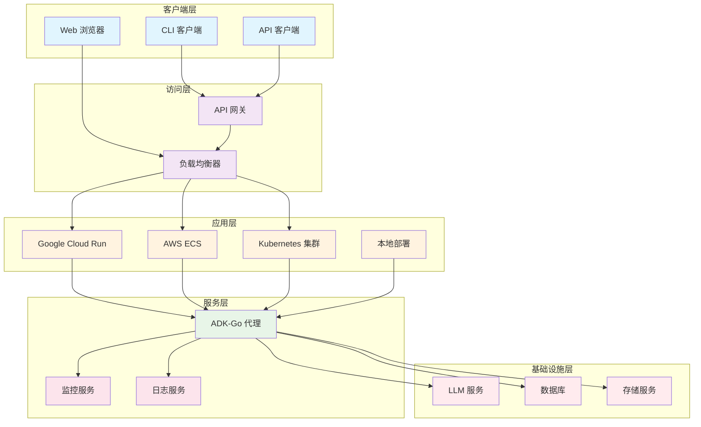

# ADK-Go 部署指南

## 1. 概述

ADK-Go 代理应用支持多种部署方式，从本地开发到大规模生产环境。本指南将详细介绍各种部署选项，帮助您选择合适的部署策略并成功部署您的 ADK-Go 代理应用。

## 2. 部署选项概览

ADK-Go 支持以下部署方式：

| 部署方式 | 适用场景 | 优势 | 劣势 |
|----------|----------|------|------|
| 本地部署 | 开发和测试 | 快速启动，易于调试 | 不适合生产环境 |
| 容器化部署 | 开发、测试和生产 | 环境一致性，易于管理 | 需要容器技术知识 |
| 云原生部署 | 生产环境 | 高可用性，自动扩展 | 成本较高，配置复杂 |

## 3. 本地部署

### 3.1 直接运行

最简单的部署方式是直接在本地运行 Go 应用：

```bash
export GOOGLE_API_KEY="your-api-key"
go run main.go console
```

或者使用 Web UI 模式：

```bash
go run main.go webui
```

### 3.2 编译为可执行文件

您可以将应用编译为可执行文件，然后运行：

```bash
go build -o my-agent .
export GOOGLE_API_KEY="your-api-key"
./my-agent restapi
```

### 3.3 配置文件

您可以使用配置文件来管理应用配置：

```yaml
# config.yaml
model:
  name: "gemini-1.5-flash"
  api_key: "your-api-key"
server:
  port: 8080
```

然后在代码中加载配置：

```go
// 加载配置文件
config, err := loadConfig("config.yaml")
if err != nil {
    log.Fatalf("无法加载配置: %v", err)
}
```

## 4. 容器化部署

### 4.1 Docker 容器化

将 ADK-Go 应用容器化可以确保环境一致性，便于部署和管理。

### 4.2 创建 Dockerfile

```dockerfile
# 使用官方 Go 镜像作为构建阶段
FROM golang:1.21 as builder

# 设置工作目录
WORKDIR /app

# 复制 go.mod 和 go.sum 文件
COPY go.mod go.sum ./

# 下载依赖
RUN go mod download

# 复制源代码
COPY . .

# 编译应用
RUN CGO_ENABLED=0 GOOS=linux go build -o my-agent .

# 使用轻量级的 Alpine 镜像作为运行阶段
FROM alpine:latest

# 添加 CA 证书，用于 HTTPS 请求
RUN apk --no-cache add ca-certificates

# 设置工作目录
WORKDIR /app

# 从构建阶段复制可执行文件
COPY --from=builder /app/my-agent .

# 暴露端口
EXPOSE 8080

# 设置环境变量
ENV PORT=8080

# 运行应用
CMD ["./my-agent", "restapi"]
```

### 4.3 构建 Docker 镜像

```bash
docker build -t my-adk-agent .
```

### 4.4 运行 Docker 容器

```bash
docker run -d -p 8080:8080 -e GOOGLE_API_KEY="your-api-key" my-adk-agent
```

### 4.5 使用 Docker Compose

对于复杂应用，可以使用 Docker Compose 管理多个服务：

```yaml
version: '3'

services:
  agent:
    build: .
    ports:
      - "8080:8080"
    environment:
      - GOOGLE_API_KEY=${GOOGLE_API_KEY}
      - PORT=8080
    restart: unless-stopped
  
  # 可选：添加监控服务
  prometheus:
    image: prom/prometheus:latest
    ports:
      - "9090:9090"
    volumes:
      - ./prometheus.yml:/etc/prometheus/prometheus.yml
    restart: unless-stopped
```

然后运行：

```bash
docker-compose up -d
```

## 5. 云原生部署

### 5.1 Google Cloud Run

Google Cloud Run 是一个无服务器平台，适合部署容器化的 Web 应用。

#### 5.1.1 部署步骤

1. **安装 Google Cloud SDK**
   ```bash
   curl https://sdk.cloud.google.com | bash
   ```

2. **登录 Google Cloud**
   ```bash
gcloud auth login
gcloud config set project YOUR_PROJECT_ID
   ```

3. **构建并推送 Docker 镜像**
   ```bash
   gcloud builds submit --tag gcr.io/YOUR_PROJECT_ID/my-adk-agent .
   ```

4. **部署到 Cloud Run**
   ```bash
   gcloud run deploy my-adk-agent \
     --image gcr.io/YOUR_PROJECT_ID/my-adk-agent \
     --platform managed \
     --region us-central1 \
     --allow-unauthenticated \
     --set-env-vars GOOGLE_API_KEY="your-api-key"
   ```

### 5.2 AWS ECS

Amazon ECS 是一个容器编排服务，用于在 AWS 上运行容器化应用。

#### 5.2.1 部署步骤

1. **创建 ECR 仓库**
   ```bash
   aws ecr create-repository --repository-name my-adk-agent --region us-east-1
   ```

2. **构建并推送 Docker 镜像**
   ```bash
   # 登录 ECR
   aws ecr get-login-password --region us-east-1 | docker login --username AWS --password-stdin YOUR_AWS_ACCOUNT_ID.dkr.ecr.us-east-1.amazonaws.com
   
   # 构建镜像
   docker build -t my-adk-agent .
   
   # 标记镜像
   docker tag my-adk-agent:latest YOUR_AWS_ACCOUNT_ID.dkr.ecr.us-east-1.amazonaws.com/my-adk-agent:latest
   
   # 推送镜像
   docker push YOUR_AWS_ACCOUNT_ID.dkr.ecr.us-east-1.amazonaws.com/my-adk-agent:latest
   ```

3. **创建 ECS 集群和任务定义**
   - 在 AWS 控制台创建 ECS 集群
   - 创建任务定义，指定容器镜像和环境变量
   - 运行任务或创建服务

### 5.3 Kubernetes 部署

对于需要高度可扩展性和灵活性的应用，可以使用 Kubernetes 部署。

#### 5.3.1 Kubernetes 配置文件

```yaml
# deployment.yaml
apiVersion: apps/v1
kind: Deployment
metadata:
  name: my-adk-agent
spec:
  replicas: 3
  selector:
    matchLabels:
      app: my-adk-agent
  template:
    metadata:
      labels:
        app: my-adk-agent
    spec:
      containers:
      - name: my-adk-agent
        image: YOUR_DOCKER_REGISTRY/my-adk-agent:latest
        ports:
        - containerPort: 8080
        env:
        - name: GOOGLE_API_KEY
          valueFrom:
            secretKeyRef:
              name: my-adk-agent-secrets
              key: google-api-key
        resources:
          limits:
            cpu: "500m"
            memory: "512Mi"
          requests:
            cpu: "200m"
            memory: "256Mi"
---
# service.yaml
apiVersion: v1
kind: Service
metadata:
  name: my-adk-agent-service
spec:
  selector:
    app: my-adk-agent
  ports:
  - protocol: TCP
    port: 80
    targetPort: 8080
  type: LoadBalancer
---
# secret.yaml
apiVersion: v1
kind: Secret
metadata:
  name: my-adk-agent-secrets
type: Opaque
data:
  google-api-key: BASE64_ENCODED_API_KEY
```

#### 5.3.2 部署到 Kubernetes

```bash
# 应用配置
kubectl apply -f deployment.yaml
kubectl apply -f service.yaml
kubectl apply -f secret.yaml

# 查看部署状态
kubectl get deployments
kubectl get pods
kubectl get services
```

## 6. 监控和日志

### 6.1 日志记录

ADK-Go 支持标准日志记录，您可以配置不同的日志级别：

```go
import "log"

func main() {
    // 设置日志级别和格式
    log.SetFlags(log.LstdFlags | log.Lshortfile | log.Lmicroseconds)
    // ...
}
```

### 6.2 监控

#### 6.2.1 Prometheus 监控

添加 Prometheus 监控支持：

```go
import (
    "net/http"
    "github.com/prometheus/client_golang/prometheus"
    "github.com/prometheus/client_golang/prometheus/promauto"
    "github.com/prometheus/client_golang/prometheus/promhttp"
)

var (
    requestsTotal = promauto.NewCounterVec(
        prometheus.CounterOpts{
            Name: "my_agent_requests_total",
            Help: "Total number of requests",
        },
        []string{"endpoint", "status"},
    )
)

func main() {
    // 注册监控指标
    http.Handle("/metrics", promhttp.Handler())
    go http.ListenAndServe(":2112", nil)
    // ...
}
```

#### 6.2.2 OpenTelemetry 支持

ADK-Go 内置了 OpenTelemetry 支持，可以集成到各种监控系统：

```go
import "github.com/sjzsdu/adk-go/telemetry"

func main() {
    // 初始化遥测
    telemetry.Init(telemetry.WithServiceName("my-adk-agent"))
    defer telemetry.Shutdown()
    // ...
}
```

## 7. 扩展和伸缩

### 7.1 水平扩展

ADK-Go 代理应用设计为无状态，支持水平扩展。您可以根据负载增加或减少实例数量：

- **Cloud Run**: 自动扩展，根据请求数量调整实例数
- **ECS**: 配置自动伸缩组
- **Kubernetes**: 使用 Horizontal Pod Autoscaler

### 7.2 垂直扩展

对于资源密集型代理，可以垂直扩展，增加单个实例的资源：

- **增加 CPU 和内存**: 在容器或虚拟机中增加资源分配
- **优化 LLM 调用**: 减少不必要的 LLM 调用，优化提示词
- **使用更强大的 LLM 模型**: 根据需要选择更强大的模型

## 8. 安全最佳实践

### 8.1 配置管理

- **使用环境变量**: 不要在代码中硬编码敏感信息
- **使用密钥管理服务**: 使用 Google Secret Manager、AWS Secrets Manager 或 Kubernetes Secrets 管理敏感信息
- **最小权限原则**: 为应用分配最小必要的权限

### 8.2 网络安全

- **使用 HTTPS**: 确保所有通信使用 HTTPS
- **限制访问**: 使用防火墙和网络策略限制对应用的访问
- **API 网关**: 使用 API 网关管理和保护 API 端点

### 8.3 容器安全

- **使用最小基础镜像**: 使用 Alpine 或 Distroless 等最小镜像
- **定期更新镜像**: 定期更新基础镜像和依赖
- **扫描镜像**: 使用容器扫描工具检测漏洞

## 9. 部署架构图



**部署架构图说明**：

这张图展示了 ADK-Go 代理应用的部署架构。客户端可以通过 CLI、Web UI 或 API 访问应用。访问层包括负载均衡器和 API 网关，负责路由和保护请求。应用层支持多种部署方式，包括 Google Cloud Run、AWS ECS、Kubernetes 集群和本地部署。服务层包含 ADK-Go 代理、监控服务和日志服务。基础设施层包括 LLM 服务、数据库和存储服务，为代理提供必要的资源和服务。

## 10. 最佳实践

### 10.1 部署策略

- **蓝绿部署**: 同时运行两个版本，平滑切换
- **金丝雀部署**: 逐步将流量引导到新版本
- **滚动更新**: 逐步更新实例，减少 downtime

### 10.2 配置管理

- **使用配置管理工具**: 使用 Ansible、Terraform 或 CloudFormation 管理基础设施
- **基础设施即代码**: 将基础设施配置视为代码，版本控制
- **环境一致性**: 确保开发、测试和生产环境一致

### 10.3 性能优化

- **缓存**: 缓存频繁使用的数据和 LLM 响应
- **异步处理**: 对于长时间运行的任务，使用异步处理
- **负载均衡**: 合理分配负载，避免单点过载

## 11. 下一步

- 阅读 [ADK-Go 开发指南](./ADK-Go开发指南.md)，学习如何开发代理应用
- 查看 [ADK-Go 示例](./examples/)，了解更多用例
- 探索 [ADK-Go 架构分析文档](./ADK-Go架构分析文档.md)，深入了解框架设计

通过遵循本指南，您应该能够成功部署和运行 ADK-Go 代理应用，根据您的需求选择合适的部署方式。祝您部署顺利！