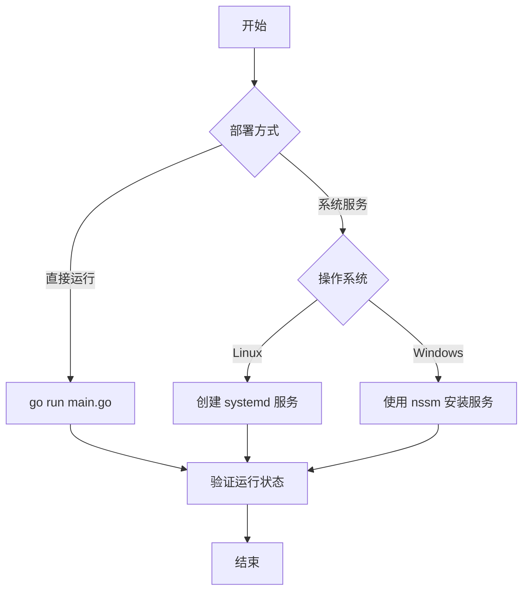
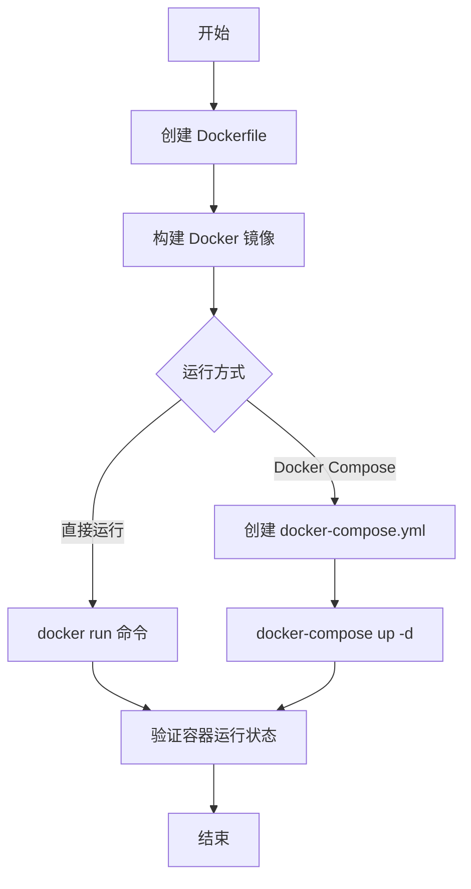
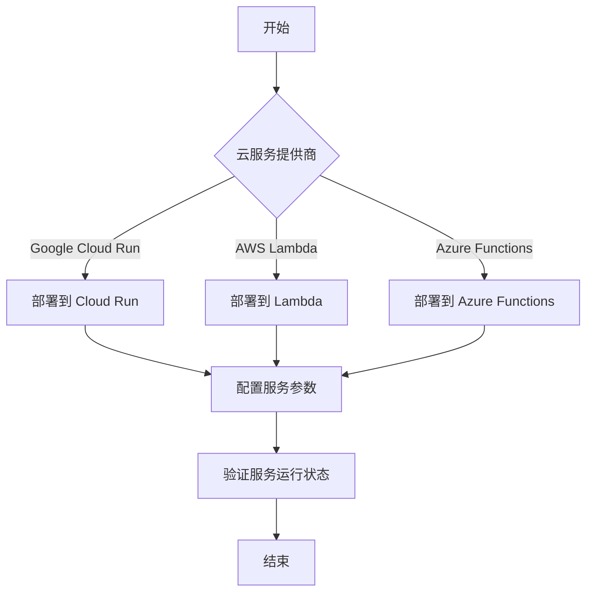
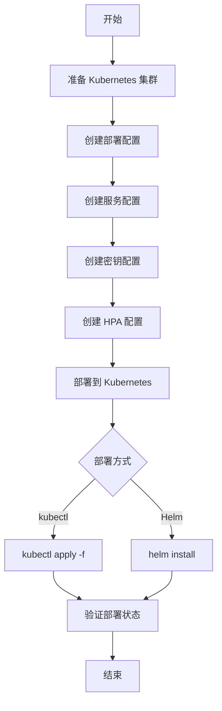
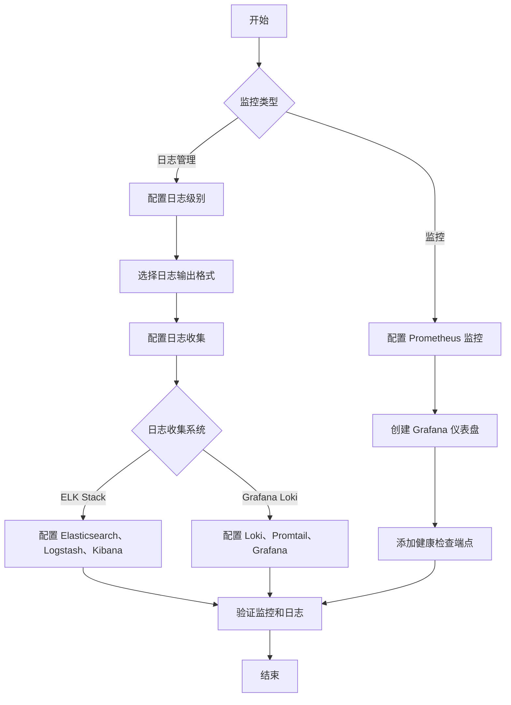
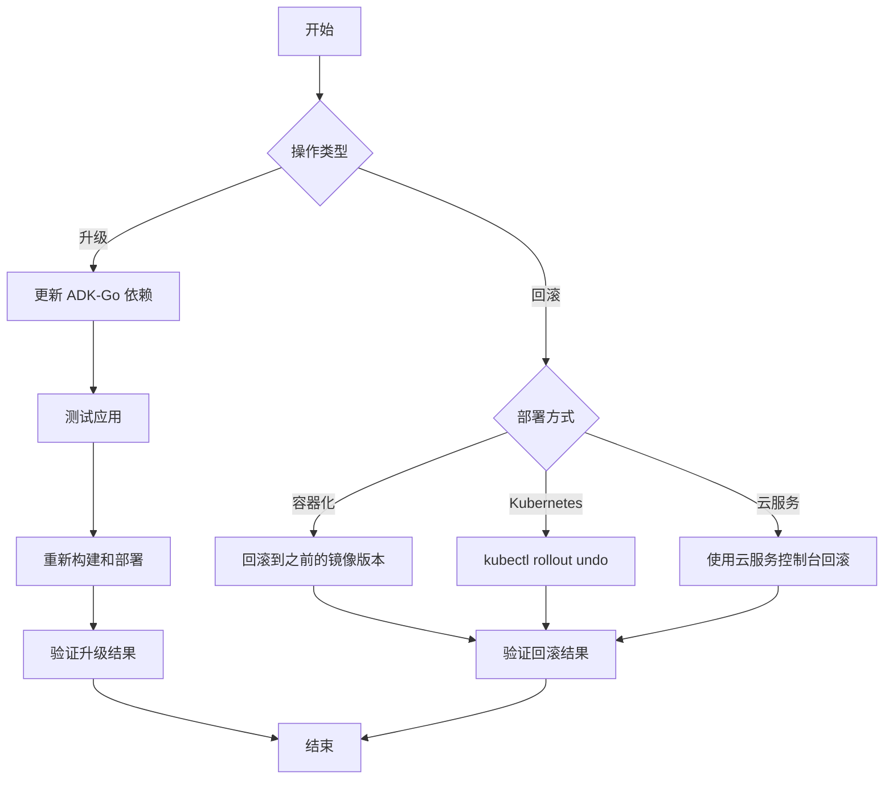

# ADK-Go 部署指南

## 1. 概述

ADK-Go 支持多种部署方式，从简单的本地运行到复杂的云原生部署。本指南将详细介绍如何部署和运行 ADK-Go 代理应用，包括本地部署、容器化部署、云原生部署和 Kubernetes 部署。

## 2. 本地部署

### 2.1 直接运行

最简单的部署方式是直接运行 Go 程序：

```bash
# 进入项目目录
cd my-adk-agent

# 运行应用
go run main.go
```

### 2.2 使用系统服务

对于生产环境，您可以将 ADK-Go 应用配置为系统服务，确保应用在系统启动时自动运行，并在崩溃时自动重启。

#### 2.2.1 Linux 系统服务

创建一个 systemd 服务文件：

```bash
sudo nano /etc/systemd/system/my-adk-agent.service
```

添加以下内容：

```ini
[Unit]
Description=My ADK-Go Agent
After=network.target

[Service]
Type=simple
User=myuser
WorkingDirectory=/path/to/my-adk-agent
ExecStart=/usr/local/bin/my-adk-agent
Restart=always
Environment=GOOGLE_API_KEY=your-gemini-api-key
Environment=ADK_LOG_LEVEL=info

[Install]
WantedBy=multi-user.target
```

启用并启动服务：

```bash
sudo systemctl enable my-adk-agent
sudo systemctl start my-adk-agent
```

查看服务状态：

```bash
sudo systemctl status my-adk-agent
```

#### 2.2.2 Windows 服务

对于 Windows 系统，您可以使用 `nssm` 工具将 ADK-Go 应用配置为 Windows 服务：

```powershell
# 安装服务
nssm install "My ADK-Go Agent" "C:\path\to\my-adk-agent.exe"

# 配置服务
nssm set "My ADK-Go Agent" AppDirectory "C:\path\to"
nssm set "My ADK-Go Agent" Environment "GOOGLE_API_KEY=your-gemini-api-key;ADK_LOG_LEVEL=info"

# 启动服务
nssm start "My ADK-Go Agent"
```

### 2.3 本地部署流程图



## 3. 容器化部署

### 3.1 构建 Docker 镜像

首先，创建一个 `Dockerfile`：

```dockerfile
# 使用 Go 官方镜像作为构建环境
FROM golang:1.24.4-alpine AS builder

# 设置工作目录
WORKDIR /app

# 复制 go.mod 和 go.sum 文件
COPY go.mod go.sum ./

# 下载依赖
RUN go mod tidy

# 复制源代码
COPY . .

# 构建应用
RUN CGO_ENABLED=0 GOOS=linux GOARCH=amd64 go build -o my-adk-agent .

# 使用轻量级的 Alpine 镜像作为运行环境
FROM alpine:latest

# 设置工作目录
WORKDIR /app

# 复制构建好的应用
COPY --from=builder /app/my-adk-agent .

# 设置环境变量
ENV GOOGLE_API_KEY=your-gemini-api-key
ENV ADK_LOG_LEVEL=info

# 暴露端口
EXPOSE 8080

# 运行应用
CMD ["./my-adk-agent"]
```

然后，构建 Docker 镜像：

```bash
docker build -t my-adk-agent:latest .
```

### 3.2 运行 Docker 容器

使用以下命令运行 Docker 容器：

```bash
docker run -d \
  --name my-adk-agent \
  -p 8080:8080 \
  -e GOOGLE_API_KEY=your-gemini-api-key \
  -e ADK_LOG_LEVEL=info \
  my-adk-agent:latest
```

### 3.3 使用 Docker Compose

对于更复杂的应用，您可以使用 Docker Compose 来管理多个服务：

创建一个 `docker-compose.yml` 文件：

```yaml
version: '3.8'

services:
  my-adk-agent:
    build: .
    ports:
      - "8080:8080"
    environment:
      - GOOGLE_API_KEY=your-gemini-api-key
      - ADK_LOG_LEVEL=info
    restart: always
    volumes:
      - ./data:/app/data

  # 可选：添加数据库服务
  # db:
  #   image: postgres:15
  #   environment:
  #     - POSTGRES_USER=myuser
  #     - POSTGRES_PASSWORD=mypassword
  #     - POSTGRES_DB=mydb
  #   volumes:
  #     - db-data:/var/lib/postgresql/data
  #   restart: always

# volumes:
#   db-data:
```

使用 Docker Compose 启动服务：

```bash
docker-compose up -d
```

### 3.4 容器化部署流程图



## 4. 云原生部署

### 4.1 Google Cloud Run

Google Cloud Run 是一个完全托管的容器运行环境，适合部署无状态的容器化应用：

#### 4.1.1 准备工作

1. 安装 Google Cloud SDK

2. 登录 Google Cloud 账号：

```bash
gcloud auth login
```

3. 设置项目：

```bash
gcloud config set project my-project-id
```

#### 4.1.2 部署到 Cloud Run

```bash
# 构建并推送镜像到 Artifact Registry
gcloud builds submit --tag us-central1-docker.pkg.dev/my-project-id/my-repo/my-adk-agent:latest

# 部署到 Cloud Run
gcloud run deploy my-adk-agent \
  --image us-central1-docker.pkg.dev/my-project-id/my-repo/my-adk-agent:latest \
  --platform managed \
  --region us-central1 \
  --allow-unauthenticated \
  --set-env-vars GOOGLE_API_KEY=your-gemini-api-key,ADK_LOG_LEVEL=info
```

#### 4.1.3 配置 Cloud Run 服务

部署完成后，您可以在 Google Cloud Console 中配置 Cloud Run 服务，包括自动扩缩容、监控和日志等。

### 4.2 AWS Lambda

AWS Lambda 是一个无服务器计算服务，适合部署事件驱动的应用：

#### 4.2.1 准备工作

1. 安装 AWS CLI

2. 配置 AWS 凭证：

```bash
aws configure
```

3. 安装 `sam-cli` 工具：

```bash
pip install aws-sam-cli
```

#### 4.2.2 部署到 AWS Lambda

创建一个 `template.yaml` 文件：

```yaml
AWSTemplateFormatVersion: '2010-09-09'
Transform: AWS::Serverless-2016-10-31

Resources:
  MyADKAgentFunction:
    Type: AWS::Serverless::Function
    Properties:
      Handler: main
      Runtime: provided.al2
      Architectures: [x86_64]
      CodeUri: .
      Environment:
        Variables:
          GOOGLE_API_KEY: your-gemini-api-key
          ADK_LOG_LEVEL: info
      Events:
        HttpApiEvent:
          Type: HttpApi
          Properties:
            Path: /
            Method: any
      Timeout: 30

Outputs:
  MyADKAgentApi:
    Description: "API Gateway endpoint URL"
    Value: !Sub "https://${ServerlessHttpApi}.execute-api.${AWS::Region}.amazonaws.com/"
```

构建并部署到 Lambda：

```bash
sam build
sam deploy --guided
```

### 4.3 Azure Functions

Azure Functions 是一个无服务器计算服务，适合部署事件驱动的应用：

#### 4.3.1 准备工作

1. 安装 Azure CLI

2. 登录 Azure 账号：

```bash
az login
```

3. 设置订阅：

```bash
az account set --subscription my-subscription-id
```

#### 4.3.2 部署到 Azure Functions

创建一个 `host.json` 文件：

```json
{
  "version": "2.0",
  "logging": {
    "applicationInsights": {
      "samplingSettings": {
        "isEnabled": true,
        "excludedTypes": "Request"
      }
    }
  },
  "extensionBundle": {
    "id": "Microsoft.Azure.Functions.ExtensionBundle",
    "version": "[4.*, 5.0.0)"
  }
}
```

创建一个 `local.settings.json` 文件：

```json
{
  "IsEncrypted": false,
  "Values": {
    "FUNCTIONS_WORKER_RUNTIME": "custom",
    "GOOGLE_API_KEY": "your-gemini-api-key",
    "ADK_LOG_LEVEL": "info",
    "AzureWebJobsStorage": "DefaultEndpointsProtocol=https;AccountName=myaccount;AccountKey=mykey;EndpointSuffix=core.windows.net"
  }
}
```

部署到 Azure Functions：

```bash
# 创建资源组
az group create --name my-resource-group --location eastus

# 创建存储账户
az storage account create --name mystorageaccount --location eastus --resource-group my-resource-group --sku Standard_LRS

# 创建函数应用
az functionapp create --resource-group my-resource-group --consumption-plan-location eastus --runtime custom --functions-version 4 --name my-adk-agent --storage-account mystorageaccount

# 部署应用
func azure functionapp publish my-adk-agent
```

### 4.4 云原生部署流程图



## 5. Kubernetes 部署

### 5.1 准备工作

1. 安装 Kubernetes 集群（可以使用 Minikube、Kind 或云服务商提供的 Kubernetes 服务）

2. 安装 `kubectl` 工具

3. 配置 `kubectl` 连接到您的 Kubernetes 集群

### 5.2 创建 Kubernetes 配置文件

#### 5.2.1 部署配置

创建一个 `deployment.yaml` 文件：

```yaml
apiVersion: apps/v1
kind: Deployment
metadata:
  name: my-adk-agent
  labels:
    app: my-adk-agent
spec:
  replicas: 2
  selector:
    matchLabels:
      app: my-adk-agent
  template:
    metadata:
      labels:
        app: my-adk-agent
    spec:
      containers:
      - name: my-adk-agent
        image: my-adk-agent:latest
        ports:
        - containerPort: 8080
        env:
        - name: GOOGLE_API_KEY
          valueFrom:
            secretKeyRef:
              name: my-adk-agent-secrets
              key: google-api-key
        - name: ADK_LOG_LEVEL
          value: "info"
        resources:
          requests:
            memory: "64Mi"
            cpu: "250m"
          limits:
            memory: "128Mi"
            cpu: "500m"
        livenessProbe:
          httpGet:
            path: /health
            port: 8080
          initialDelaySeconds: 30
          periodSeconds: 10
        readinessProbe:
          httpGet:
            path: /ready
            port: 8080
          initialDelaySeconds: 5
          periodSeconds: 5
```

#### 5.2.2 服务配置

创建一个 `service.yaml` 文件：

```yaml
apiVersion: v1
kind: Service
metadata:
  name: my-adk-agent-service
spec:
  selector:
    app: my-adk-agent
  ports:
  - port: 80
    targetPort: 8080
  type: LoadBalancer
```

#### 5.2.3 密钥配置

创建一个 `secrets.yaml` 文件：

```yaml
apiVersion: v1
kind: Secret
metadata:
  name: my-adk-agent-secrets
type: Opaque
data:
  google-api-key: <base64-encoded-google-api-key>
```

将您的 Google API 密钥转换为 base64 编码：

```bash
echo -n "your-gemini-api-key" | base64
```

#### 5.2.4 水平扩缩容配置

创建一个 `hpa.yaml` 文件：

```yaml
apiVersion: autoscaling/v2
kind: HorizontalPodAutoscaler
metadata:
  name: my-adk-agent-hpa
spec:
  scaleTargetRef:
    apiVersion: apps/v1
    kind: Deployment
    name: my-adk-agent
  minReplicas: 2
  maxReplicas: 10
  metrics:
  - type: Resource
    resource:
      name: cpu
      target:
        type: Utilization
        averageUtilization: 50
  - type: Resource
    resource:
      name: memory
      target:
        type: Utilization
        averageUtilization: 80
```

### 5.3 部署到 Kubernetes

应用所有配置文件：

```bash
kubectl apply -f secrets.yaml
kubectl apply -f deployment.yaml
kubectl apply -f service.yaml
kubectl apply -f hpa.yaml
```

检查部署状态：

```bash
kubectl get pods
kubectl get services
kubectl get hpa
```

### 5.4 使用 Helm 部署

对于更复杂的部署，您可以使用 Helm 来管理 Kubernetes 应用：

#### 5.4.1 创建 Helm Chart

```bash
helm create my-adk-agent-chart
```

修改 `values.yaml` 文件：

```yaml
env:
  googleApiKey: your-gemini-api-key
  logLevel: info

replicaCount: 2

resources:
  requests:
    memory: 64Mi
    cpu: 250m
  limits:
    memory: 128Mi
    cpu: 500m

service:
  type: LoadBalancer
  port: 80
  targetPort: 8080

hpa:
  enabled: true
  minReplicas: 2
  maxReplicas: 10
  cpuUtilization: 50
  memoryUtilization: 80
```

修改 `templates/deployment.yaml`、`templates/service.yaml` 和 `templates/hpa.yaml` 文件以使用这些值。

#### 5.4.2 部署 Helm Chart

```bash
helm install my-adk-agent ./my-adk-agent-chart
```

### 5.5 Kubernetes 部署流程图



## 6. 监控和日志

### 6.1 日志管理

ADK-Go 提供了丰富的日志支持，可以将日志输出到控制台、文件或第三方日志服务。

#### 6.1.1 配置日志级别

您可以通过环境变量或代码配置日志级别：

```bash
# 通过环境变量设置
export ADK_LOG_LEVEL="debug"

# 或者在代码中设置
log.SetLevel(log.DebugLevel)
```

#### 6.1.2 日志输出格式

ADK-Go 支持多种日志输出格式，包括文本格式和 JSON 格式：

```go
// 配置 JSON 格式日志
log.SetFormatter(&log.JSONFormatter{})
```

#### 6.1.3 日志收集

对于生产环境，建议使用日志收集系统收集和分析日志：

##### 6.1.3.1 ELK Stack

使用 Elasticsearch、Logstash 和 Kibana 收集和分析日志：

```yaml
# docker-compose.yml 中添加 ELK 服务
version: '3.8'

services:
  elasticsearch:
    image: elasticsearch:8.10.0
    environment:
      - discovery.type=single-node
      - ES_JAVA_OPTS=-Xms512m -Xmx512m
    ports:
      - 9200:9200
    volumes:
      - es-data:/usr/share/elasticsearch/data

  logstash:
    image: logstash:8.10.0
    depends_on:
      - elasticsearch
    ports:
      - 5044:5044
    volumes:
      - ./logstash.conf:/usr/share/logstash/pipeline/logstash.conf

  kibana:
    image: kibana:8.10.0
    depends_on:
      - elasticsearch
    ports:
      - 5601:5601

volumes:
  es-data:
```

##### 6.1.3.2 Grafana Loki

使用 Grafana Loki 收集和分析日志：

```yaml
# docker-compose.yml 中添加 Loki 服务
version: '3.8'

services:
  loki:
    image: grafana/loki:2.9.0
    ports:
      - 3100:3100

  promtail:
    image: grafana/promtail:2.9.0
    volumes:
      - /var/log:/var/log
      - ./promtail.yml:/etc/promtail/config.yml
    depends_on:
      - loki

  grafana:
    image: grafana/grafana:10.2.0
    ports:
      - 3000:3000
    depends_on:
      - loki
```

### 6.2 监控

ADK-Go 提供了监控支持，可以监控代理的运行状态、性能指标和资源使用情况。

#### 6.2.1 Prometheus 监控

ADK-Go 内置了 Prometheus 监控支持，可以通过配置启用：

```go
// 配置 Prometheus 监控	runner, err := runner.New(runner.Config{
	AppName:   "my-app",
	RootAgent: myAgent,
	Monitor:   monitor.NewPrometheusMonitor(),
})
```

创建一个 Prometheus 配置文件：

```yaml
scrape_configs:
  - job_name: 'adk-go-agent'
    static_configs:
      - targets: ['my-adk-agent:8080']
    scrape_interval: 15s
```

#### 6.2.2 Grafana 仪表盘

使用 Grafana 创建仪表盘，可视化监控数据：

1. 添加 Prometheus 数据源

2. 导入或创建仪表盘，监控以下指标：

   - 代理运行时间
   - 事件处理数量
   - 工具调用数量
   - 内存使用情况
   - CPU 使用情况
   - 请求延迟

#### 6.2.3 健康检查

ADK-Go 提供了健康检查端点，可以用于监控代理的健康状态：

```go
// 添加健康检查端点
restServer := rest.New(runner)
restServer.AddHealthCheckHandler("/health", func() bool {
	// 检查代理健康状态
	return true
})
```

### 6.3 监控和日志流程图



## 7. 配置管理

### 7.1 环境变量

ADK-Go 支持通过环境变量配置应用：

| 环境变量 | 描述 | 默认值 |
|----------|------|--------|
| GOOGLE_API_KEY | Gemini API 密钥 | 无 |
| ADK_APP_NAME | 应用名称 | adk-app |
| ADK_LOG_LEVEL | 日志级别 | info |
| ADK_PORT | 应用端口 | 8080 |
| ADK_STORAGE_TYPE | 存储类型（memory、file、cloud） | memory |
| ADK_FILE_STORAGE_PATH | 文件存储路径 | ./data |

### 7.2 配置文件

您也可以使用配置文件配置应用：

```go
// 加载配置文件
config, err := config.LoadConfig("config.yaml")
if err != nil {
	panic(err)
}
```

配置文件示例：

```yaml
app_name: "my-adk-app"
log_level: "info"
port: 8080
storage:
  type: "file"
  path: "./data"
model:
  name: "gemini-1.5-pro"
instruction: "You are a helpful assistant."
```

### 7.3 密钥管理

对于敏感配置，如 API 密钥，建议使用密钥管理服务：

- Google Cloud Secret Manager

- AWS Secrets Manager

- Azure Key Vault

- HashiCorp Vault

## 8. 安全考虑

### 8.1 认证和授权

确保您的 ADK-Go 应用有适当的认证和授权机制：

```go
// 添加认证中间件
restServer := rest.New(runner)
restServer.AddMiddleware(func(next http.Handler) http.Handler {
	return http.HandlerFunc(func(w http.ResponseWriter, r *http.Request) {
		// 认证逻辑
		if !isAuthenticated(r) {
			http.Error(w, "Unauthorized", http.StatusUnauthorized)
			return
		}
		next.ServeHTTP(w, r)
	})
})
```

### 8.2 数据加密

确保敏感数据在传输和存储时加密：

```go
// 配置 TLS
tlsConfig := &tls.Config{
	MinVersion: tls.VersionTLS12,
	// 其他 TLS 配置
}

restServer := rest.New(runner)
restServer.Run(rest.RunConfig{
	Port:      443,
	TLSConfig: tlsConfig,
})
```

### 8.3 网络安全

确保您的 ADK-Go 应用有适当的网络安全措施：

- 使用防火墙限制访问

- 配置网络访问控制列表

- 定期更新依赖项，修复安全漏洞

- 启用速率限制，防止 DDoS 攻击

## 9. 升级和回滚

### 9.1 升级

升级 ADK-Go 应用的步骤：

1. 更新 ADK-Go 依赖：

```bash
go get -u github.com/sjzsdu/adk-go
```

2. 测试应用，确保升级后正常工作：

```bash
go test ./...
go run main.go
```

3. 重新构建和部署应用

### 9.2 回滚

如果升级后出现问题，需要回滚到之前的版本：

#### 9.2.1 容器化部署回滚

```bash
# 回滚到之前的镜像版本
docker run -d --name my-adk-agent my-adk-agent:v1.0.0
```

#### 9.2.2 Kubernetes 部署回滚

```bash
# 回滚到之前的部署版本
kubectl rollout undo deployment my-adk-agent
```

#### 9.2.3 云服务回滚

- **Cloud Run**：在 Google Cloud Console 中，点击 "Revisions" 标签页，然后点击 "Rollback"

- **AWS Lambda**：在 AWS Console 中，点击 "Versions" 标签页，然后点击 "Publish new version"，选择之前的版本

- **Azure Functions**：在 Azure Portal 中，点击 "Deployment Center" 标签页，然后点击 "Deployment history"，选择之前的部署，然后点击 "Redeploy"

### 9.3 升级和回滚流程图



## 10. 常见问题和解决方案

### 10.1 端口被占用

**问题**：部署时出现 "address already in use" 错误

**解决方案**：

1. 更改应用端口：

```go
restServer.Run(rest.RunConfig{Port: 8081})
```

2. 查找并杀死占用端口的进程：

```bash
# Linux
lsof -i :8080 | grep LISTEN | awk '{print $2}' | xargs kill

# Windows
netstat -ano | findstr :8080
taskkill /PID <PID> /F
```

### 10.2 内存不足

**问题**：部署后应用崩溃，出现 "out of memory" 错误

**解决方案**：

1. 增加应用内存限制：

```yaml
# Kubernetes 部署
eresources:
  requests:
    memory: "128Mi"
  limits:
    memory: "256Mi"
```

2. 优化应用内存使用：

   - 减少不必要的内存分配
   - 使用更高效的数据结构
   - 及时释放不再使用的资源

### 10.3 连接 LLM 模型失败

**问题**：部署后应用无法连接到 LLM 模型，出现 "failed to connect to model" 错误

**解决方案**：

1. 检查 API 密钥是否正确配置

2. 确保应用可以访问互联网

3. 检查防火墙设置，确保应用可以访问模型服务

4. 检查模型名称是否正确

### 10.4 健康检查失败

**问题**：健康检查失败，应用被标记为不健康

**解决方案**：

1. 检查健康检查端点实现是否正确

2. 检查应用是否真的不健康，查看日志以获取更多信息

3. 调整健康检查间隔和超时设置

## 11. 最佳实践

### 11.1 部署最佳实践

- **使用容器化部署**：容器化部署提供了一致性、可移植性和可扩展性

- **使用自动化部署工具**：使用 CI/CD 工具（如 GitHub Actions、GitLab CI、Jenkins）自动化部署流程

- **实现滚动部署**：使用滚动部署策略，确保零停机部署

- **配置自动扩缩容**：根据负载自动调整应用实例数量

- **实现健康检查**：添加健康检查端点，确保应用健康运行

### 11.2 监控和日志最佳实践

- **集中管理日志**：使用日志收集系统集中管理和分析日志

- **监控关键指标**：监控代理运行时间、事件处理数量、工具调用数量、内存使用情况和 CPU 使用情况

- **设置告警**：设置告警规则，及时发现和处理问题

- **保留日志足够长时间**：根据需要保留日志足够长时间，用于故障排查和审计

### 11.3 安全最佳实践

- **使用最小权限原则**：应用只应拥有必要的权限

- **加密敏感数据**：对敏感数据进行加密存储和传输

- **定期更新依赖**：定期更新依赖项，修复安全漏洞

- **实现认证和授权**：确保应用有适当的认证和授权机制

- **配置网络安全**：使用防火墙、网络访问控制列表等措施保护应用

## 12. 结论

ADK-Go 支持多种部署方式，从简单的本地运行到复杂的云原生部署。选择哪种部署方式取决于您的应用需求、规模和资源限制。通过遵循本指南，您可以成功部署和运行 ADK-Go 代理应用，并确保应用的可靠性、性能和安全性。
