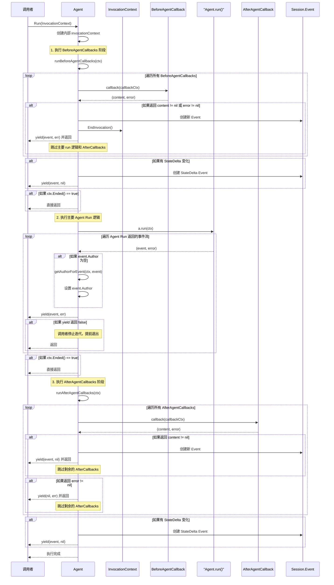

# ADK-Go 问答

## Agent Run 方法执行过程是怎么样的？

下面的时序图详细说明了 Agent 的 Run 方法以及 BeforeAgentCallbacks 和 AfterAgentCallbacks 的完整执行过程：

### 1. BeforeAgentCallbacks 阶段

**目的**: 在主要的 Agent 逻辑执行前进行预处理

**执行逻辑**:
- 按顺序执行所有的 BeforeAgentCallback 函数
- 每个 callback 接收 CallbackContext 参数
- 如果任何 callback 返回非空的 content 或 error：
  - 创建新的 Session.Event
  - 调用 `ctx.EndInvocation()` 标记调用结束
  - 跳过主要的 agent.run() 逻辑
  - 跳过所有 AfterAgentCallbacks
  - 直接返回结果给调用者

**关键特性**:
- **早期退出机制**: 允许在主逻辑执行前终止流程
- **状态修改**: 支持通过 StateDelta 修改会话状态
- **顺序执行**: Callbacks 按配置顺序依次执行

### 2. 主要 Agent Run 逻辑

**目的**: 执行 Agent 的核心业务逻辑

**执行逻辑**:
- 调用用户定义的 `agent.run(InvocationContext)` 函数
- 该函数返回一个事件迭代器 `iter.Seq2[*session.Event, error]`
- 对每个返回的事件：
  - 如果事件的 Author 字段为空，自动设置为当前 Agent 的名称
  - 通过 yield 函数将事件流式传递给调用者
  - 如果 yield 返回 false，表示调用者停止迭代，提前退出

**关键特性**:
- **流式处理**: 支持实时产生和消费事件
- **自动作者设置**: 确保每个事件都有正确的作者信息
- **可中断性**: 支持调用者控制的提前退出

### 3. AfterAgentCallbacks 阶段

**目的**: 在主要 Agent 逻辑执行后进行后处理

**执行逻辑**:
- 按顺序执行所有的 AfterAgentCallback 函数
- 每个 callback 接收 CallbackContext 参数
- 如果任何 callback 返回非空的 content 或 error：
  - 创建新的 Session.Event
  - 跳过剩余的 AfterAgentCallbacks
  - 返回结果给调用者

**关键特性**:
- **后处理机制**: 允许在主逻辑完成后进行额外处理
- **状态修改**: 支持通过 StateDelta 修改会话状态
- **错误处理**: 支持在后处理阶段产生错误或新内容