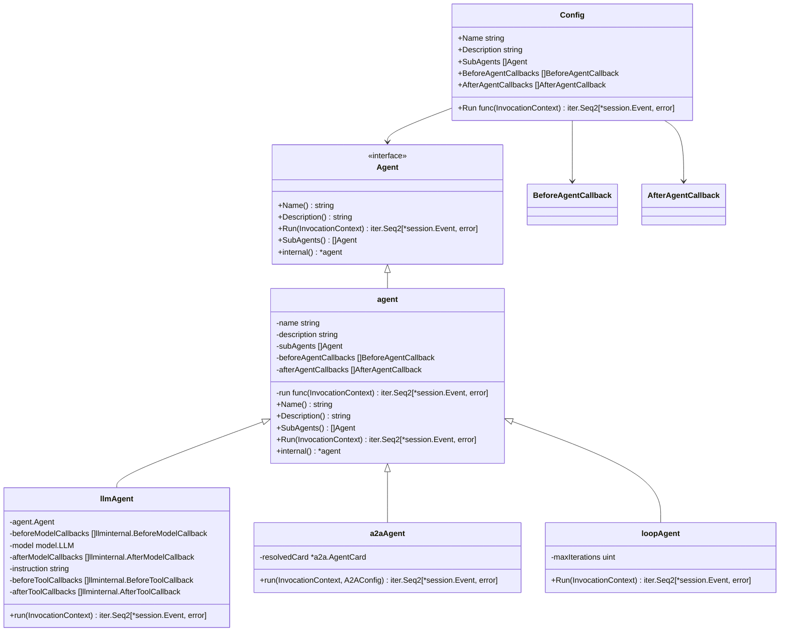
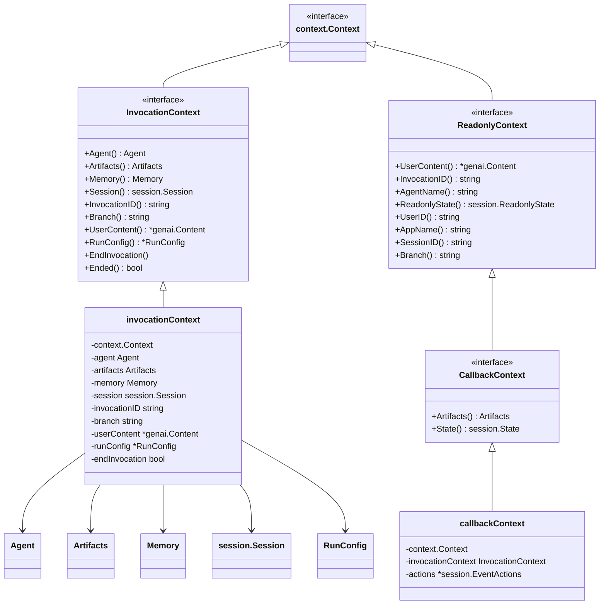
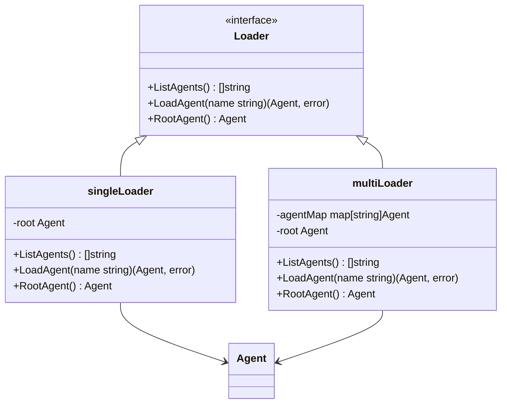
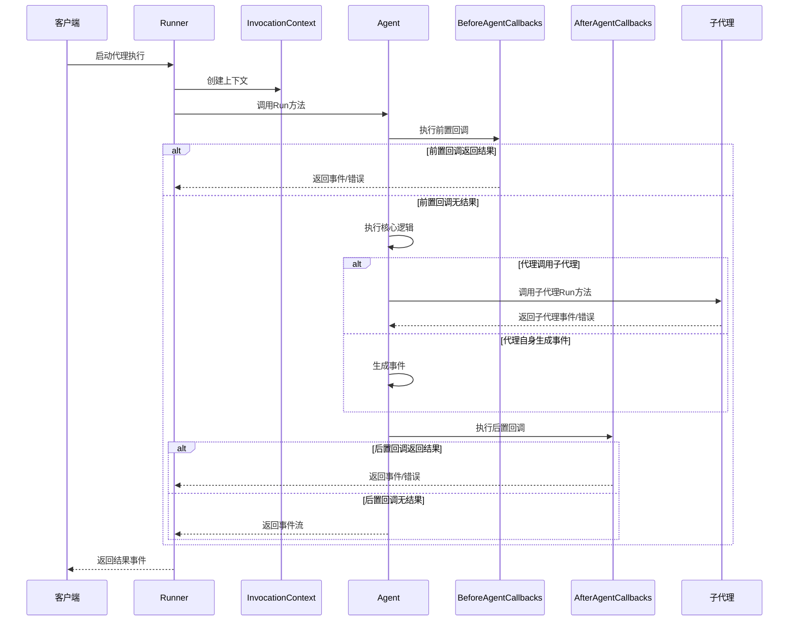
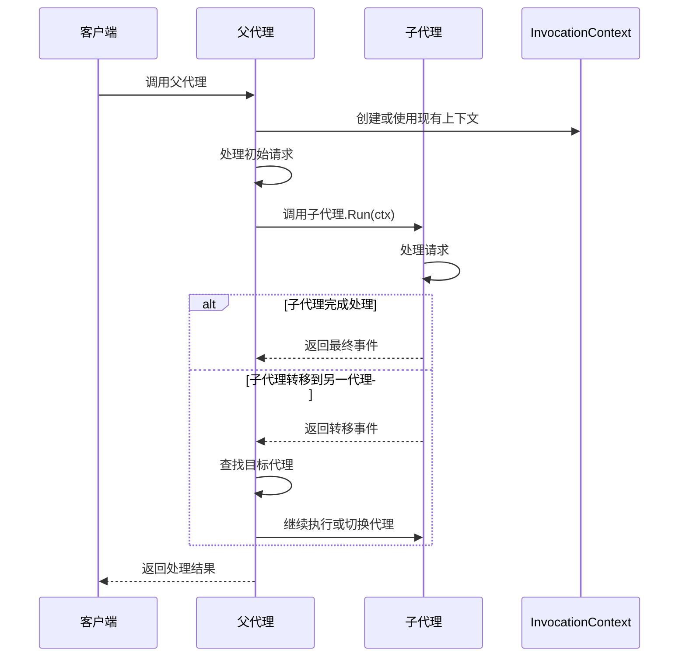
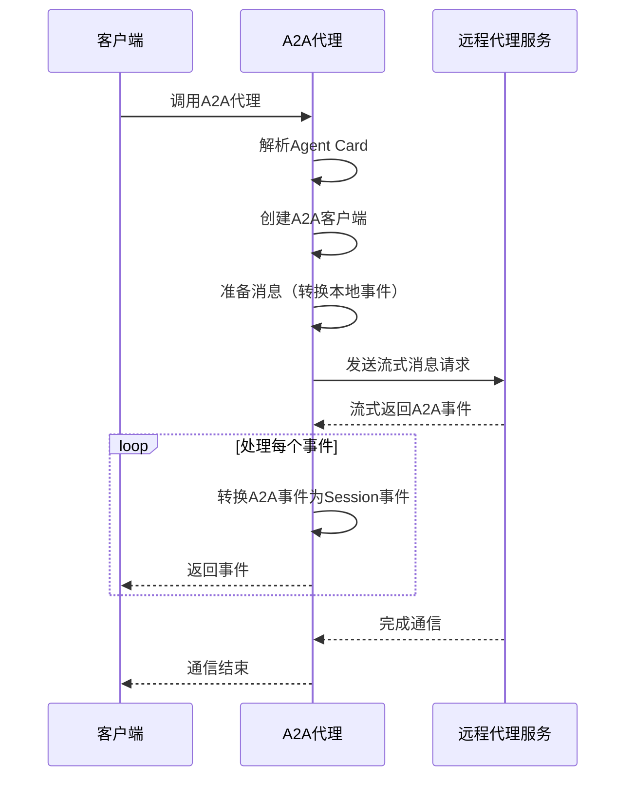
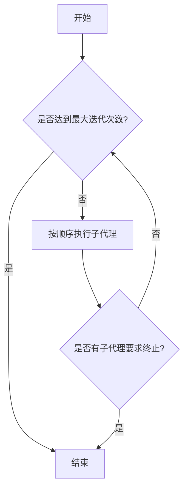
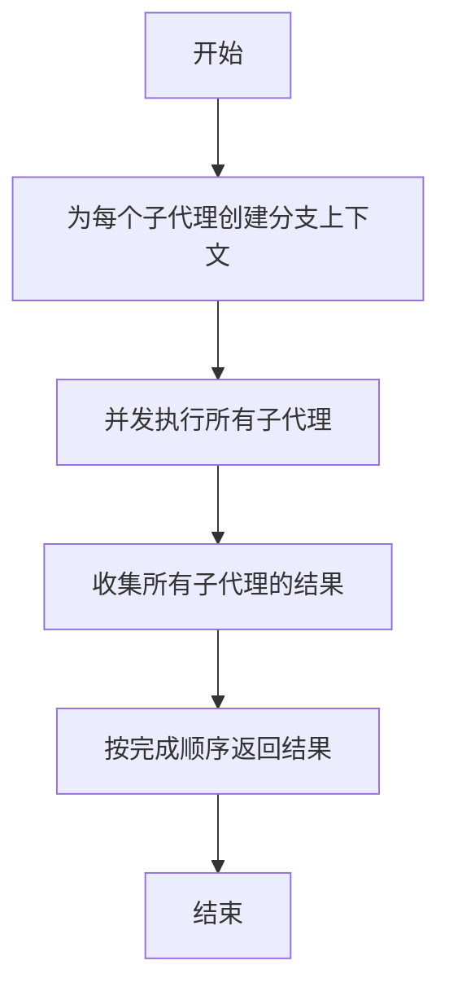
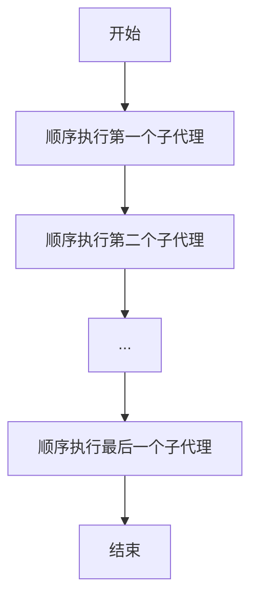

# ADK-Go Agent 包架构分析

## 1. 概述

ADK-Go Agent 包是一个灵活的智能代理框架，提供了构建和管理各种类型代理的核心功能。该框架支持多种代理类型，包括基于大语言模型的LLMAgent、远程代理（RemoteAgent）和工作流代理（WorkflowAgents）。本文档从架构师角度详细分析Agent包的设计思想、核心组件及其交互关系。

### 核心特性

- **统一的Agent接口**：所有代理类型实现相同的基础接口，确保一致性
- **丰富的代理类型**：支持LLM代理、远程代理和多种工作流代理
- **灵活的上下文管理**：提供多层次的Context接口，支持不同场景的需求
- **代理组合机制**：通过父子关系和子代理集合实现复杂的代理组合
- **统一的事件流模型**：使用迭代器模式实现事件流处理

## 2. 核心类与接口

### 2.1 Agent 接口体系



这个类图展示了Agent接口及其主要实现类的关系。Agent接口是整个框架的基础，定义了代理必须实现的核心方法。所有具体的代理类型都通过嵌入基础的agent结构体来复用公共功能。

- **Agent接口**：定义了代理的核心行为，包括获取名称、描述、运行代理和获取子代理列表
- **agent结构体**：基础实现，提供了Agent接口的通用功能
- **llmAgent**：基于大语言模型的代理实现，包含与模型交互的各种回调和配置
- **a2aAgent**：远程代理实现，通过A2A协议与远程代理通信
- **loopAgent**：工作流代理，支持循环执行子代理
- **Config结构体**：用于配置代理的创建，包含名称、描述、子代理和回调等

### 2.2 Context 接口体系



这个类图展示了Context接口体系，这是Agent框架中的重要组成部分，负责提供代理运行所需的上下文信息。

- **InvocationContext**：最核心的上下文接口，提供完整的代理运行环境访问权限
- **ReadonlyContext**：只读上下文接口，提供对上下文数据的只读访问
- **CallbackContext**：回调上下文接口，在代理回调中使用
- **invocationContext**：InvocationContext的具体实现
- **callbackContext**：CallbackContext的具体实现

Context体系设计遵循了最小权限原则，根据不同场景提供不同级别的访问权限，增强了代码的安全性和可维护性。

### 2.3 Loader 接口与实现



这个类图展示了Loader接口及其两个主要实现，用于加载和管理代理实例。

- **Loader接口**：定义了加载和管理代理的方法
- **singleLoader**：用于管理单个代理的加载器实现
- **multiLoader**：用于管理多个代理的加载器实现

Loader机制提供了统一的代理访问方式，支持单个代理和多个代理的场景，并确保根代理的正确管理。

## 3. 核心流程

### 3.1 Agent 执行流程



这个时序图展示了Agent的完整执行流程，从客户端启动到最终返回结果。执行流程包括：

1. **上下文创建**：Runner创建InvocationContext提供运行环境
2. **前置回调执行**：如果前置回调返回结果，将直接返回而不执行代理核心逻辑
3. **核心逻辑执行**：代理执行自身逻辑，可能调用子代理或生成事件
4. **后置回调执行**：在核心逻辑完成后执行，可修改或补充返回结果
5. **事件流返回**：整个执行过程中生成的事件通过迭代器模式返回

这种设计使得代理执行过程高度可扩展，允许在不同阶段插入自定义逻辑。

### 3.2 代理调用与转移流程



这个时序图展示了代理之间的调用和转移机制，这是ADK框架中实现复杂工作流的关键。

- **代理调用**：父代理可以直接调用子代理的Run方法
- **上下文传递**：调用时共享或创建新的上下文，维护状态一致性
- **代理转移**：一个代理可以将控制权转移给另一个代理，实现复杂的协作模式

这种设计允许构建由多个专业代理组成的复杂代理网络，每个代理专注于特定任务，通过转移机制协同工作。

### 3.3 A2A远程代理通信流程



这个时序图展示了A2A远程代理的通信流程，展示了如何通过A2A协议与远程代理服务进行交互。

- **Agent Card解析**：A2A代理首先解析Agent Card，获取远程代理的配置信息
- **客户端创建**：基于Agent Card创建A2A客户端
- **消息准备**：将本地会话事件转换为A2A协议消息
- **流式通信**：通过A2A协议与远程代理进行流式通信
- **事件转换**：将接收到的A2A事件转换回本地Session事件

这种设计使得本地ADK应用可以无缝集成远程代理服务，扩展了框架的能力边界。

## 4. 工作流代理模式

ADK框架提供了三种主要的工作流代理模式，用于组织和协调多个子代理的执行：

### 4.1 循环代理 (LoopAgent)



LoopAgent按顺序重复执行其子代理，直到满足终止条件。主要特点：

- 支持设置最大迭代次数，控制循环上限
- 可以通过子代理的Escalate操作提前终止循环
- 适用于需要反复迭代处理的场景，如代码改进、内容优化等

### 4.2 并行代理 (ParallelAgent)



ParallelAgent同时并行执行所有子代理，每个子代理在独立的分支上下文中运行。主要特点：

- 使用errgroup实现并发控制和错误管理
- 为每个子代理创建独立的分支上下文，避免状态冲突
- 通过channel收集和返回各子代理的执行结果
- 适用于需要多角度处理同一任务的场景，如创意生成、多方案比较等

### 4.3 顺序代理 (SequentialAgent)



SequentialAgent按顺序执行一次其子代理，是LoopAgent的特例（MaxIterations=1）。主要特点：

- 基于LoopAgent实现，但限制只执行一次
- 确保子代理按严格的顺序执行
- 适用于有明确执行步骤的工作流场景

## 5. 关键机制与设计模式

### 5.1 迭代器模式 (Iterator Pattern)

ADK框架广泛使用Go 1.23引入的迭代器模式（iter.Seq2）来处理事件流：

```go
Run(InvocationContext) iter.Seq2[*session.Event, error]
```

这种设计的优势：
- **延迟执行**：事件在需要时才生成，提高效率
- **流式处理**：支持流式响应，适合实时交互场景
- **错误处理**：与Go的迭代器模式结合，优雅处理错误
- **组合灵活**：可以方便地组合多个迭代器

### 5.2 代理组合模式 (Composite Pattern)

通过Agent接口的SubAgents方法，实现了代理的组合模式：

- 单个代理和复合代理（包含子代理的代理）实现相同的接口
- 客户端代码可以统一处理单个代理和代理组合
- 支持构建复杂的代理层次结构

### 5.3 上下文分层与依赖注入

Context接口体系体现了分层设计和依赖注入的思想：

- 不同级别的上下文提供不同权限的访问能力
- 运行时通过注入上下文，提供代理执行所需的各种资源
- 支持上下文扩展和自定义，增强框架的灵活性

### 5.4 回调机制

框架提供了多层回调机制，允许在代理执行的不同阶段插入自定义逻辑：

- BeforeAgentCallbacks：代理执行前调用
- AfterAgentCallbacks：代理执行后调用
- BeforeModelCallbacks：模型调用前调用（LLMAgent）
- AfterModelCallbacks：模型调用后调用（LLMAgent）
- BeforeToolCallbacks：工具调用前调用（LLMAgent）
- AfterToolCallbacks：工具调用后调用（LLMAgent）

这种设计使得框架高度可扩展，允许用户在不修改核心代码的情况下定制代理行为。

## 6. 代码优化建议

### 6.1 错误处理改进

在代码中发现多处TODO注释和简单错误处理，可以改进：

```go
// 当前实现
destroy(client *a2aclient.Client) {
	// TODO(yarolegovich): log ignored error
	_ = client.Destroy()
}

// 建议改进
func destroy(client *a2aclient.Client) {
	if err := client.Destroy(); err != nil {
		// 使用日志框架记录错误
		log.Printf("Error destroying A2A client: %v", err)
	}
}
```

### 6.2 并发安全增强

对于可能在并发环境中使用的组件，建议增加并发安全保证：

```go
// 为需要并发访问的共享状态添加互斥锁保护
type SafeAgentMap struct {
	mu        sync.RWMutex
	agentMap  map[string]Agent
}

func (s *SafeAgentMap) Get(name string) (Agent, bool) {
	s.mu.RLock()
	defer s.mu.RUnlock()
	agent, ok := s.agentMap[name]
	return agent, ok
}
```

### 6.3 接口抽象优化

考虑将一些重复逻辑抽象为更通用的接口：

- 为工作流代理创建通用的WorkflowAgent接口
- 为代理间通信创建更抽象的通信层接口

### 6.4 文档完善

代码中有多处需要更详细文档的地方，建议补充：

- 为复杂结构体和接口添加更详细的文档注释
- 为关键算法和流程添加注释说明
- 添加更多示例代码，展示各种代理类型的使用方法

## 7. 输入输出示例

### 7.1 创建和使用基本代理

```go
// 创建简单代理
myAgent, err := agent.New(agent.Config{
	Name:        "my-agent",
	Description: "A simple custom agent",
	Run: func(ctx agent.InvocationContext) iter.Seq2[*session.Event, error] {
		return func(yield func(*session.Event, error) bool) {
			event := session.NewEvent(ctx.InvocationID())
			event.Content = genai.NewContentFromText("Hello from custom agent!")
			event.Author = ctx.Agent().Name()
			yield(event, nil)
		}
	},
})

// 使用代理
loader := agent.NewSingleLoader(myAgent)
rootAgent := loader.RootAgent()
for event, err := range rootAgent.Run(ctx) {
	// 处理事件
}
```

### 7.2 创建和使用LLM代理

```go
// 创建LLM代理
llmAgent, err := llmagent.New(llmagent.Config{
	Name:        "llm-assistant",
	Description: "A helpful LLM assistant",
	Model:       myModel, // 一个实现model.LLM接口的模型
	Instruction: "You are a helpful assistant.",
	Tools:       myTools, // 可用工具列表
})
```

### 7.3 创建工作流代理

```go
// 创建顺序代理
sequentialAgent, err := sequentialagent.New(sequentialagent.Config{
	AgentConfig: agent.Config{
		Name:        "sequential-workflow",
		Description: "A sequential workflow agent",
		SubAgents:   []agent.Agent{agent1, agent2, agent3},
	},
})

// 创建循环代理
loopAgent, err := loopagent.New(loopagent.Config{
	AgentConfig: agent.Config{
		Name:        "loop-workflow",
		Description: "A loop workflow agent",
		SubAgents:   []agent.Agent{processorAgent},
	},
	MaxIterations: 5, // 最多执行5次
})
```

## 8. 总结

ADK-Go Agent包是一个设计精良的代理框架，通过统一的接口、灵活的组合机制和丰富的代理类型，为构建复杂的代理系统提供了强大的支持。主要优势包括：

1. **统一且灵活的接口设计**：所有代理实现相同的基础接口，同时支持丰富的定制化
2. **强大的组合能力**：通过子代理机制和工作流代理，支持构建复杂的代理网络
3. **优雅的事件流处理**：基于Go的迭代器模式，实现高效的事件流处理
4. **完善的上下文管理**：多层次的Context接口，满足不同场景的需求
5. **丰富的扩展点**：通过回调机制，允许在各个执行阶段插入自定义逻辑

这个框架设计体现了良好的软件工程实践，包括接口抽象、组合模式、迭代器模式等设计模式的应用，以及分层设计、最小权限原则等设计理念。这些设计使得ADK-Go Agent包既灵活又强大，能够支持从简单代理到复杂多代理系统的各种应用场景。