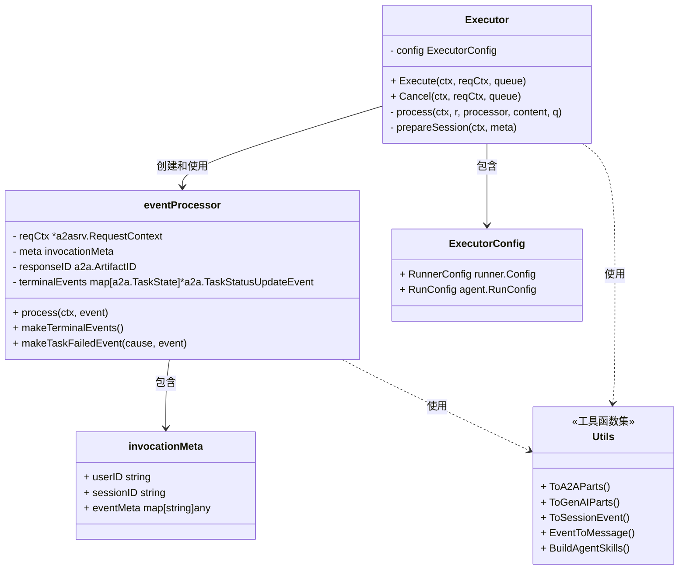
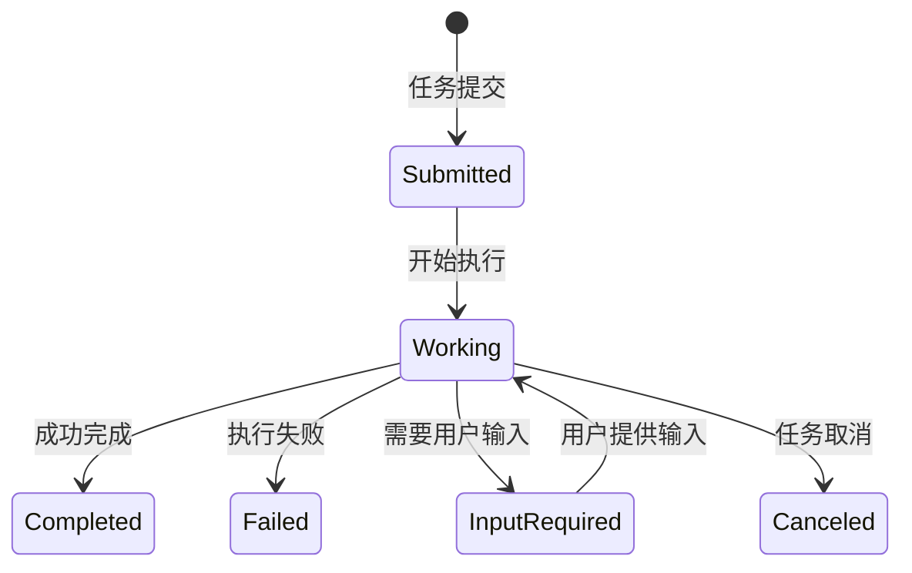
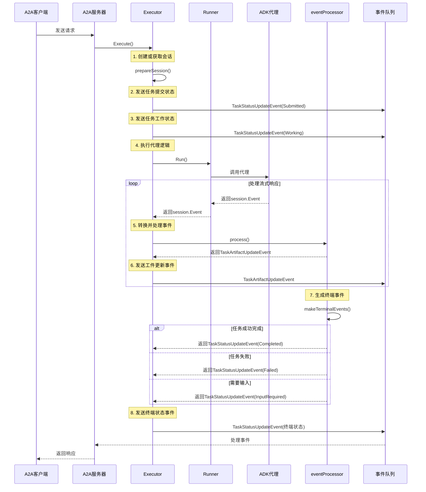
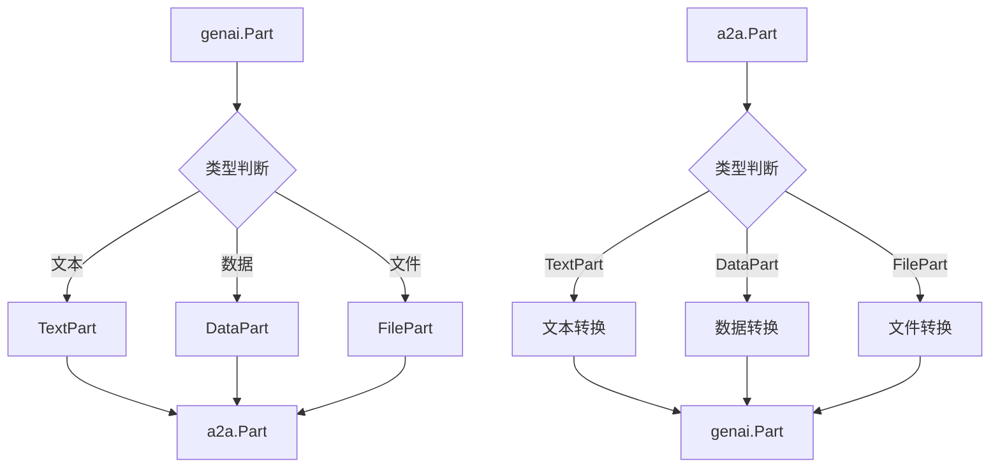
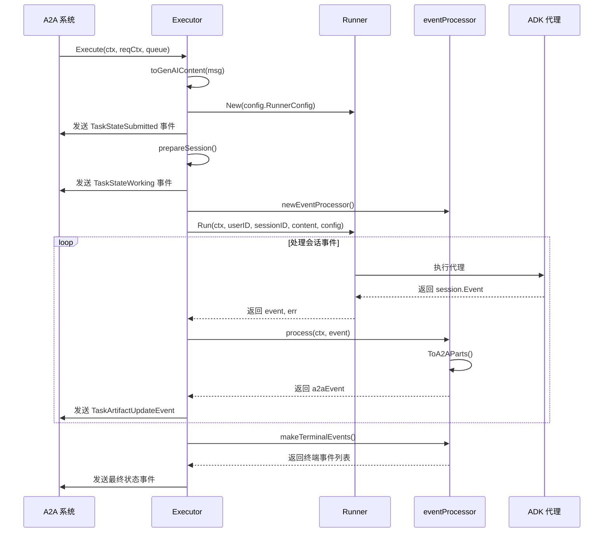
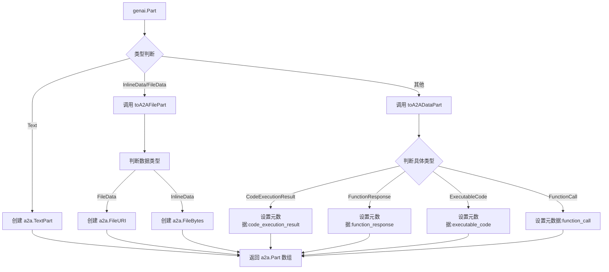
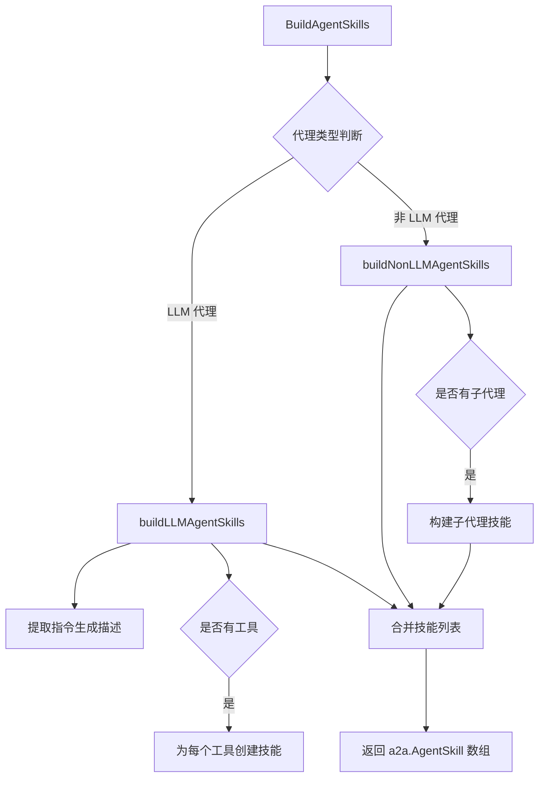

# ADK A2A 包架构分析文档

## 1. 概述

adka2a 包是 ADK-Go 框架中的关键组件，负责实现 ADK (Agent Development Kit) 与 A2A (Agent-to-Agent) 协议之间的互操作性。该包提供了一套完整的转换机制，使得 ADK 开发的代理能够与基于 A2A 协议的系统进行无缝集成和交互。

主要功能和职责：
- 在 ADK 会话事件与 A2A 协议事件之间进行双向转换
- 处理内容部分(parts)的格式转换（文本、数据、文件）
- 管理代理执行状态和生命周期
- 支持代理技能(AgentSkill)的构建和展示
- 处理元数据转换和传递

## 2. 包结构

adka2a 包由多个功能明确的文件组成，每个文件专注于特定的转换和处理逻辑：

| 文件名 | 主要职责 | 核心功能 |
|--------|---------|--------|
| executor.go | 代理执行器 | 实现 a2asrv.AgentExecutor 接口，管理代理执行流程 |
| processor.go | 事件处理器 | 处理会话事件并转换为 A2A 事件 |
| parts.go | 内容部分转换 | 在 genai.Part 和 a2a.Part 之间进行转换 |
| events.go | 事件转换 | 在会话事件和 A2A 事件之间进行转换 |
| metadata.go | 元数据管理 | 处理元数据的转换和传递 |
| agent_card.go | 代理能力卡片 | 构建代理技能列表用于展示代理能力 |

## 3. 核心类与接口

### 3.1 类图



### 3.2 关键组件说明

#### Executor

`Executor` 是整个包的核心类，实现了 `a2asrv.AgentExecutor` 接口，负责协调 ADK 代理的执行过程并将结果转换为 A2A 事件。

**主要功能：**
- 接收 A2A 请求并创建 ADK 运行环境
- 管理代理执行的整个生命周期
- 协调事件处理器处理会话事件
- 发送 A2A 状态更新事件

#### eventProcessor

`eventProcessor` 类负责将会话事件转换为 A2A 事件，并管理终端事件的处理逻辑。

**主要功能：**
- 处理会话事件并转换为 A2A 工件更新事件
- 识别和管理终端事件（失败、需要输入等）
- 生成最终的任务状态更新事件

#### 工具函数集

### 4. A2A协议工作原理与时序关系

#### 4.1 协议概述

A2A (Agent-to-Agent) 协议是一种用于代理间通信的标准化协议，允许不同系统和平台上的代理相互交换信息和协同工作。ADK A2A 包作为桥接层，实现了 ADK 代理与 A2A 协议系统之间的互操作性，通过事件转换和状态管理机制，确保两个系统能够无缝协作。

#### 4.2 主要事件类型

A2A 协议定义了多种事件类型，用于代理间通信和任务管理：

| 事件类型 | 描述 | 使用场景 |
|---------|------|----------|
| Task | 表示一个完整的任务，包含相关的工件和状态信息 | 初始任务创建和传递 |
| Message | 代理间的消息传递，包含内容部分(parts) | 用户输入和代理输出 |
| TaskArtifactUpdateEvent | 任务工件更新事件，用于追加内容到任务 | 流式响应和进度更新 |
| TaskStatusUpdateEvent | 任务状态更新事件，反映任务的当前状态 | 任务生命周期管理 |

#### 4.3 事件状态流转

任务在其生命周期中会经历多个状态转换：



#### 4.4 时序关系与执行流程

以下时序图展示了 A2A 协议在 ADK 环境中的完整工作流程，从接收请求到生成最终响应的整个过程：



#### 4.5 双向事件转换机制

ADK A2A 包实现了双向事件转换机制，确保 ADK 事件和 A2A 事件之间能够准确映射：

1. **ADK → A2A 转换**：
   - `session.Event` 转换为 `a2a.TaskArtifactUpdateEvent`
   - 错误状态转换为 `a2a.TaskStateFailed`
   - 长运行工具调用转换为 `a2a.TaskStateInputRequired`
   - 正常完成转换为 `a2a.TaskStateCompleted`

2. **A2A → ADK 转换**：
   - `a2a.Task`、`a2a.Message` 等转换为 `session.Event`
   - A2A 元数据转换并存储在 `session.Event.CustomMetadata` 中
   - A2A 任务状态更新转换为 ADK 可理解的形式

#### 4.6 关键数据转换流程

内容部分(parts)的转换是 A2A 协议工作的核心，支持多种内容类型：



这种双向转换机制确保了 ADK 代理能够与 A2A 系统进行无缝通信，无论底层实现如何，都能保持一致的用户体验和功能完整性。

## 5. 核心流程

包中包含一系列工具函数，负责各种类型的转换操作：

**内容部分转换：**
- `ToA2AParts`: 将 genai.Part 转换为 a2a.Part
- `ToGenAIParts`: 将 a2a.Part 转换为 genai.Part

**事件转换：**
- `ToSessionEvent`: 将 a2a.Event 转换为 session.Event
- `EventToMessage`: 将 session.Event 转换为 a2a.Message

**代理能力构建：**
- `BuildAgentSkills`: 根据代理描述和类型构建代理技能列表

## 5. 核心流程

### 4.1 代理执行流程



**流程说明：**
1. **初始化阶段**：Executor 接收 A2A 系统的执行请求，创建必要的运行环境和处理器。
2. **状态通知**：发送任务已提交和开始工作的状态更新事件。
3. **代理执行**：调用 Runner 运行 ADK 代理，处理返回的会话事件。
4. **事件转换**：使用 eventProcessor 将每个会话事件转换为对应的 A2A 事件。
5. **结果返回**：发送最终的任务状态更新事件，完成整个执行流程。

### 4.2 内容部分转换流程



**流程说明：**
1. **类型判断**：根据 genai.Part 的具体类型选择不同的转换路径。
2. **文本转换**：直接创建 a2a.TextPart，保留 thought 标记。
3. **文件转换**：根据是内联数据还是文件 URI 创建对应的 a2a.FilePart。
4. **数据转换**：根据具体数据类型（函数调用、响应等）设置相应的元数据。
5. **结果整合**：将所有转换后的部分组合成数组返回。

## 6. 关键机制

### 5.1 双向事件转换

adka2a 包实现了 ADK 会话事件和 A2A 事件之间的双向转换机制：

**ADK → A2A 转换：**
- `EventToMessage`: 将 session.Event 转换为 a2a.Message
- `process`: 在 eventProcessor 中将 session.Event 转换为 a2a.TaskArtifactUpdateEvent

**A2A → ADK 转换：**
- `ToSessionEvent`: 将各种类型的 a2a.Event 转换为 session.Event
- 支持 Task、Message、TaskArtifactUpdateEvent 和 TaskStatusUpdateEvent 等多种事件类型

### 5.2 元数据传递

系统使用特定的键前缀来区分不同来源的元数据：

- A2A 相关元数据使用 `adk_` 前缀
- ADK 相关元数据使用 `a2a:` 前缀

元数据包含关键信息如：
- 用户 ID 和会话 ID
- 应用程序名称
- 调用 ID
- 作者信息
- 分支信息
- 错误码
- grounding 元数据

### 5.3 任务状态管理

系统支持多种任务状态，并按照优先级处理：

1. **TaskStateFailed**：任务执行失败，优先级最高
2. **TaskStateInputRequired**：需要用户输入
3. **TaskStateCompleted**：任务成功完成
4. **TaskStateCanceled**：任务被取消
5. **TaskStateWorking**：任务正在执行
6. **TaskStateSubmitted**：任务已提交

## 7. 代理技能构建

### 6.1 技能构建流程



**功能说明：**
- `BuildAgentSkills` 函数分析代理的类型和结构，生成描述代理能力的技能列表
- 对于 LLM 代理，会提取指令并为每个工具创建技能条目
- 对于工作流代理，会分析子代理结构并生成相应的编排描述
- 自动替换指令中的人称代词，使描述更加准确

## 8. 代码优化建议

### 7.1 错误处理增强

**当前问题：** 在多处代码中，错误处理使用 TODO 注释而非实际实现。

**优化建议：**
```go
// 当前实现
if err != nil {
    // TODO(yarolegovich): log ignored error
}

// 建议实现
if err != nil {
    log.Printf("Warning: failed to process metadata: %v", err)
}
```

### 7.2 并发安全增强

**当前问题：** `eventProcessor` 中的 `terminalEvents` 映射在高并发场景下可能存在安全问题。

**优化建议：**
```go
// 建议添加互斥锁
import "sync"

type eventProcessor struct {
    // 现有字段
    mu             sync.Mutex
    terminalEvents map[a2a.TaskState]*a2a.TaskStatusUpdateEvent
}

// 在访问 terminalEvents 时加锁
func (p *eventProcessor) process(_ context.Context, event *session.Event) (*a2a.TaskArtifactUpdateEvent, error) {
    // ... 现有代码
    if resp.ErrorCode != "" {
        p.mu.Lock()
        if _, ok := p.terminalEvents[a2a.TaskStateFailed]; !ok {
            p.terminalEvents[a2a.TaskStateFailed] = toTaskFailedUpdateEvent(p.reqCtx, errorFromResponse(&resp), eventMeta)
        }
        p.mu.Unlock()
    }
    // ... 现有代码
}
```

### 7.3 内存优化

**当前问题：** 在 `parts.go` 中，某些转换函数可能在处理大量数据时创建不必要的临时对象。

**优化建议：**
```go
// 预分配容量以减少内存分配
func ToA2AParts(parts []*genai.Part, longRunningToolIDs []string) ([]a2a.Part, error) {
    result := make([]a2a.Part, 0, len(parts)) // 预分配容量
    for _, part := range parts {
        // ... 现有转换逻辑
        result = append(result, convertedPart)
    }
    return result, nil
}
```

## 9. 输入输出示例

### 8.1 代理执行示例

**输入：**
```go
// A2A 请求
msg := a2a.NewMessage(a2a.MessageRoleUser, a2a.TextPart{Text: "Hello, world!"})
reqCtx := a2asrv.NewRequestContext(ctx, msg)

// 执行配置
config := ExecutorConfig{
    RunnerConfig: runner.Config{
        AppName:        "test-app",
        SessionService: sessionService,
    },
    RunConfig: agent.RunConfig{},
}

executor := NewExecutor(config)
executor.Execute(ctx, reqCtx, queue)
```

**输出：**
```go
// 生成的 A2A 事件序列
// 1. 提交任务事件
TaskStatusUpdateEvent{State: TaskStateSubmitted}

// 2. 工作中事件
TaskStatusUpdateEvent{State: TaskStateWorking}

// 3. 工件更新事件
TaskArtifactUpdateEvent{Artifact: Artifact{Parts: [TextPart{Text: "Hello, I'm your assistant!"}]}}

// 4. 最后一个工件块（标记结束）
TaskArtifactUpdateEvent{Artifact: Artifact{ID: "..."}, LastChunk: true}

// 5. 完成任务事件
TaskStatusUpdateEvent{State: TaskStateCompleted, Final: true}
```

## 10. 总结

adka2a 包是 ADK-Go 框架中实现 ADK 与 A2A 协议互操作性的关键组件。它通过精心设计的转换机制，使得 ADK 开发的代理能够无缝集成到基于 A2A 协议的系统中。

**核心优势：**
- 提供完整的双向事件转换机制
- 支持多种内容类型的转换（文本、数据、文件）
- 智能的代理技能构建，展示代理能力
- 完善的元数据传递和任务状态管理

该包的设计遵循了良好的软件工程实践，包括职责分离、接口抽象和错误处理，为开发者提供了一个可靠的工具，用于构建跨平台、互操作的代理系统。