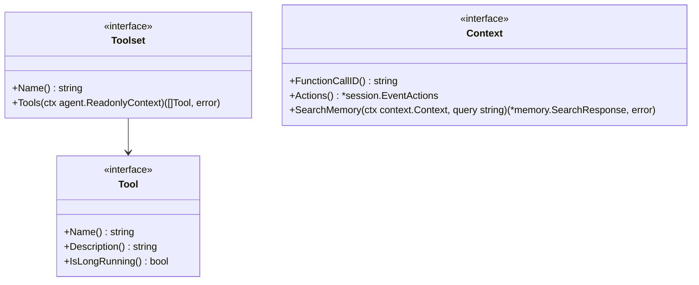
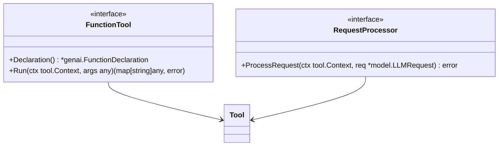
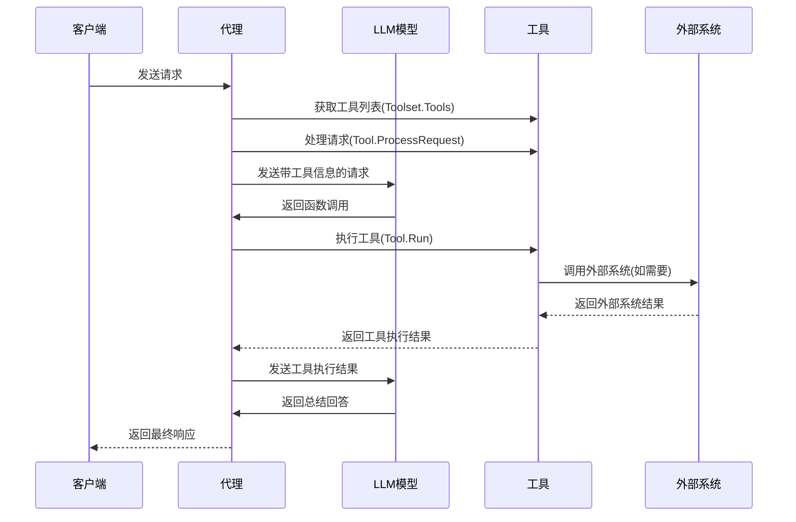
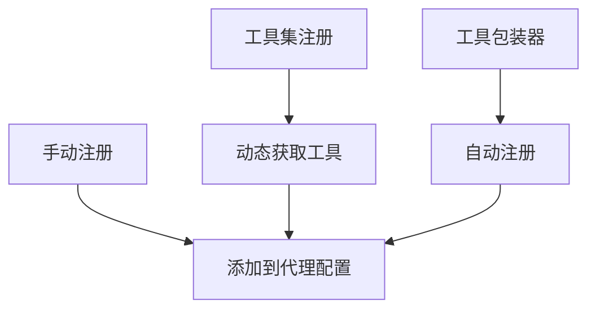

# ADK-Go Tool 架构设计与实现分析

## 1. 概述

ADK-Go（Agent Development Kit for Go）是一个用于开发AI代理的框架，其中tool包提供了代理调用各种工具的能力。本文档从架构师角度详细分析tool包的设计思想、核心组件及工作流程，帮助开发者快速理解并有效使用这些工具组件。

tool包采用了接口驱动设计，通过清晰的接口定义将工具功能抽象化，同时提供了多种实现方式，满足不同场景的需求。整个架构具有良好的扩展性和灵活性，允许开发者轻松集成自定义工具。

## 2. 核心接口设计

### 2.1 核心接口概览

tool包定义了几个核心接口，构成了整个工具系统的基础：



**核心接口说明：**

1. **Tool接口**：定义单个工具的基本属性和行为
   - `Name()`: 返回工具的唯一标识符
   - `Description()`: 返回工具的描述信息，用于LLM理解工具功能
   - `IsLongRunning()`: 标识工具是否为长时间运行的操作

2. **Toolset接口**：工具集合的抽象，用于管理一组相关工具
   - `Name()`: 返回工具集的名称
   - `Tools()`: 根据上下文返回可用的工具列表

3. **Context接口**：工具执行时的上下文环境
   - `FunctionCallID()`: 获取函数调用的唯一标识符
   - `Actions()`: 获取当前事件的可执行操作
   - `SearchMemory()`: 在代理的记忆中执行语义搜索

这种接口设计体现了良好的抽象原则，将工具的定义、组织和执行环境分离，便于扩展和维护。

### 2.2 函数工具的扩展接口

除了基础接口外，系统内部还定义了一些扩展接口用于增强工具功能，主要包括：



**扩展接口说明：**

1. **FunctionTool接口**：用于支持函数调用类型的工具
   - `Declaration()`: 返回函数声明，定义参数和返回值结构
   - `Run()`: 执行工具逻辑并返回结果

2. **RequestProcessor接口**：用于在LLM请求发送前处理请求内容
   - `ProcessRequest()`: 处理LLM请求，可用于添加工具声明或修改请求内容

## 3. 工具实现组件分析

### 3.1 工具实现组件层次结构

ADK-Go提供了多种工具实现，以满足不同的应用场景：

```mermaid
classDiagram
    Tool <|-- functionTool
    Tool <|-- agentTool
    Tool <|-- artifactsTool
    Tool <|-- geminiTool
    Tool <|-- mcpTool
    
    functionTool <|-- exitLoopTool
    geminiTool <|-- GoogleSearch
    
    Toolset <|-- set
    
    class functionTool {
        -handler Func[TArgs, TResults]
        -inputSchema *jsonschema.Resolved
        -outputSchema *jsonschema.Resolved
        +Run(ctx tool.Context, args any) (map[string]any, error)
        +ProcessRequest(ctx tool.Context, req *model.LLMRequest) error
    }
    
    class agentTool {
        -agent agent.Agent
        -skipSummarization bool
        +Run(ctx tool.Context, args any) (map[string]any, error)
        +ProcessRequest(ctx tool.Context, req *model.LLMRequest) error
    }
    
    class artifactsTool {
        +Run(ctx tool.Context, args any) (map[string]any, error)
        +ProcessRequest(ctx tool.Context, req *model.LLMRequest) error
    }
    
    class geminiTool {
        -value *genai.Tool
        +ProcessRequest(ctx tool.Context, req *model.LLMRequest) error
    }
    
    class mcpTool {
        -funcDeclaration *genai.FunctionDeclaration
        -getSessionFunc func(ctx context.Context) (*mcp.ClientSession, error)
        +Run(ctx tool.Context, args any) (map[string]any, error)
        +ProcessRequest(ctx tool.Context, req *model.LLMRequest) error
    }
    
    class set {
        -client *mcp.Client
        -transport mcp.Transport
        -toolFilter tool.Predicate
        +Tools(ctx agent.ReadonlyContext) ([]tool.Tool, error)
    }
```



### 3.2 主要工具实现组件详解

#### 3.2.1 函数工具 (functiontool)

**功能与设计：**
函数工具是最灵活的工具实现，允许将任何Go函数包装为工具。它使用泛型来支持不同类型的输入和输出，并自动从函数类型推断JSON Schema。

**核心组件：**
- `functionTool[TArgs, TResults]`: 泛型实现，支持任意类型的输入和输出
- 自动推断JSON Schema，简化开发流程
- 支持长运行操作标记，对LLM提供额外提示

**使用场景：**
适用于需要将自定义Go函数暴露给LLM调用的场景，如数据处理、API调用等。

#### 3.2.2 代理工具 (agenttool)

**功能与设计：**
代理工具允许一个代理调用另一个代理，实现代理的组合和嵌套。它创建一个新的会话来运行子代理，并处理输入输出的转换。

**核心组件：**
- `agentTool`: 包装现有代理的工具实现
- 支持输入/输出模式验证
- 可选择性跳过总结，优化调用链性能

**使用场景：**
适用于复杂任务分解，将大任务拆分为多个专业代理协作完成的场景。

#### 3.2.3 工件加载工具 (loadartifactstool)

**功能与设计：**
工件加载工具允许LLM访问会话中的工件（artifacts）。它提供了列出可用工件和加载特定工件内容的能力。

**核心组件：**
- `artifactsTool`: 提供工件加载功能
- 自动将可用工件信息添加到LLM上下文中
- 支持并行加载多个工件

**使用场景：**
适用于需要LLM分析文件内容或处理上传文档的场景。

#### 3.2.4 Gemini工具 (geminitool)

**功能与设计：**
Gemini工具提供对Google Gemini原生工具的访问，如Google Search。它是对genai.Tool的简单包装。

**核心组件：**
- `geminiTool`: 通用Gemini工具包装器
- `GoogleSearch`: 预定义的Google搜索工具

**使用场景：**
适用于需要使用Gemini特定功能的场景，如网络搜索、代码执行等。

#### 3.2.5 MCP工具集 (mcptoolset)

**功能与设计：**
MCP（Model Context Protocol）工具集允许ADK代理访问MCP服务器提供的工具。它实现了Toolset接口，可以动态获取远程工具。

**核心组件：**
- `set`: MCP工具集实现
- `mcpTool`: 单个MCP工具的代理实现
- 支持工具过滤，可选择性暴露工具

**使用场景：**
适用于需要集成外部服务或工具的场景，通过标准协议与第三方工具交互。

#### 3.2.6 退出循环工具 (exitlooptool)

**功能与设计：**
退出循环工具是一个特殊的函数工具，用于指示代理退出当前循环。它设置特定的事件动作来实现循环退出。

**使用场景：**
适用于工作流代理或循环代理中，需要在特定条件下终止循环的场景。

## 4. 工具调用工作流程

工具调用的完整工作流程包括工具注册、请求处理、函数调用生成、工具执行和结果处理等阶段：



**工作流程说明：**

1. **初始化阶段**
   - 代理从工具集获取可用工具列表
   - 工具通过ProcessRequest方法修改LLM请求，添加工具声明

2. **函数调用生成阶段**
   - 代理将修改后的请求发送给LLM
   - LLM根据请求和工具信息生成函数调用

3. **工具执行阶段**
   - 代理解析LLM返回的函数调用
   - 调用相应工具的Run方法执行具体逻辑
   - 工具可能会调用外部系统或服务

4. **结果处理阶段**
   - 工具返回执行结果给代理
   - 代理将结果发送给LLM生成总结
   - 代理将最终响应返回给客户端

## 5. 工具注册与发现机制

### 5.1 工具注册机制

ADK-Go采用了灵活的工具注册机制，支持多种注册方式：



**主要注册方式：**

1. **手动注册**：直接将工具实例添加到代理配置的Tools字段
2. **工具集注册**：通过Toolset接口动态获取和注册工具
3. **自动注册**：一些特殊工具通过包装器自动注册到请求中

### 5.2 工具过滤机制

系统提供了工具过滤功能，允许根据上下文动态决定暴露哪些工具：

```go
// Predicate定义了工具过滤的函数类型
type Predicate func(ctx agent.ReadonlyContext, tool Tool) bool

// StringPredicate是一个便捷函数，从字符串列表创建过滤条件
func StringPredicate(allowedTools []string) Predicate {
    m := make(map[string]bool)
    for _, t := range allowedTools {
        m[t] = true
    }

    return func(ctx agent.ReadonlyContext, tool Tool) bool {
        return m[tool.Name()]
    }
}
```

这种设计使代理能够根据不同的上下文或用户请求动态调整可用工具，增强了系统的安全性和灵活性。

## 6. 代码示例与最佳实践

### 6.1 创建和使用函数工具

```go
// 定义工具函数
func getWeather(ctx tool.Context, args struct {
    Location string `json:"location"`
}) (map[string]string, error) {
    // 实现天气查询逻辑
    return map[string]string{
        "location": args.Location,
        "temperature": "25°C",
        "condition": "sunny",
    }, nil
}

// 创建工具实例
weatherTool, err := functiontool.New(functiontool.Config{
    Name:        "get_weather",
    Description: "获取指定位置的天气信息",
}, getWeather)

// 在代理中使用
llmAgent := llmagent.New(llmagent.Config{
    Name:        "weather_agent",
    Model:       model,
    Description: "天气查询代理",
    Tools:       []tool.Tool{weatherTool},
})
```

### 6.2 使用MCP工具集

```go
// 创建MCP工具集
mcpToolSet, err := mcptoolset.New(mcptoolset.Config{
    Transport: &mcp.CommandTransport{Command: exec.Command("myserver")},
    ToolFilter: tool.StringPredicate([]string{"search", "calculator"}),
})

// 在代理中使用
llmAgent := llmagent.New(llmagent.Config{
    Name:        "mcp_agent",
    Model:       model,
    Description: "使用MCP工具的代理",
    Toolsets:    []tool.Toolset{mcpToolSet},
})
```

### 6.3 嵌套代理调用

```go
// 创建子代理
childAgent := llmagent.New(llmagent.Config{
    Name:        "child_agent",
    Model:       childModel,
    Description: "子代理",
})

// 创建代理工具
agentTool := agenttool.New(childAgent, &agenttool.Config{
    SkipSummarization: true,
})

// 在父代理中使用
parentAgent := llmagent.New(llmagent.Config{
    Name:        "parent_agent",
    Model:       parentModel,
    Description: "父代理",
    Tools:       []tool.Tool{agentTool},
})
```

## 7. 架构特点与优势

### 7.1 接口驱动设计

ADK-Go的工具系统采用了严格的接口驱动设计，带来以下优势：

- **解耦与模块化**：工具定义与实现分离，便于独立开发和测试
- **扩展性**：新增工具只需实现相应接口，无需修改现有代码
- **灵活性**：同一接口可有多种实现，满足不同场景需求

### 7.2 类型安全与泛型支持

利用Go的泛型特性，特别是在函数工具中，提供了更好的类型安全：

- 编译时类型检查，减少运行时错误
- 自动类型转换，简化开发流程
- 强类型接口，提高代码可读性和维护性

### 7.3 多级抽象与组合

系统通过多级抽象和组合模式，实现了高度的灵活性：

- **基础抽象**：Tool接口定义基本工具属性
- **功能抽象**：FunctionTool等接口扩展特定功能
- **集合抽象**：Toolset接口管理工具集合
- **组合模式**：agenttool支持代理的组合和嵌套

### 7.4 可观测性与调试支持

工具系统提供了良好的可观测性支持：

- 唯一标识符跟踪每个函数调用
- 上下文传递，便于记录和监控
- 错误处理和传播机制，便于调试

## 8. 总结

ADK-Go的tool包提供了一个设计精良、灵活可扩展的工具系统，支持代理与各种外部功能的交互。其核心优势包括：

1. **接口驱动设计**：提供清晰的抽象和扩展点
2. **丰富的工具实现**：内置多种常用工具类型
3. **类型安全**：利用Go泛型提供类型安全的函数调用
4. **灵活组合**：支持工具的动态发现、过滤和组合
5. **可扩展性**：易于集成自定义工具和外部服务

通过合理使用这些工具组件，开发者可以构建功能强大、灵活可扩展的AI代理应用，满足各种复杂场景的需求。